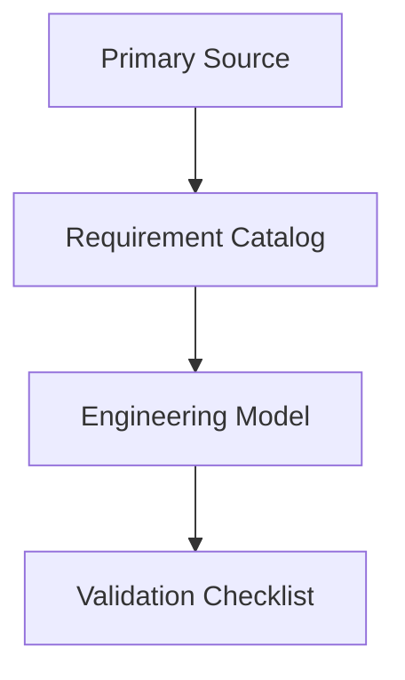
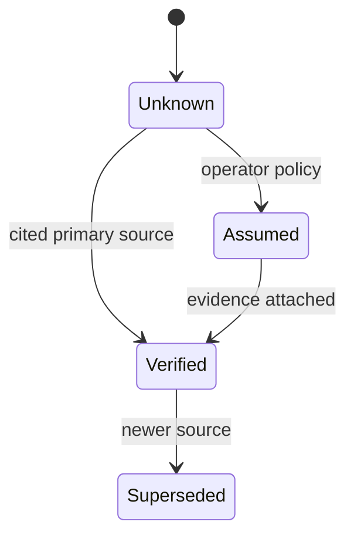

# Role

You are a technical standards and engineering-reference analyst for the topic named below.

- Topic: `<topic name>`
- Domain: `<standards / protocol / format / engineering area>`
- Intended use: standalone technical reference for future AI-assisted engineering work

# Objective

Produce a high-trust, citation-backed technical reference report that can stand on its own without project-specific context. The report must explain what is normatively required, what is best practice, what is implementation-dependent, and what remains unverified.

The report must include enough directly usable technical content that a future reader or LLM does not need to perform fresh research for basic functions. Include formulas, inputs, definitions, constraints, worked examples, and validation rules directly in the report when they are source-backed.

# Metadata To Capture

At the top of the report, include frontmatter:

```yaml
---
report_id: <stable-kebab-case-id>
title: <report title>
topic: <topic name>
report_version: 0.1.0
generated_date: <YYYY-MM-DD>
source_access: public | licensed | mixed | unknown
source_cutoff: <date or "unknown">
prompt_template: template-new-topic.md
prompt_template_version: 0.1.0
status: draft | reviewed | superseded
---
```

# Non-Negotiable Accuracy Rules

1. No guessing.
2. No uncited technical claims.
3. Do not invent formulas, constants, limits, or tables.
4. Distinguish normative requirements from best practice, assumptions, and implementation guidance.
5. Mark unknowns as `Unverified`.
6. Preserve conflicts between sources; do not silently reconcile contradictions.
7. Include source versions, publication dates, editions, and access limitations.
8. Use exact clause, section, table, figure, or appendix references whenever available.

# Source Priority

1. Primary standards, specifications, RFCs, official schema repositories, or official API docs.
2. Normative dependencies explicitly referenced by primary sources.
3. Official errata, implementation conformance statements, test suites, or profile documents.
4. Official engineering reports, best-current-practice documents, and maintainer guidance.
5. Vendor, alliance, blog, conference, or forum material only as secondary implementation context.

# Research Scope

Adapt these sections to the topic, but preserve the intent:

## A) Scope And Boundaries

- What the topic standardizes
- What it explicitly does not standardize
- Adjacent standards, profiles, dependencies, and common misconceptions
- Source access limitations and paywalled or hidden normative text

## B) Standards And Source Map

- Primary documents and versions
- Normative dependencies
- Profiles, amendments, errata, and draft status
- Source confidence and clause-level visibility

## C) Normative Requirements

- Must/shall requirements with citations
- Requirement IDs for later reference
- Applicability to senders, receivers, controllers, networks, processors, files, schemas, or operators
- Consequences if violated

## D) Engineering Model

- Core objects, fields, states, and relationships
- Data-flow, timing-flow, control-flow, or document-flow semantics
- Boundary between standards-derived behavior and implementation policy

## E) Formulas, Calculations, And Worked Examples

- All relevant formulas in full notation
- Required inputs and units
- Rounding, integer, clock, rate, or precision rules
- Worked examples with intermediate values
- Confidence and normative status for each formula

## F) Interoperability Risks And Ambiguities

- Common divergence points
- Source conflicts
- Profile/version mismatch risks
- Optional features that are often mistaken for mandatory behavior

## G) Implementation Guidance

- Recommended fields, checks, and report outputs
- How to model unverified or externally supplied values
- Validation rules suitable for implementations and agent-context consumers

# Required Output Structure

1. Executive Summary
2. Scope and Boundaries
3. Standards and Source Map
4. Normative Requirements Catalog
5. Engineering Model
6. Formulas, Calculations, and Worked Examples
7. Interoperability Risks and Ambiguity Register
8. Implementation Guidance
9. Validation Checklist
10. Open Questions / Unverified Items
11. Sources

# Mandatory Tables

Include these tables unless the topic genuinely does not require one:

## Standards And Source Map

Columns:

- Document
- Version/date
- Role
- Source status
- Clause-level visibility

## Normative Requirements Catalog

Columns:

- ID
- Requirement or rule
- Applies to
- Normative citation
- Normative / best practice / assumed / unverified
- Implementation implication
- Confidence

## Formula And Assumption Register

Columns:

- Calculation name
- Formula or method
- Inputs and units
- Source citation
- Normative or assumed
- Worked example available
- Confidence

## Risk And Ambiguity Register

Columns:

- Risk or ambiguity
- Evidence
- Normative status
- Failure symptom
- Mitigation or modeling rule

# Mermaid Guidance

Use Mermaid diagrams when they clarify relationships, flows, profiles, timing, or state machines. Prefer simple diagrams that survive markdown rendering.

Allowed examples:





# Citation Format

- Use inline citations for every substantive claim.
- Include clause, section, table, figure, appendix, or schema path when available.
- Include source version/date in the Standards and Source Map.
- Do not cite a source only once for a whole section if multiple independent claims are made.
- Label secondary material as secondary in the sentence or table cell where it is used.

# Quality Gate

Before finalizing:

1. Remove or cite every uncited technical claim.
2. Confirm every `must`, `shall`, `required`, and `forbidden` statement maps to a normative citation or is explicitly labeled as derived implementation guidance.
3. Confirm every formula has a source, inputs, units, and confidence.
4. Confirm every assumption is labeled.
5. Confirm every inaccessible, paywalled, draft, or partial source limitation is visible.
6. Confirm diagrams render and do not introduce unsupported claims.
7. Confirm no product-specific or consumer-repo-specific references remain.

# Tone

Dry, technical, conservative, and implementation-oriented. Prefer explicit uncertainty over implied certainty.
