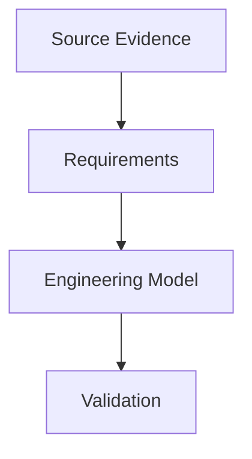

# Report Contract

This contract defines the durable shape of standalone technical reference reports in this repository. Reports may specialize sections for their domain, but they should preserve this structure unless the deviation is documented in `manifest.md`.

## Required Frontmatter

```yaml
---
report_id: <stable-kebab-case-id>
title: <standalone report title>
topic: <topic name>
report_version: 0.1.0
generated_date: <YYYY-MM-DD>
converted_date: <YYYY-MM-DD or null>
source_access: public | licensed | mixed | unknown
source_cutoff: <YYYY-MM-DD or unknown>
prompt_template: template-new-topic.md | template-convert-existing-context.md | unknown
prompt_template_version: 0.1.0
status: draft | reviewed | superseded
supersedes: <report_id@version or null>
---
```

## Evidence Labels

Use these labels consistently:

| Label | Meaning |
| ----- | ------- |
| `Normative` | Directly required by a cited primary standard, specification, RFC, schema, or official conformance document. |
| `Best practice` | Recommended by official guidance, engineering reports, BCPs, or widely accepted operational guidance, but not a binding requirement. |
| `Assumed` | Required for implementation or calculation, but selected by operator policy, deployment context, or tool design rather than a standard. |
| `Derived` | Computed from cited source facts. The derivation must show inputs, units, and intermediate steps when non-trivial. |
| `Secondary` | Sourced from vendor, alliance, presentation, blog, secondary-hosted standard text, or other non-primary material. |
| `Unverified` | Useful claim or requirement that cannot be proven from available sources. |

Do not use `must`, `shall`, `required`, `prohibited`, or `forbidden` unless the statement is normative or explicitly says it is an implementation requirement.

## Required Section Order

1. Executive Summary
2. Scope and Boundaries
3. Standards and Source Map
4. Normative Requirements Catalog
5. Engineering Model
6. Formulas, Calculations, and Worked Examples
7. Interoperability Risks and Ambiguity Register
8. Implementation Guidance
9. Validation Checklist
10. Open Questions / Unverified Items
11. Sources

## Required Tables

### Standards And Source Map

| Column | Requirement |
| ------ | ----------- |
| Document | Official document or source name. |
| Version/date | Edition, publication date, draft date, amendment, or `Unverified`. |
| Role | Why the source matters to this report. |
| Source status | Primary, normative dependency, secondary, draft, metadata only, partial preview, paywalled, or inaccessible. |
| Clause-level visibility | Whether the report can cite exact clauses, tables, schemas, or only metadata. |

### Normative Requirements Catalog

| Column | Requirement |
| ------ | ----------- |
| ID | Stable local requirement ID. |
| Requirement or rule | Exact or carefully paraphrased requirement. |
| Applies to | Sender, receiver, controller, processor, document, network, operator, or other domain role. |
| Normative citation | Source with clause, section, table, figure, appendix, or schema path where available. |
| Evidence label | `Normative`, `Best practice`, `Assumed`, `Derived`, `Secondary`, or `Unverified`. |
| Implementation implication | How the requirement affects modeling, validation, calculation, or reporting. |
| Confidence | High, Medium, or Low. |

### Formula And Assumption Register

| Column | Requirement |
| ------ | ----------- |
| Calculation name | Stable name for the formula or method. |
| Formula or method | Complete expression, algorithm, or lookup rule. |
| Inputs and units | All required variables, units, and expected precision. |
| Source citation | Primary formula source or cited facts used for derivation. |
| Evidence label | Normative, informative, derived, assumed, secondary, or unverified. |
| Worked example | Yes, No, or Not applicable. |
| Confidence | High, Medium, or Low. |

### Risk And Ambiguity Register

| Column | Requirement |
| ------ | ----------- |
| Risk or ambiguity | Specific interoperability, modeling, or evidence risk. |
| Evidence | Citation or reason the risk exists. |
| Normative status | Whether the risk is normative, profile-dependent, implementation-dependent, secondary, or unverified. |
| Failure symptom | What can break if it is ignored. |
| Mitigation or modeling rule | How a tool, operator, or future report should handle it. |

## Formula Requirements

Every formula must include:

- Name and purpose.
- Full expression or method.
- Inputs and units.
- Output unit.
- Rounding, integer, clock, rate, or precision behavior.
- Normative/informative/assumed status.
- Source citation.
- Worked example when the formula is expected to be used directly.

## Mermaid Requirements

Mermaid diagrams are encouraged for relationships, flows, state machines, and validation pipelines. Diagrams must not introduce claims that are not supported in the surrounding text.

Use simple identifiers without spaces:



## Citation Requirements

- Cite every substantive technical claim.
- Prefer clause, section, table, figure, appendix, schema path, or exact versioned URL.
- Identify source version/date in the Standards and Source Map.
- Label secondary or partial sources at the point of use.
- Preserve conflicts and do not silently choose one source unless the reason is cited.

## Quality Gate

Before a report is marked `reviewed`:

1. No project-specific references remain.
2. All technical claims have citations or explicit evidence labels.
3. Every normative claim maps to a primary source or is downgraded.
4. Every formula has inputs, units, source, confidence, and at least one worked example when useful.
5. Tables are complete or incomplete cells are marked `Unverified`.
6. Mermaid diagrams render.
7. Open questions are explicit and actionable.
8. `manifest.md` reflects the report status, version, source access, and regeneration policy.
