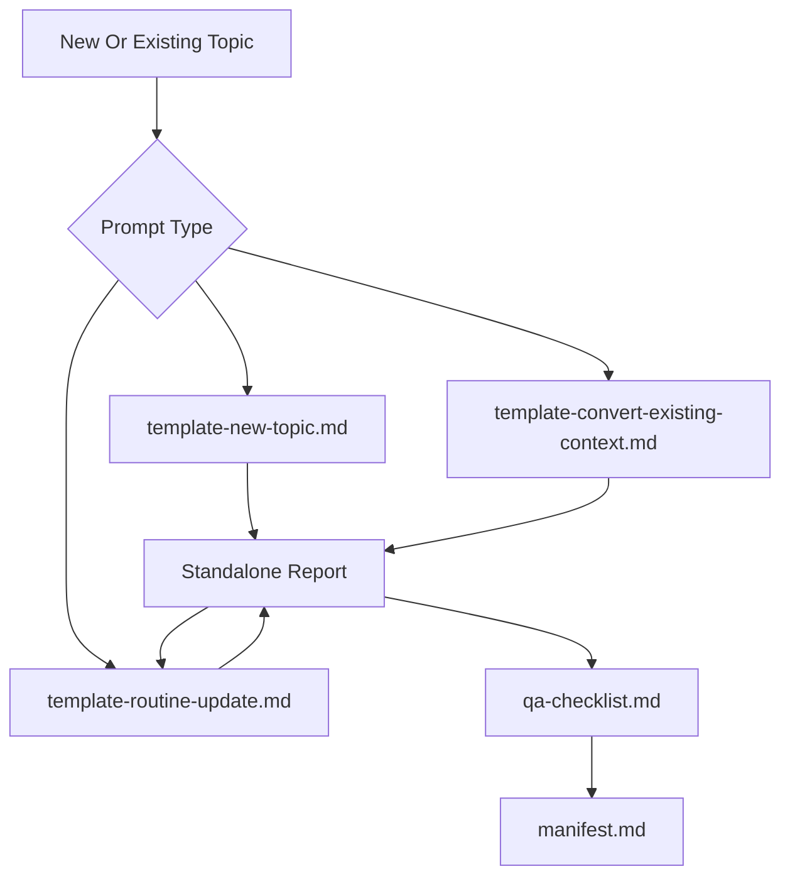

# Technical Research Reference

This workspace contains standalone, citation-backed technical reference reports. The reports are intended to preserve enough standards and engineering context for future AI-assisted work without depending on project history, chat context, or a consuming repository.

## Goals

- Preserve dry, high-density technical context in markdown.
- Keep normative requirements separate from best practice, assumptions, and unverified items.
- Include formulas, worked examples, validation rules, and implementation implications directly in reports.
- Record source versions, access limitations, and confidence levels.
- Keep consumer-specific integration details outside this repository.

## Structure

- `report-*.md` - generated or converted standalone reference reports.
- `prompts/template-new-topic.md` - reusable prompt for creating a new topic report.
- `prompts/template-convert-existing-context.md` - reusable prompt for converting existing context into the standard report shape.
- `prompts/template-routine-update.md` - reusable prompt for researching source changes and producing controlled report updates.
- `report-template.md` - required report contract and section structure.
- `manifest.md` - report inventory, status, source access, and regeneration policy.
- `qa-checklist.md` - post-generation review checklist.

## Report Inventory

| Report | Topic | Status |
| ------ | ----- | ------ |
| `report-master.md` | Cross-domain ST 2110, PTP, bandwidth, and NMOS synthesis | Converted reference |
| `report-st2110.md` | ST 2110 transport and essence | Converted reference |
| `report-ptp.md` | PTP timing and synchronization | Converted reference |
| `report-bandwidth.md` | ST 2110 bandwidth and capacity calculations | Converted reference |
| `report-aes67.md` | AES67 IP audio interoperability | Converted reference |
| `report-ttml.md` | TTML and IMSC timed text | Converted reference |

## Standard Workflow

## Creating A New Report

Use `prompts/template-new-topic.md` when the topic is not already captured in a report.

The output must:

- Use the frontmatter defined in `report-template.md`.
- Follow the required section order unless a topic-specific exception is justified.
- Include standards maps, requirement catalogs, formula registers, risk registers, and validation checklists where relevant.
- Mark unknowns as `Unverified`.
- Include Mermaid diagrams only when they clarify already-cited relationships.

## Converting Existing Context

Use `prompts/template-convert-existing-context.md` when turning notes, prior reports, old prompt outputs, or memory documents into a standalone report.

The conversion must:

- Remove project-specific names, repo paths, roadmap terms, and consumer-specific guidance.
- Preserve formulas, worked examples, citations, source limitations, and uncertainty labels.
- Replace project-specific language with neutral implementation language.
- Mark useful but uncited claims as `Unverified` rather than inventing citations.

## Routine Updates

Use `prompts/template-routine-update.md` when a source changes or new public documentation becomes available.

The update must:

- Start from the existing report and current manifest entry.
- Verify source authority, version/date, and clause visibility before changing the report.
- Classify impact as no change, citation improvement, evidence promotion, evidence downgrade, formula change, new requirement, source conflict, or deprecation.
- Produce a controlled patch or impact assessment rather than rewriting unaffected sections.
- Update formulas, worked examples, validation rules, open questions, and source maps only when evidence warrants it.

## Operating Rules

- Reports are the durable artifacts; one-off prompts are disposable.
- Every substantive technical claim needs a citation or an explicit uncertainty label.
- Normative requirements must identify the source document and clause, section, table, or schema path when available.
- Formula outputs must include inputs, units, assumptions, and confidence.
- Consumer repositories are responsible for documenting how they ingest or reference these reports.
