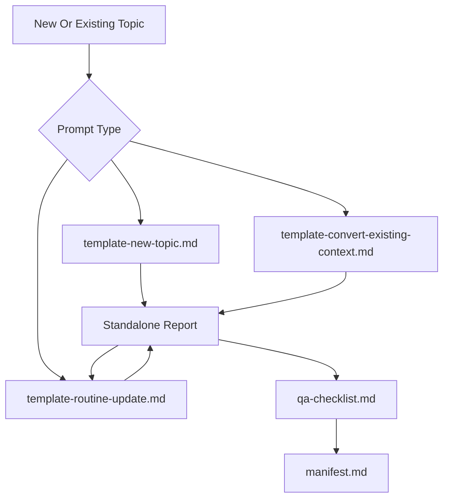

# Technical Research Reference

This workspace contains standalone, citation-backed technical reference reports. The reports preserve enough standards and engineering context for future AI-assisted work without depending on project history, chat context, or a consuming repository.

## Goals

- Preserve dry, high-density technical context in markdown.
- Keep normative requirements separate from best practice, assumptions, secondary sources, derived values, and unverified items.
- Include formulas, worked examples, validation rules, and implementation implications directly in the owning report.
- Record source versions, access limitations, confidence levels, and source visibility.
- Keep consumer-specific integration details outside this repository.

## Structure

- `reports/` - standalone domain reports organized by topic.
- `.creation/prompts/template-new-topic.md` - reusable prompt for creating a new topic report.
- `.creation/prompts/template-convert-existing-context.md` - reusable prompt for converting existing context into the standard report shape.
- `.creation/prompts/template-routine-update.md` - reusable prompt for researching source changes and producing controlled report updates.
- `.creation/report-template.md` - required report contract and section structure.
- `.creation/manifest.md` - report inventory, status, source access, and regeneration policy.
- `.creation/qa-checklist.md` - post-generation review checklist.

## Report Inventory

| Report | Topic | Ownership |
| ------ | ----- | --------- |
| `reports/st2110/overview.md` | ST 2110 overview and cross-domain context | Navigation and synthesis only; detailed claims live in domain reports. |
| `reports/st2110/transport-and-essence.md` | ST 2110 transport and essence | ST 2110 parts, RTP essence model, video/audio/ANC flow boundaries, and conformance limits. |
| `reports/st2110/bandwidth-and-capacity.md` | ST 2110 bandwidth and capacity calculations | Formulas, packet overhead, capacity assumptions, worked examples, and link-budget risks. |
| `reports/audio/aes67.md` | AES67 IP audio interoperability | Generic AES67 audio behavior and ST 2110-30 compatibility caveats. |
| `reports/timing/ptp.md` | PTP timing and synchronization | IEEE 1588, ST 2059, RTP clock signaling, timing validation, and timing risk model. |
| `reports/timed-text/ttml-imsc.md` | TTML and IMSC timed text | TTML, IMSC, DAPT, timing/styling/layout validation, and profile semantics. |

## Overlap Policy

Each report should stand alone. Short repeated context is acceptable when it is needed to understand the report without another file, but detailed treatment belongs to the owning report listed above.

Common overlap boundaries:

- RTP/SDP facts may appear in ST 2110, AES67, PTP, and bandwidth reports, but must be scoped to the local report purpose.
- PTP timing architecture belongs in `reports/timing/ptp.md`; other reports should keep timing summaries short.
- AES67 belongs in `reports/audio/aes67.md`; ST 2110-30-specific broadcast constraints belong in `reports/st2110/transport-and-essence.md`.
- Bandwidth formulas and worked examples belong in `reports/st2110/bandwidth-and-capacity.md`.
- TTML/IMSC belongs in `reports/timed-text/ttml-imsc.md`, not under the ST 2110 topic tree.

## Standard Workflow

## Creating A New Report

Use `.creation/prompts/template-new-topic.md` when the topic is not already captured in a report.

The output must:

- Use the frontmatter defined in `report-template.md`.
- Follow the required section order unless a topic-specific exception is justified.
- Include standards maps, requirement catalogs, formula registers, risk registers, and validation checklists where relevant.
- Mark unknowns as `Unverified`.
- Include Mermaid diagrams only when they clarify already-cited relationships.

## Converting Existing Context

Use `.creation/prompts/template-convert-existing-context.md` when turning notes, prior reports, old prompt outputs, or memory documents into a standalone report.

The conversion must:

- Remove project-specific names, repo paths, roadmap terms, and consumer-specific guidance.
- Preserve formulas, worked examples, citations, source limitations, and uncertainty labels.
- Replace project-specific language with neutral implementation language.
- Mark useful but uncited claims as `Unverified` rather than inventing citations.

## Routine Updates

Use `.creation/prompts/template-routine-update.md` when a source changes or new public documentation becomes available.

The update must:

- Start from the existing report and current manifest entry.
- Verify source authority, version/date, and clause visibility before changing the report.
- Classify impact as no change, citation improvement, evidence promotion, evidence downgrade, formula change, new requirement, source conflict, or deprecation.
- Produce a controlled patch or impact assessment rather than rewriting unaffected sections.
- Update formulas, worked examples, validation rules, open questions, and source maps only when evidence warrants it.

## Operating Rules

- Reports are the durable artifacts; one-off prompts are disposable.
- Every substantive technical claim needs a citation or an explicit uncertainty label.
- Normative requirements must identify the source document and clause, section, table, or schema path when available.
- Formula outputs must include inputs, units, assumptions, and confidence.
- Consumer repositories are responsible for documenting how they ingest or reference these reports.
