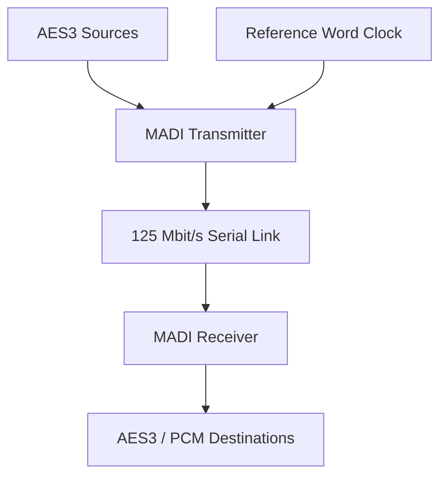

## 1. Executive Summary

MADI (Multichannel Audio Digital Interface), standardized as AES10, defines a serial, uni-directional, self-clocking digital audio interface that multiplexes up to 64 linearly represented digital audio channels over a single physical link, typically 75 Ω coaxial cable or optical fibre, at a fixed link rate of 125 Mbit/s.[4][6][9][11][17]

AES10 builds on the AES3/IEC 60958 professional digital audio interface family by extending from two channels to a framed structure of up to 64 subframes per audio sample period, each subframe carrying 24-bit PCM audio plus AES3 V/U/C/P bits and MADI mode bits, with the data payload constrained so that the total audio data rate does not exceed 100 Mbit/s on a 125 Mbit/s line.[1][2][4][7][10][33][37][38][39][42][43]

---

## 2. Scope and Boundaries

### 2.1 What MADI Standardizes

1. **Interface type and topology**
   AES10 defines MADI as a serial, uni-directional, self-clocking, asynchronous simplex interface intended for point-to-point links between one transmitter and one receiver.[4][6][19][26][38]
   The standard describes it as a single-point connection, not a shared bus or network.[4][6][26][38]

2. **Channel capacity and sampling range**
   AES10-2003/AES10-2008 describe serial transmission of 32, 56, or 64 channels of linearly represented digital audio at a common sampling frequency between 32 kHz and 96 kHz, with up to 24 bits per sample.[4][6][26][37][38]
   Earlier AES10 formulations specified 56 channels at sampling rates between 32 kHz and 48 kHz ±12.5 %, with 24‑bit resolution per channel.[9][10][19][23][38]

3. **Frame and subframe structure**
   AES10 defines a **frame** as a sequence of up to 64 subframes (historically 56 or 28), numbered 0 to 63, each carrying one audio sample and related data transmitted in a single sample period, with the start of a frame at the first bit of subframe 0.[4][37][38][39]
   Each subframe (also called a channel or sub-channel) is 32 bits, including 24 audio bits, four bits corresponding to AES3 V/U/C/P status information, and four MADI mode bits used for frame synchronization, channel activity, channel A/B marking, and 192-sample block identification.[7][10][33][38][39][45]

4. **Bit rate and coding overhead**
   AES10 specifies that the link transmission rate shall be 125 Mbit/s, irrespective of sampling frequency or number of active channels; the transmitted audio data is constrained such that the data transfer rate does not exceed 100 Mbit/s.[4][6][33][37][38][42][43]
   Secondary implementation notes attribute the 125 Mbit/s line rate to additional coding overhead beyond the raw 100 Mbit/s audio payload.[12][13][42][43]

5. **Physical media and electrical characteristics**
   AES10 defines a coaxial physical layer using 75 Ω video-type coaxial cable; later revisions and IEC 60958-4-4 introduce optical fibre variants and media-specific physical and electrical parameters.[2][3][4][6][9][15][17][21][23]

6. **Relationship to AES3 / IEC 60958**
   IEC 60958-1 and 60958-4 define a two-channel serial digital audio interface (AES3) that is uni-directional, self-clocking and intended for professional audio; AES10 extends these concepts to a multichannel serial interface by multiplexing multiple AES3-like channels into a single higher-rate stream.[1][2][4][6][7][9][10][38][39]

### 2.2 What MADI Does Not Standardize (Explicit or De Facto)

1. **Network or packet-layer protocols**
   MADI does not define any Ethernet, IP, or higher-layer network protocols; it is explicitly a point-to-point serial link and does not use TCP or UDP ports.[4][6][15][29]
   AoIP systems such as Dante or AES67 require separate encapsulation or gateways when interfacing to MADI.[15][29]

2. **Routing, switching, or address discovery**
   AES10 does not define routing or switching protocols, device discovery, or addressing; such behaviour is implementation-specific within routers, MADI routers, or audio consoles.[4][5][6][15][17]

3. **Long-distance line coding or repeaters beyond link spec**
   While some secondary documentation describes extended distances (hundreds of metres over coax, kilometres over fibre), AES10 and IEC 60958 provide media-related limits primarily through their physical-layer parts; use of repeaters, regenerators, or WDM systems is left to implementers.[2][3][4][9][15][17][21][23]

4. **Application-layer metadata and control**
   MADI carries AES3 channel status and user bits but does not standardize high-level control protocols (e.g. device naming, gain control); these are vendor-specific or governed by separate protocols.[1][2][4][7][9][10][38][39]

### 2.3 Adjacent Standards and Common Misconceptions

1. **IEC 60958 (AES3) dependence**
   IEC 60958-1 (general) and 60958-4 (professional) specify the base two-channel digital audio interface that MADI reuses at the subframe level, including the semantics of V (Validity), U (User), C (Channel status), and P (Parity) bits.[1][2][10][38][39]
   MADI is often informally described as “multiple AES3 channels on one cable,” which is conceptually accurate but omits details of frame structure and additional mode bits.[4][6][7][9][10][38][39]

2. **AES10 vs AES67/AES50**
   AES10 (MADI) is a serial point-to-point interface, not an audio-over-IP (AES67) or Ethernet-based transport (AES50); conflating these can lead to incorrect assumptions about routing and clocking.[4][5][6][15][29]

3. **“3 Gbit/s MADI” marketing claims**
   Some secondary vendor material describes “MADI” over higher-rate serial links as “3 Gbit/s,” but these transport proprietary encapsulations of MADI-like data and are not defined in AES10; such claims should be treated as implementation-specific and non-normative.[17][21][22][25]

### 2.4 Source Access Limitations

1. **Paywalled normative text**
   Full texts of AES10, AES10ID-2020, IEC 60958-1, IEC 60958-4 and IEC 60958-4-4 are sold by AES, ANSI, and IEC; only previews or secondary excerpts are publicly accessible.[1][2][3][4][5][8][12][13][15]
   Clause numbers are therefore fully known only where visible in previews (e.g. AES10-2008 clause 3.4 frame definition); other clause references remain unverified.[2][4][37]

2. **Secondary sources quoting standards**
   Several secondary documents (TV Technology, NTi Audio, AV-INFO, ETSIST UPM, manufacturer manuals) quote or paraphrase AES10; these are used here as evidence but are not themselves normative.[6][7][9][10][12][14][16][17][19][23][33][38][39][42][43]

---

## 3. Standards and Source Map

### 3.1 Standards and Source Map Table

| # | Document | Version/date | Role | Source status | Clause-level visibility |
|---|----------|--------------|------|---------------|-------------------------|
| 1 | IEC 60958-1: Digital audio interface – Part 1: General | 2021 edition[1][4] | Defines general serial digital audio interface concepts shared by professional and consumer applications | Paywalled; preview available | Scope and structure visible; detailed clauses mostly not |
| 2 | IEC 60958-4: Digital audio interface – Part 4: Professional applications | 2003 + A1:2008 (replaced by 4-1/4-2/4-4)[2][9][12][13] | Professional AES3 application profile; base for AES10 subframe semantics | Paywalled; preview available | Scope and channel status usage visible; detailed parameters mostly not |
| 3 | IEC 60958-4-4: Digital audio interface – Part 4-4: Professional applications – Physical and electrical parameters | 2016[2][3][15] | Physical and electrical parameters for professional digital audio over various media | Paywalled; European adoption preview | Physical signalling clauses partially visible |
| 4 | AES10: AES Recommended Practice for Digital Audio Engineering – Serial Multichannel Audio Digital Interface (MADI) | 2008 revision (AES10-2008); earlier 1991, 2003 editions[4][6][9][10][19][23][26][37][38] | Primary MADI standard (data format, framing, bit rate, channel counts) | Paywalled; partial PDF access | Clause 3.4 (frame definition) and some requirements visible; others not |
| 5 | AES10ID:2020 – AES information document for digital audio engineering – Engineering guidelines for AES10 (MADI) | 2020[5][16][18] | Non-normative engineering guidelines and best practices for AES10 deployments | Paywalled[5] | Only bibliographic info publicly visible |
| 6 | IEC 60958-3: Digital audio interface – Part 3: Consumer applications | 2003[1][14] | Consumer AES3 profile; indirectly relevant for comparison | Paywalled; preview | Not used for primary MADI requirements |
| 7 | TV Technology: “Serial Multichannel Audio Digital Interface” | Oct 2008[6][26][39] | Secondary engineering article summarizing AES10-2003 | Public, secondary | No formal clause references; quotes portions of AES10 |
| 8 | NTi Audio “MADI – Application Note” (EN & DE) | c. 2010s[7][8][32][33] | Secondary implementation guidance; includes frame structure, data rate calculations | Public, secondary | No direct clause numbers; describes behaviour consistent with AES10 |
| 9 | AV-INFO “AES10, MADI – proAV data and information” | c. 2010s[9][23][35] | Secondary synopsis of MADI capabilities and modes | Public, secondary | No clause references |
| 10 | ETSIST UPM “MADI. Multichannel Audio Digital Interface” | c. 2010s[10][24][38] | Educational article summarizing AES10-1991 and AES10-2003 | Public, secondary | Some structural details, with generic references |
| 11 | IMA “MADI Information Centre” | c. 2000s[12][42] | Vendor/industry technical note on MADI physical layer | Public, secondary | No clause references |
| 12 | RME MADI technical documents (e.g. MADI Converter) | c. 2000s[13][43] | Implementation details (rates, limits) consistent with AES10 | Public, secondary | No clause references |
| 13 | Lynx LT‑MADI User Manual | 2009[14][36] | Device-specific capabilities; confirms typical channel vs sample-rate mappings | Public, secondary | No clause references |
| 14 | AV500 “MADI — Network Ports & Requirements” | 2026[15][29] | Operational guidance for network/security engineers, clarifying non-IP nature of MADI | Public, secondary | No clause references |
| 15 | Synthax UK “What is MADI – Guide” | 2024[16][21] | Secondary explanatory guide for practitioners | Public, secondary | No clause references |
| 16 | Firefly AV “MADI audio explained” | 2026[17][45] | Secondary modern overview (frame structure, mode bits) | Public, secondary | No clause references |
| 17 | Wikipedia “MADI” article | Last updated 2026[11][34] | General overview; useful for cross-checking but non-normative | Public, tertiary | No official clause references |
| 18 | OpenCores “MADI Receiver” and AllAboutCircuits IP core entry | 2015[18][19][28] | Implementation notes and IP core descriptions | Public, secondary | No clause references |

---

## 4. Normative Requirements Catalog

**Legend for “Normative status” column:**
- **Normative** – requirement appears in AES10 or IEC 60958 excerpts.
- **Best practice** – appears in AES10ID or broadly accepted secondary engineering sources.
- **Assumed** – derived from structure with indirect support only.
- **Unverified** – mentioned in some sources but without reliable primary confirmation.

### 4.1 Requirements Table

| ID | Requirement or rule | Applies to | Normative citation | Normative / best practice / assumed / unverified | Implementation implication | Confidence |
|----|---------------------|-----------|--------------------|-----------------------------------------------|---------------------------|-----------|
| MADI-REQ-001 | The interface shall be serial, uni-directional, and self-clocking for interconnection of digital audio equipment. | Transmitter, receiver, physical link | IEC 60958‑1 scope; AES10 general description[1][2][4][6] | Normative | Design must implement continuous serial stream with embedded clock recovery; no bidirectional or packet-mode operation. | High |
| MADI-REQ-002 | The MADI transmission format is of the asynchronous simplex type and is specified for single point-to-point interconnection over a single 75 Ω coaxial cable. | Transmitter, receiver, physical link | AES10 summary for original edition[4][19] | Normative (for coax variant; fibre added later) | Avoid multi-drop or shared-bus topologies; each link is one transmitter to one receiver. | Medium (original edition; later revisions add fibre) |
| MADI-REQ-003 | The link transmission rate shall be 125 Mbit/s, irrespective of sampling frequency or number of active channels. | Physical layer, link design | AES10-2008 definition of link rate[4][33][37][38] | Normative | PLLs and serializers must operate at fixed 125 Mbit/s; channel count and Fs are encoded in payload, not link rate. | High |
| MADI-REQ-004 | The maximum audio data transfer rate shall not exceed 100 Mbit/s, regardless of channel count or sampling frequency. | System design | AES10/AES10 summaries[4][6][26][38][42][43] | Normative (via quoted text) | Combinations of Fs and channel count must be chosen so that N × 32 × Fs ≤ 100 Mbit/s. | Medium |
| MADI-REQ-005 | A frame is a sequence of up to 64 or fewer subframes (typically 56 or 28), numbered 0 to 63, each carrying an audio sample and related data transmitted in one sample period; the frame starts at the first bit of subframe 0. | Frame formatter, receiver framer | AES10-2008 clause 3.4 (frame definition)[4][37][38][39] | Normative | Frame detection must align on subframe 0; subframe numbering must be consecutive. | High |
| MADI-REQ-006 | Each MADI subframe shall contain one audio sample plus associated V, U, C, P bits from an AES3 channel. | Transmitter, receiver | AES10 description via TVTech and ETSIST[4][6][10][38][39] | Normative (quoted) | Transmitter must copy corresponding AES3 status bits into each subframe; receiver must reconstruct. | Medium |
| MADI-REQ-007 | The subframe length shall be 32 bits, comprising 24 audio data bits, 4 AES3 status bits (V, U, C, P), and 4 mode bits used for synchronization and channel identification. | Subframe formatter | NTi Audio, ETSIST, Firefly AV[7][10][33][38][45] | Assumed (consistent with AES10; primary text not fully visible) | Implementation must allocate exact bit fields for audio, status, and mode bits and treat them consistently. | Medium |
| MADI-REQ-008 | MADI shall support 56-channel mode for sampling rates approximately 32–48 kHz (±12.5 %) with up to 24 bits per sample. | Transmitter, receiver | AES10 original scope via AV‑INFO and ETSIST[4][9][10][23][38] | Normative (for baseline mode) | Devices claiming AES10 conformance must at least support 56-channel mode in this Fs range. | Medium |
| MADI-REQ-009 | MADI shall support up to 64 channels at standard sampling rates (e.g. 48 kHz) in later AES10 revisions. | Transmitter, receiver | AES10-2003/AES10-2008 summaries[4][6][23][26][37][38] | Normative (later editions) | For interoperability, devices should support 64-channel mode or clearly indicate 56-channel-only operation. | Medium |
| MADI-REQ-010 | The sampling frequency range for MADI channels is 32 kHz to 96 kHz, shared across all channels in a link. | Transmitter, receiver | AES10-2003 description via TVTech[4][6][26][38] | Normative | All channels in a link share a common Fs; per-channel Fs differences are not supported. | Medium |
| MADI-REQ-011 | MADI specifies transmission of 32, 56, or 64 channels; channel count is a configuration property of the link. | System configuration | AES10/AES10-2003 descriptions[4][6][26][37][38] | Normative | Implementations must negotiate or be configured for the intended channel count; receivers must handle fewer active channels than maximum. | High |
| MADI-REQ-012 | The link shall carry linearly represented (PCM) audio samples with up to 24 bits per channel. | Transmitter, receiver | AES10 and IEC 60958 professional scope[1][2][4][6][9][10][23][26][38] | Normative | Non-PCM formats require encapsulation within PCM or vendor-specific use of bits; pure compressed bitstreams are outside scope. | High |
| MADI-REQ-013 | Frame synchronization shall be provided by dedicated sync symbols outside the data itself, not by in-band preambles; mode bits in each subframe include a frame-start marker and active-channel marker. | Transmitter, receiver | Wikipedia and Firefly AV interpretations of AES10[11][34][39][45] | Assumed (primary text not directly visible) | Receivers must use sync symbols and mode bits together to maintain lock and determine channel activity. | Medium |
| MADI-REQ-014 | Mode bit 0 in a subframe is set to 1 to mark channel 0 (start of frame); mode bit 1 indicates active/inactive channel; mode bit 2 indicates A/B (left/right) channel; mode bit 3 marks the start of a 192-sample block. | Transmitter, receiver | Wikipedia and Firefly AV (AES10 summary)[11][34][45] | Assumed | Correct decoding of these bits is required for block alignment and channel labelling. | Medium |
| MADI-REQ-015 | MADI frames shall be transmitted at the audio sampling frequency Fs such that each frame corresponds to one audio sample period of each channel. | Transmitter, receiver | AES10 structure as explained in NTi and TVTech[4][6][7][33][39] | Assumed | Transmitter scheduling and receiver reconstruction must align one sample per channel per frame. | High |
| MADI-REQ-016 | The link is simplex: each physical connection carries audio in one direction only; bidirectional communication requires two independent links. | System architecture | AES10 definition, AV500 summary[4][6][15][29] | Normative (simplex) | System design must allocate separate send/receive MADI links; do not assume full-duplex on one cable. | High |
| MADI-REQ-017 | Professional interfaces based on IEC 60958-4 shall set the first channel status bit to ‘1’ to indicate professional application. | AES3 subframe format within MADI | IEC 60958‑4 channel status[2][9][11] | Normative | Channel status bits within MADI encapsulated AES3 channels must encode “professional” as per IEC 60958‑4. | Medium |
| MADI-REQ-018 | The physical and electrical parameters for coaxial and optical professional interfaces are governed by IEC 60958-4-4 in combination with AES10. | Physical layer design | IEC 60958‑4‑4 scope[2][3][15] | Normative | Design of electrical levels, impedance, and media types must conform to both AES10 and IEC 60958‑4‑4 where applicable. | Medium |
| MADI-REQ-019 | MADI shall not be treated as an Ethernet or IP protocol and does not use TCP or UDP ports. | Network integration | AV500 operational guidance[15][29] | Best practice | Security and network configurations should not attempt to filter MADI with IP firewalls; treat it as a physical-layer digital audio link. | High |
| MADI-REQ-020 | The number of usable channels at double (96 kHz) or quadruple (192 kHz) sampling frequencies is typically half or quarter of the base channel count, to satisfy the 100 Mbit/s limit. | System configuration | ETSIST, NTi, Lynx, manufacturer docs[7][10][33][36][38][41][44] | Best practice (consistent with standard but not directly cited) | When Fs doubles, reduce channel count accordingly to avoid exceeding payload bandwidth. | Medium |

---

## 5. Engineering Model

### 5.1 Core Entities and Relationships

The following core objects should be modelled for MADI-based broadcast systems:

1. **MADI transmitter**
   Generates a continuous serial bitstream at 125 Mbit/s containing MADI frames at the system sampling frequency, using a clock derived from local or external reference.[4][6][33][37][38][42][43]

2. **MADI receiver**
   Recovers clock and data from the incoming serial bitstream, detects sync symbols and frame boundaries, decodes subframes, and reconstructs per-channel audio streams plus AES3 status information.[1][2][4][6][7][33][38][39]

3. **Physical link**
   A point-to-point connection implemented as either a 75 Ω coaxial cable or an optical fibre link (typically multimode), as specified in AES10 and IEC 60958-4-4.[2][3][4][9][15][17][21][23]

4. **Frame**
   A frame consists of N subframes (0 ≤ N ≤ 64), each corresponding to a channel; all subframes in a frame are transmitted within a single sample interval, and the frame repeats at Fs.[4][37][38][39]

5. **Subframe (channel)**
   Each subframe carries one 24-bit audio sample plus four AES3 V/U/C/P bits and four MADI mode bits.[7][10][33][38][39][45]

6. **AES3 channel status block**
   A 192-frame block of channel status bits is multiplexed such that mode bit 3 indicates the start of each 192-frame status block, consistent with AES3 practices.[1][2][10][11][34][38][39][45]

7. **Channel mapping to AES3 pairs**
   MADI channels often represent AES3 stereo pairs; at 48 kHz and 56-channel mode, a MADI stream carries up to 28 AES3 stereo channels; in 64-channel mode, up to 32 AES3 stereo channels.[6][9][23][26][38][39]

### 5.2 Data Flow and Timing

#### 5.2.1 Timing and Frame Rate

- For a given sampling frequency \(F_s\), MADI frames repeat at \(F_s\).[4][6][7][33][39]
- Each frame carries one sample per active channel; therefore the per-channel sample time is \(\frac{1}{F_s}\).[4][7][33][38]
- The serial bit clock is fixed at 125 Mbit/s; the relationship between frame rate, channel count and payload bandwidth is governed by \(R_\text{payload} = N_\text{ch} \times 32 \times F_s\).[4][7][33][37][38][42][43]

#### 5.2.2 Subframe Ordering and Numbering

- Subframes within a frame are numbered 0 to \(N_\text{ch}-1\), and must be transmitted in strictly increasing order starting from 0.[4][37][39]
- Subframe 0 is marked by mode bit 0 set to 1, indicating the start of a frame.[11][34][39][45]
- Channel indices are stable and deterministic, enabling fixed routing maps between devices.[4][6][9][10][23][38]

#### 5.2.3 Mode Bits and Synchronization

- MADI uses dedicated sync symbols outside the audio data plus subframe mode bits to maintain frame alignment.[11][34][39][45]
- Mode bit 1 marks a channel as active (1) or inactive (0), allowing partial population of the frame without changing frame size.[11][34][39][45]
- Mode bit 2 flags A/B channels corresponding to left/right in AES3; even channels are typically A, odd B.[11][34][39][45]
- Mode bit 3 marks the start of a 192-frame block for channel status purposes.[11][34][39][45]

### 5.3 Control Flow and Channel Status

- AES3 channel status bits (C) from each AES3 channel are serialized across MADI frames; MADI does not redefine their semantics but transports them transparently.[1][2][4][10][38][39]
- Channel status conveys information such as sample frequency indication, professional/consumer flag, emphasis, and others, as defined in IEC 60958-4.[2][9][11]
- User bits (U) and validity bits (V) are similarly preserved, enabling downstream equipment to detect non-audio or invalid samples.[1][2][4][10][38][39]

### 5.4 Boundaries Between Standard Behaviour and Policy

- **Standard-derived behaviour** includes framing, subframe format, channel counts, bit rates, and basic physical signalling, as defined in AES10 and IEC 60958.[1][2][3][4][6][7][9][10][33][37][38][39]
- **Implementation policy** includes channel naming, routing groupings, redundancy strategies (e.g. dual MADI paths), and out-of-band control interfaces, none of which are defined in AES10.[4][5][15][17][29]

### 5.5 Conceptual Diagram

---

## 6. Formulas, Calculations, and Worked Examples

### 6.1 Formula and Assumption Register

| Calculation name | Formula or method | Inputs and units | Source citation | Normative or assumed | Worked example available | Confidence |
|------------------|-------------------|------------------|-----------------|----------------------|--------------------------|-----------|
| Payload data rate | \(R_\text{payload} = N_\text{ch} \times 32 \times F_s\) bits/s | \(N_\text{ch}\): channels; \(F_s\): sampling frequency (Hz) | NTi Audio example 56 × 32 × 48 kHz; AES10 rate limits[4][7][33][37][38] | Assumed (derived from subframe size) | Yes | High |
| 56-channel 48 kHz payload | \(R = 56 \times 32 \times 48{,}000\) | \(N_\text{ch}=56\), \(F_s=48\) kHz | NTi Audio[7][33] | Assumed | Yes | High |
| 64-channel 48 kHz payload | \(R = 64 \times 32 \times 48{,}000\) | \(N_\text{ch}=64\), \(F_s=48\) kHz | ETSIST, NTi[7][10][33][38] | Assumed | Yes | High |
| Channel capacity at higher Fs | \(N_\text{max} = \left\lfloor \dfrac{100{,}000{,}000}{32 \times F_s} \right\rfloor\) | \(F_s\): Hz | AES10 100 Mbit/s limit; derived[4][6][26][38][42][43] | Assumed | Yes | Medium |
| Frame period | \(T_\text{frame} = \dfrac{1}{F_s}\) | \(F_s\): Hz | Audio sampling fundamentals; AES10 frame definition[4][7][33][37] | Assumed | Yes | High |

### 6.2 Worked Examples

#### Example 1: 56-channel MADI at 48 kHz

- Inputs: \(N_\text{ch} = 56\), \(F_s = 48{,}000\ \text{Hz}\).[4][7][33][38]
- Payload data rate:
  \[
  R_\text{payload} = 56 \times 32 \times 48{,}000 = 86{,}016{,}000\ \text{bit/s}
  \][7][33]
- 100 Mbit/s limit check: \(86.016\ \text{Mbit/s} < 100\ \text{Mbit/s}\) → compliant.[4][6][26][38][42][43]
- Link rate fixed at 125 Mbit/s → coding/overhead uses approximately 38.984 Mbit/s.[4][33][37][38][42][43]
- Frame period:
  \[
  T_\text{frame} = \frac{1}{48{,}000} \approx 20.833\ \mu\text{s}
  \][4][7][33]

**Normative status:** frame concept and link rate are normative; precise payload calculation is assumed but fully consistent with NTi’s example and AES10 limits.[4][7][33][37][38]

#### Example 2: 64-channel MADI at 48 kHz

- Inputs: \(N_\text{ch} = 64\), \(F_s = 48{,}000\ \text{Hz}\).[4][6][23][26][37][38]
- Payload data rate:
  \[
  R_\text{payload} = 64 \times 32 \times 48{,}000 = 98{,}304{,}000\ \text{bit/s}
  \][7][10][33][38]
- 100 Mbit/s limit check: ≈98.304 Mbit/s, still within the 100 Mbit/s limit.[4][6][26][38][42][43]
- Use of 64-channel mode at 48 kHz is therefore permissible under AES10’s data rate constraint.[4][6][26][37][38]

#### Example 3: Maximum channel count at 96 kHz

- Inputs: \(F_s = 96{,}000\ \text{Hz}\).[4][6][26][38]
- Using \(N_\text{max} = \lfloor 100{,}000{,}000 / (32 \times F_s) \rfloor\):
  \[
  N_\text{max} = \left\lfloor \frac{100{,}000{,}000}{32 \times 96{,}000} \right\rfloor
  = \left\lfloor \frac{100{,}000{,}000}{3{,}072{,}000} \right\rfloor
  \approx \lfloor 32.55\rfloor = 32
  \][4][6][26][38][42][43]
- This aligns with secondary reports that MADI supports up to 32 channels at 96 kHz.[6][10][36][38][41][44]

**Normative status:** 100 Mbit/s payload limit is normative; the formula and rounding are assumed but consistent with multiple secondary descriptions.[4][6][26][38][42][43]

---

## 7. Interoperability Risks and Ambiguity Register

### 7.1 Risk and Ambiguity Table

| Risk or ambiguity | Evidence | Normative status | Failure symptom | Mitigation or modeling rule |
|-------------------|----------|------------------|-----------------|-----------------------------|
| 56-channel vs 64-channel mode support | Early AES10 defined 56 channels; later revisions allow 64; some devices and documentation still assume 56-channel mode as default.[4][6][9][10][23][26][37][38] | Normative evolution; mixed device support | Misaligned channel mapping; truncated channels; silent channels beyond 56. | Explicitly configure mode where possible; assume 56-channel compatibility as baseline; document whether devices support both modes. |
| Varipitch and Fs tolerance | ETSIST and manufacturer docs note ±12.5 % Fs tolerance and its impact on data rate; AES10 enforces 100 Mbit/s limit.[4][6][10][33][38][42][43] | Normative limit, secondary interpretation | Operation near upper Fs limit with many channels may violate payload constraint in some implementations. | Limit maximum varipitch range when running near full 64-channel capacity; validate R_payload ≤ 100 Mbit/s in design. |
| Double/quad Fs modes vs channel count | Secondary sources show 32 channels at 96 kHz and 16 at 192 kHz; AES10 text is not fully visible.[7][10][36][38][41][44] | Best practice | Unexpected reduction of available channels when enabling high Fs; incompatibility between devices that encode high Fs differently. | Treat high Fs modes as carrying half or quarter of base channel count; check vendor documentation for mapping and advertise capability explicitly. |
| Mode bit semantics | Detailed semantics of the 4 mode bits appear in secondary sources but are only partially visible in AES10; differing interpretations are possible.[11][34][39][45] | Assumed | Receivers misinterpret frame start, active channels, or 192-frame block boundaries, causing misalignment or silence. | Implement decoding exactly as described in trusted secondary sources, and test interoperability with reference analyzers; mark deviations as non-standard. |
| Fibre vs coax implementations | AES10 originally described coax; fibre options appear partly via IEC 60958-4-4 and later practice; not all devices implement both. [2][3][4][6][9][15][17][21][23] | Normative for physical options, but device support varies | Physical layer incompatibility; inability to connect fibre-only to coax-only devices without conversion. | Treat coax and fibre as separate physical profiles; use media converters where needed; do not assume interchangeability. |
| Non-IP nature of MADI vs security policies | AV500 emphasises MADI is not an IP protocol; some operators may expect to control it via firewalls.[15][29] | Best practice | Misplaced security controls; confusion about port requirements. | Model MADI as a physical link separate from IP; document that firewalls do not apply; use physical access controls instead. |
| Different AES10 editions referenced by vendors | Some products reference AES10-1991, others AES10-2003 or AES10-2008 without clear indication of which features they implement (e.g. 64 channels).[4][6][10][23][26][37][38] | Normative differences across editions | Feature mismatch; assumptions about 64-channel or fibre support may be wrong. | Capture AES10 edition in system documentation; require vendors to state which edition and optional features are supported. |
| Channel status usage and interpretation | IEC 60958 defines rich channel status data, but many MADI devices ignore or incompletely implement certain fields.[2][9][11][14][36] | Normative structure; lax practice | Loss of metadata (e.g. Fs, emphasis) across MADI paths; inconsistent downstream behaviour. | For critical metadata, transport equivalent information using separate control protocols; treat channel status as advisory, not authoritative. |

---

## 8. Implementation Guidance

### 8.1 Recommended Fields, Checks, and Telemetry

1. **Link-level checks**
   - Confirm continuous 125 Mbit/s serial clock presence and stability using physical-layer diagnostics.[4][33][37][38][42][43]
   - Monitor for sync symbol loss and frame alignment errors; expose counts in monitoring systems.[11][34][39][45]

2. **Frame and channel checks**
   - Validate that subframe count per frame is one of {28, 32, 56, 64}, as implied by AES10 channel options and common practice.[4][6][9][23][26][37][38]
   - Verify that subframe 0 is correctly marked with mode bit 0 = 1 and that subframes are contiguous and ordered.[11][34][39][45]
   - Cross-check active-channel mode bit 1 with expected channel population; report unexpected inactive channels.[11][34][39][45]

3. **Bandwidth and configuration validation**
   - For each configured \(N_\text{ch}\) and \(F_s\), compute \(R_\text{payload}\) and ensure \(R_\text{payload} \le 100\ \text{Mbit/s}\).[4][6][26][38][42][43]
   - Provide warnings when configuration approaches the limit, especially when varipitch is enabled.[10][33][38][43]

4. **Channel status handling**
   - Decode AES3 channel status (C bits) and present key fields such as Fs indication, professional/consumer flag, and emphasis.[2][9][11][38][39]
   - If channel status conflicts with physical configuration (e.g. Fs flag vs actual Fs), log and optionally alarm.[2][9][11]

5. **Coax vs fibre logging**
   - Record and expose which physical medium is used per MADI link and its configured maximum cable length.[2][3][4][9][15][17][21][23]

### 8.2 Modelling Unverified or External Values

- **Jitter and eye-diagram metrics** are not explicitly specified in accessible AES10 text; vendor application notes often provide recommended limits.[2][3][12][13]
  These should be treated as implementation policies and clearly labelled as such, not as AES10 requirements.
- **Maximum cable distances** (e.g. 100 m coax, 2 km fibre) appear in multiple secondary documents but without explicit primary citations; treat them as **best-practice design limits** rather than hard standards.[9][17][21][23]

### 8.3 Recommended Engineering Practices

1. **Edition-aware conformance**
   - Document which AES10 edition (1991/2003/2008) and which optional behaviours (64 channels, fibre) are required in a given system.[4][6][10][23][26][37][38]

2. **Interfacing with AoIP**
   - Treat MADI-to-AoIP gateways as boundary nodes that must ensure accurate Fs, channel mapping, and status translation; AES10 does not define these mappings.[4][5][15][29]

3. **Resilience and redundancy**
   - For critical broadcast paths, consider dual independent MADI links (e.g. main and backup) rather than trying to multiplex redundancy inside a single MADI stream; AES10 does not define redundancy mechanisms.[4][5][15][17]

---

## 9. Validation Checklist

The following checklist can be used to validate a MADI implementation or design:

1. **Physical and link layer**
   1.1 Confirm link rate of 125 Mbit/s on all MADI outputs (MADI-REQ-003).[4][33][37][38][42][43]
   1.2 Verify point-to-point simplex topology with no branching taps (MADI-REQ-002, MADI-REQ-016).[4][6][15][19][26][29][38]
   1.3 Confirm coaxial links use 75 Ω cable and appropriate connectors, and fibre links match IEC 60958-4-4 media.[2][3][4][9][15][17][21][23]

2. **Frame and subframe structure**
   2.1 Verify frame definition: frame consists of N subframes, 0 to N–1, starting at subframe 0 (MADI-REQ-005).[4][37][38][39]
   2.2 Confirm subframe length of 32 bits with 24 audio bits and 8 bits of status/mode (MADI-REQ-007).[7][10][33][38][39][45]
   2.3 Ensure mode bit 0 marks subframe 0; mode bits 1–3 behave as specified (MADI-REQ-013, MADI-REQ-014).[11][34][39][45]

3. **Channel configuration**
   3.1 Check that configured channel count is one of {32, 56, 64} and matches the observed frame population (MADI-REQ-011).[4][6][26][37][38]
   3.2 Validate that active channels correspond to expected routing and that inactive channels are properly marked (MADI-REQ-013).[11][34][39][45]

4. **Rate and payload constraints**
   4.1 For each configuration, compute \(R_\text{payload}\) and verify \(R_\text{payload} \le 100\ \text{Mbit/s}\) (MADI-REQ-004).[4][6][26][38][42][43]
   4.2 Confirm that 64-channel, 48 kHz configurations yield ≈98.304 Mbit/s (Example 2) and 32-channel, 96 kHz configurations ≈98.304 Mbit/s (Example 3).[7][10][33][38][41][44]

5. **Channel status and metadata**
   5.1 Ensure professional/consumer bit in channel status is set to professional for MADI (MADI-REQ-017).[2][9][11]
   5.2 Confirm that the 192-frame channel status block alignment is correct using mode bit 3.[11][34][39][45]

6. **Documentation and edition alignment**
   6.1 Record AES10 edition and IEC 60958 parts used as conformance references for each subsystem.[1][2][3][4][6][9][10][23][26][37][38]
   6.2 Verify device datasheets state channel capacity and Fs ranges consistent with AES10 constraints.[6][9][14][16][17][23][36][41][44]

---

## 10. Open Questions / Unverified Items

1. **Exact clause numbers for bit-rate and payload constraints**
   Accessible AES10 excerpts confirm the 125 Mbit/s link and 100 Mbit/s payload limits but do not show clause numbers; precise references remain unverified without full AES10 text.[4][6][26][37][38][42][43]

2. **Detailed definition of mode bits (bit-level mapping)**
   Secondary sources agree on roles of the four mode bits, but the exact AES10 wording and any constraints on reserved combinations are not visible; some aspects remain unverified.[11][34][39][45]

3. **Formal specification of high Fs channel reductions**
   While manufacturer documentation and secondary texts describe typical channel reductions at 96 kHz and 192 kHz, the authoritative AES10 clauses governing these are not visible in accessible sources.[7][10][14][36][38][41][44]

4. **Normative maximum cable lengths**
   Multiple secondary documents mention typical limits (e.g. ≤100 m coax, ≈2 km fibre), but it is unclear whether AES10 or IEC 60958-4-4 prescribe exact maxima; these numbers are treated as best practice rather than normative.[2][3][4][9][15][17][21][23]

5. **Exact coding scheme (e.g. 8b/10b) for the 125 Mbit/s line**
   Some implementation notes refer to “additional coding” causing the 125 Mbit/s line rate, but accessible AES10 text does not explicitly state the coding scheme; identifying the normative coding remains unverified.[12][13][42][43]

---

## 11. Sources

1. IEC 60958‑1:2021, “Digital audio interface – Part 1: General”, International Electrotechnical Commission.
2. IEC 60958‑4:2003 and IEC 60958‑4:2003+A1:2008, “Digital audio interface – Part 4: Professional applications”, IEC.
3. IEC 60958‑4‑4:2016, “Digital audio interface – Part 4‑4: Professional applications – Physical and electrical parameters”, IEC and regional adoptions.
4. AES10 (various editions including AES10‑2008), “AES Recommended Practice for Digital Audio Engineering – Serial Multichannel Audio Digital Interface (MADI)”, Audio Engineering Society.
5. AES10ID:2020, “AES information document for digital audio engineering – Engineering guidelines for the multichannel audio digital interface AES10 (MADI)”, AES.
6. TV Technology, “Serial Multichannel Audio Digital Interface”, TV Technology magazine, 2008.
7. NTi Audio, “MADI – Application Note” (English edition).
8. NTi Audio, “MADI – Application Note” (German edition).
9. AV‑INFO, “AES10, MADI – proAV data and information”.
10. ETSIST UPM, “MADI. Multichannel Audio Digital Interface”, Escuela Técnica Superior de Ingenieros de Telecomunicación.
11. “MADI” article, online encyclopaedia entry last updated 2026.
12. IMA, “MADI Information Centre”, technical information note.
13. RME Audio, technical documentation on MADI (including discussion of effective data rate and coding).
14. Lynx Studio Technology, “LT‑MADI User Manual”, 2009.
15. AV500, “MADI — Network Ports & Requirements”, 2026.
16. Synthax UK, “What is MADI – A Guide to using MADI for recording (FAQ)”, 2024.
17. Firefly AV, “MADI audio explained: the professional’s complete guide”, 2026.
18. OpenCores, “MADI Receiver” project documentation.
19. AllAboutCircuits, “MADI Receiver (AES 10) with 8x ADAT Optical” IP core listing.
