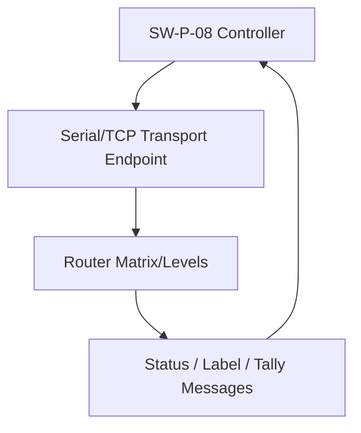

```yaml
---
report_id: probel-swp-08-broadcast-router-control
title: Technical Reference for Probel SW-P-08 General Remote Router Control Protocol
topic: Probel SW-P-08
report_version: 0.1.0
generated_date: 2026-08-27
source_access: unknown
source_cutoff: 2026-08-27
prompt_template: template-new-topic.md
prompt_template_version: 0.1.0
status: draft
---
```

## Executive Summary

Probel SW-P-08 (often written SWP08 or SW-P-08 General Remote) is a widely implemented router-control protocol originally developed by Pro-Bel/Snell for remote control and status monitoring of routing matrices in broadcast systems.[3][5][14] It is used over serial and TCP/IP transports by many router frames, control systems, and third‑party controllers to perform crosspoint (source–destination) switching, report connection status, and exchange label and tally information.[3][10][11][13][15]

The normative specification is the “General Remote Control Protocol (SW‑P‑08)” document from Pro‑Bel/Snell/Grass Valley, which defines a three‑layer protocol (physical, data link, and message/application)[14] and a standard method of interfacing remote devices to Pro‑Bel control systems.[5][14] This report collates known normative behaviors, common implementation patterns, and interoperability risks from manufacturer manuals and implementation notes; however, detailed message formats, command codes, and exact limits are only partially visible and remain **Unverified** where the primary document text is not accessible clause‑by‑clause.[14]

---

## 1. Scope and Boundaries

### 1.1 What SW-P-08 Standardizes

1. SW-P-08 defines a protocol for “general remote” control and status of a system of routing matrices.[5][15]  
2. The protocol provides a common and robust method of interfacing remote devices (controllers, automation systems, panels) to Pro‑Bel router control systems.[5][14]  
3. It consists of three levels:  
   - Physical layer  
   - Data link layer  
   - Message/application layer[14]  
4. The message/application layer includes the “general router switch commands commonly used by external controllers” to set and monitor crosspoint connections.[14][15]  
5. Implementations use SW‑P‑08 to:  
   - Set routes (connect a source to a destination)[3][10][11][15]  
   - Receive “connected” messages or equivalent status when routes are made by other controllers[10][11][15]  
   - Exchange label (human‑readable names) and tally (on‑air or selected state) information.[7][10][11]

### 1.2 What SW-P-08 Does Not Standardize (as far as visible sources)

1. SW-P-08 does not define the semantic meaning of router levels (e.g., video vs audio vs GPIO); levels are configured by each router/control system.[2][9][11]  
2. It does not standardize how matrices and levels map to physical I/O on specific products; this remains device‑specific.[3][9][11][13]  
3. It does not prescribe specific TCP/IP port numbers; implementations frequently use TCP port 2008 for SW‑P‑08 over IP, but this is explicitly noted as not fixed.[4]  
4. It does not define plant‑wide access control or user rights; Calrec Hydra2, Lawo, and other systems apply their own access policies to determine which sources/destinations are controllable.[3][9]  
5. It does not standardize GUI configuration flows, controller UI behavior, or automation logic; these are vendor and application dependent.[9][12][13]

### 1.3 Adjacent Standards, Profiles, and Related Protocols

1. Pro‑Bel also defined SW‑P‑02, another general remote protocol that can be used in parallel with SW‑P‑08, with per‑COM‑port selection between them.[7]  
2. Grass Valley documentation for “Router Control Protocols SW‑P‑88 Issue 4b” includes an introduction to the SW‑P‑08 General Remote Control Protocol and appears to serve as the normative description for SW‑P‑08.[14]  
3. Some systems refer to “General Switcher” vs “General Router” modes within a Probel/SW‑P‑08 interface; these are profile choices at the controller level, not distinct wire protocols.[9]  
4. Many broadcast control environments also support other router-control protocols (e.g., RollCall, SNMP, proprietary TCP APIs), and SW‑P‑08 is one option among several for interop.[4][6]

### 1.4 Source Access Limitations

1. The Pro‑Bel/Grass Valley SW‑P‑08 protocol document (General Remote) is referenced by manufacturer manuals and appears to define the full command set and framing, but only its introductory portion is visible in the accessible excerpt; clause‑level details of message formats and error handling remain **Unverified**.[14]  
2. Calrec, Grass Valley, Lawo, Studer, Ross, and Rascular provide product‑specific implementation notes that describe use of SW‑P‑08 over serial and TCP/IP, but these are secondary to the original SW‑P‑08 specification.[3][4][5][7][9][10][13][15]  
3. Some documents are freely downloadable PDFs, while others may require registration or a support account; the licensing and completeness of each source is **Unverified**.

---

## 2. Standards and Source Map

### 2.1 Primary Documents and Normative Role

The following table summarizes known standards and significant implementation references.

| Document | Version/date | Role | Source status | Clause-level visibility |
|---------|--------------|------|---------------|-------------------------|
| Pro‑Bel / Grass Valley “General Remote Control Protocol (SW‑P‑08)” within Router Control Protocols SW‑P‑88 Issue 4b[14] | Issue 4b (publication date Unverified) | Primary normative specification of SW‑P‑08 general remote router control protocol | Text access status Unverified (introduction visible; full command set may require product documentation access)[14] | Partial (introduction and high‑level architecture visible; detailed clauses Unverified)[14] |
| Pro‑Bel General Remote Protocol description in NEBULA User Guide[5] | v07 (document revision; exact date Unverified) | Confirms SW‑P‑08 as standard general remote protocol for Pro‑Bel control systems | Secondary (product manual referencing primary spec)[5] | Low (overview paragraphs only) |
| Calrec “SW‑P‑08 Router Remote Control”[3] | Issue/date Unverified (path suggests 2014) | Product‑specific implementation of SW‑P‑08 over TCP/IP for Hydra2 networks | Secondary implementation guidance[3] | Medium (connection behavior explained; message details limited) |
| Grass Valley MCM User Guide (General Remote Protocol SW‑P‑08)[15] | v01 (date Unverified) | Product‑specific serial implementation (38400, 8, N, 1) and route/status semantics | Secondary implementation guidance[15] | Medium (physical layer and route/status behavior described) |
| Studer “Pro‑Bel Implementation Notes V1.5”[7] | V1.5 (2008‑02 noted in filename; date Unverified) | Describes enabling SW‑P‑08 and SW‑P‑02 on COM ports, label transfer, and router control | Secondary implementation guidance[7] | Medium (config and use cases; protocol internals limited) |
| Lawo “Driver – Pro‑Bel SW‑P‑08 (Generic)”[10] | Knowledge base article (date Unverified) | Describes support for routing, label, and tally exchange; up to 16 layers per port | Secondary implementation guidance[10] | Low–Medium (feature set described) |
| Lawo Pathfinder Core PRO “Probel (SW‑P‑08) interface”[9] | Online documentation (date Unverified) | Explains TCP‑only implementation, matrix/level configuration, and router binding | Secondary implementation guidance[9] | Low–Medium |
| Ross MC1‑MK Probel SW‑P‑08 Setup Sheet[13] | MC1MKDR‑105 (date Unverified) | Describes serial/Ethernet connectivity and matrix/level selection for transitions | Secondary implementation guidance[13] | Low–Medium |
| Rascular Pro‑Bel SW‑P‑08 Implementation Notes[4] | Implementation notes (date Unverified) | Describes TCP port usage and support in Helm/RouteMaster | Secondary implementation guidance[4] | Low |
| Bitfocus Generic SW‑P‑08 module description[2] | Online module docs (date Unverified) | Provides typical limits (levels/sources/destinations) and notes extended command set | Secondary implementation guidance[2] | Low |
| Skaarhoj FlowGrid Third‑Party Control article[11] | Online wiki (date Unverified) | Explains matrix and level semantics, multi‑instance routing, and tally support | Secondary implementation guidance[11] | Low |
| GitHub “probel‑swp‑08” JavaScript implementation[1] | Repository (2022 commit; ongoing updates) | Shows practical IP implementation, including label length and married routing | Secondary, non‑normative implementation reference[1] | Low |

Source confidence: primary normative status is assigned only to the Pro‑Bel/Grass Valley protocol document; all others are secondary and potentially partial or product‑specific.[5][14]

---

## 3. Normative Requirements Catalog

> **Note:** Where the primary SW‑P‑08 document is not fully visible, requirements are inferred from manufacturer descriptions that explicitly treat SW‑P‑08 as “General Remote” and “standard method of interfacing,” but the underlying clauses remain **Unverified**.[5][14] Such items are marked accordingly.

### 3.1 Requirement Table

| ID | Requirement or rule | Applies to | Normative citation | Normative / best practice / assumed / unverified | Implementation implication | Confidence |
|----|---------------------|-----------|--------------------|--------------------------------------------------|----------------------------|-----------|
| SWP08-N-001 | Implementations of SW‑P‑08 shall treat it as the standard method of interfacing a remote device to a Pro‑Bel router control system for general remote control.[5][14] | Controllers, routers, automation systems | Pro‑Bel General Remote description (NEBULA User Guide)[5]; SW‑P‑08 protocol introduction (Issue 4b)[14] | Normative (per Pro‑Bel) | Use SW‑P‑08 for interoperable routing control and status with Pro‑Bel systems; other protocols are alternatives, not replacements.[5][14] | Medium (text is descriptive but clearly “standard”) |
| SWP08-N-002 | The SW‑P‑08 protocol consists of three levels: physical, data link, and message/application.[14] | All SW‑P‑08 implementations | SW‑P‑08 introduction (Issue 4b)[14] | Normative | Implementations must respect framing and behavior appropriate to each layer; e.g., physical transport, data link framing, and application commands.[14] | High |
| SWP08-N-003 | SW‑P‑08 controllers shall be able to route any assigned source to any assigned destination within the matrices they have been given access to.[3][5] | Controllers | Calrec SW‑P‑08 Router Remote Control[3]; NEBULA User Guide General Remote description[5] | Normative (controller behavior) | Controller designs should expose source/destination selection and crosspoint switching consistent with router capabilities and access control.[3][5] | Medium |
| SWP08-N-004 | Input sources and output destinations controlled via SW‑P‑08 shall be assigned unique SW‑P‑08 IDs within the router, which are mapped and labelled accordingly in the controller.[3] | Routers, controllers | Calrec SW‑P‑08 Router Remote Control[3] | Normative (for Calrec Hydra2) / Assumed-general | Implementations must maintain a stable mapping between router I/O and SW‑P‑08 IDs to preserve interoperability and correct routing.[3] | Medium |
| SWP08-N-005 | SW‑P‑08 General Remote shall provide both control and status of routing matrices, including routes set by other controllers.[5][15] | Routers, controllers | NEBULA User Guide[5]; MCM User Guide[15] | Normative | Routers must generate status/“connected” messages for crosspoints altered by any controller; controllers should listen for these messages.[5][15] | Medium |
| SWP08-N-006 | For MCM General Remote implementations, the physical layer uses a serial interface running at 38400 baud, 8 data bits, no parity, 1 stop bit (38400, 8, N, 1) on a 9‑pin D‑type connector.[15] | Grass Valley MCM controller, attached routers | MCM User Guide, General Remote Protocol (SW‑P‑08) section[15] | Normative (product‑specific) | Deployments with MCM must configure serial links exactly to 38400,8,N,1 and correct connector type; deviations risk loss of control.[15] | High |
| SWP08-N-007 | SW‑P‑08 routers and controllers shall support both route‑setting commands and “connected” or equivalent feedback messages to indicate current crosspoint state.[10][11][15] | Routers, controllers | Lawo SW‑P‑08 driver[10]; Skaarhoj FlowGrid SW‑P‑08 description[11]; MCM User Guide[15] | Normative (per product docs) / Assumed-general | Implementations must both transmit routing commands and parse status/tally messages; send‑only behavior is incomplete.[10][11][15] | Medium |
| SWP08-BP-001 | SW‑P‑08 over TCP/IP frequently uses TCP port 2008, but the port is not fixed by the protocol.[4] | Routers, controllers | Rascular SW‑P‑08 Implementation Notes[4] | Best practice (secondary) | Default to port 2008 where appropriate, but make port configurable and do not assume 2008 is mandated.[4] | High |
| SWP08-BP-002 | Up to 16 layers per communication port are commonly supported by generic SW‑P‑08 implementations; some extended command sets allow up to 256 levels.[2][10] | Router interfaces, controllers | Bitfocus Generic SW‑P‑08 module docs[2]; Lawo SW‑P‑08 driver[10] | Best practice / Unverified-normative | Design controllers to handle at least 16 levels and allow configuration for extended profiles supporting more; do not hard‑code limits without router confirmation.[2][10] | Medium |
| SWP08-BP-003 | Many implementations support label transfer and tally exchange via SW‑P‑08 in addition to routing control.[7][10][11] | Routers, controllers | Studer Pro‑Bel Implementation Notes[7]; Lawo SW‑P‑08 driver[10]; Skaarhoj FlowGrid article[11] | Best practice | Implement label and tally message handling to maximize interoperability, especially with broadcast control systems expecting feedback.[7][10][11] | High |
| SWP08-AS-001 | SW‑P‑08 levels are used to represent separate logical routing planes (e.g., video, audio, GPIO), and level selection in commands chooses which plane is affected.[2][9][11] | Controllers, routers | Bitfocus module docs (secondary)[2]; Pathfinder Core PRO interface docs[9]; Skaarhoj FlowGrid article[11] | Assumed (based on implementation patterns) | Provide flexible level configuration and document mappings between levels and physical signals; do not assume fixed semantics for level numbers.[2][9][11] | Medium |
| SWP08-UNV-001 | Maximum supported numbers of sources, destinations, and levels in the original SW‑P‑08 specification (beyond typical values such as 16 levels, 1024 sources/destinations) are Unverified.[2][14] | All implementations | Bitfocus module docs (limits)[2]; SW‑P‑08 spec reference[14] | Unverified | Implementations must query or configure limits per router; do not rely on module examples as normative maxima.[2][14] | High (on “Unverified” status) |

---

## 4. Engineering Model

### 4.1 Core Objects and Relationships

From the visible documentation and implementation notes, the following conceptual model is consistent across systems using SW‑P‑08.[3][5][9][10][11][13][15]

1. **Router Matrix**: A logical routing matrix managed by a router or control system, identified by a matrix number in SW‑P‑08 messages.[11][13]  
   - Some controllers can address multiple matrices (instances) using matrix IDs.[9][11][13]  

2. **Level (Layer)**: A logical routing plane within a matrix (e.g., video, audio, GPIO), selected by a level number.[2][9][11]  
   - Levels are understood by SW‑P‑08 and allow multi‑level routing over a single connection.[11]  
   - The maximum number of levels per port is commonly 16, with some extended implementations supporting up to 256.[2][10]  

3. **Source**: An input or internal signal that can be routed to destinations, assigned a unique SW‑P‑08 ID and label in the router.[3][5][11]  

4. **Destination**: An output or internal sink that can receive routed signals, also assigned a unique SW‑P‑08 ID and label.[3][5][11]  

5. **Route / Crosspoint**: A mapping of (matrix, level, destination) → source at a given time, maintained by the router and visible to controllers via routing and status messages.[3][10][11][15]  

6. **Label**: A short textual name associated with sources and destinations, typically exchanged via SW‑P‑08 messages.[1][7][10]  

7. **Tally / On‑air State**: Status information indicating whether a source/destination is considered “on‑air” or active, often reported via SW‑P‑08 tally messages.[10][11]  

8. **Controller**: A device or application using SW‑P‑08 to issue routing commands and parse status/label/tally messages (e.g., automation system, multiviewer panel, MC1‑MK master control).[4][9][11][13][15]  

9. **Transport Endpoint**: A serial port (e.g., 38400,8,N,1) or TCP socket (client or listener) through which SW‑P‑08 messages are exchanged.[3][4][9][13][15]

### 4.2 Data-Flow and Control-Flow Semantics

1. **Connection Establishment**  
   - Serial implementations configure a COM port with product‑specific parameters, such as MCM using 38400,8,N,1 on a 9‑pin connector.[7][15]  
   - TCP/IP implementations configure a client or listener endpoint, sometimes defaulting to port 2008 but allowing configuration.[3][4][9][13]  

2. **Routing Commands**  
   - Controllers send routing messages specifying matrix, level, destination, and source to set routes.[3][9][11][13]  
   - Some implementations support “married” routing, where all levels from one source are routed to a destination in a single operation (e.g., one video + multiple audio).[1] (secondary)  

3. **Status / Connected Messages**  
   - Routers send “connected” or equivalent status messages over SW‑P‑08 to indicate crosspoints that have been set, whether by the local controller or by other controllers.[10][11][15]  
   - Controllers listen to these messages to maintain an up‑to‑date model of router state.[10][11][15]  

4. **Label Exchange**  
   - Many SW‑P‑08 implementations support commands to retrieve or update labels for sources and destinations.[1][7][10]  
   - Some implementations restrict label length (e.g., up to 8 characters) in practice.[1] (secondary; Unverified‑normative)  

5. **Tally Exchange**  
   - Tally messages allow controllers to “read back on‑air state” and other router statuses via SW‑P‑08.[10][11]  
   - These may be optional at the protocol level but are commonly implemented in broadcast control systems.[10][11]  

6. **Multi‑Instance and Multi‑Level Routing**  
   - Matrix numbers select which router instance or logical matrix is being addressed.[9][11][13]  
   - Level numbers select which level within that matrix is affected by routing or tally messages.[2][9][11]  
   - A single TCP connection or serial link can address multiple FlowGrid instances or routers by using distinct matrix IDs.[11]

### 4.3 Boundary Between Standards-Derived Behavior and Implementation Policy

1. The presence of physical, data link, and message/application layers is normative to the SW‑P‑08 spec.[14]  
2. Specific physical parameters (baud rate, connector type) are product‑specific; for example, MCM’s serial settings are normative for that product but not for all SW‑P‑08 implementations.[7][15]  
3. The semantics of matrix, level, source, destination, label, and tally are broadly aligned across implementations but their numerical ranges and mapping to physical signals are implementation policy.[2][3][9][10][11]  
4. TCP port number, client vs listener roles, and reconnection strategies are implementation policy, with SW‑P‑08 only defining the message layer behavior.[3][4][9][13]  
5. Married routing, label length limits, and other enhanced features in specific libraries are implementation extensions, not proven normative requirements.[1][2]

### 4.4 Simple Flow Diagram



This diagram reflects the general pattern of controllers sending SW‑P‑08 commands over serial/TCP to routers and receiving status, label, and tally messages back.[3][4][9][10][11][15]

---

## 5. Formulas, Calculations, and Worked Examples

> **Important:** The primary SW‑P‑08 specification’s detailed numeric limits and message formats are not fully visible.[14] All formulas below are derived from secondary implementation references and are therefore **Assumed** or **Unverified** for the original standard.

### 5.1 Formula and Assumption Register

| Calculation name | Formula or method | Inputs and units | Source citation | Normative or assumed | Worked example available | Confidence |
|------------------|------------------|------------------|-----------------|----------------------|--------------------------|-----------|
| Typical base-profile maximum levels | \( L_{\text{max,base}} = 16 \) | \(L_{\text{max,base}}\): maximum supported levels per communication port (dimensionless) | Bitfocus SW‑P‑08 module docs[2]; Lawo SW‑P‑08 driver (up to 16 layers per port)[10] | Assumed (implementation pattern; normative status Unverified) | Yes (Example 5.2.1) | Medium |
| Typical extended-profile maximum levels | \( L_{\text{max,ext}} = 256 \) | \(L_{\text{max,ext}}\): maximum supported levels per communication port (dimensionless) | Bitfocus module docs (extended command set)[2] | Assumed (secondary) | Yes (Example 5.2.1) | Low–Medium |
| Typical base-profile maximum sources/destinations | \( S_{\text{max,base}} = D_{\text{max,base}} = 1024 \) | \(S_{\text{max,base}}\): max sources; \(D_{\text{max,base}}\): max destinations (dimensionless) | Bitfocus SW‑P‑08 module docs[2] | Assumed (secondary) | Yes (Example 5.2.2) | Low–Medium |
| Typical extended-profile maximum sources/destinations | \( S_{\text{max,ext}} = D_{\text{max,ext}} = 65535 \) | \(S_{\text{max,ext}}\), \(D_{\text{max,ext}}\): max sources/destinations (dimensionless) | Bitfocus SW‑P‑08 module docs[2] | Assumed (secondary) | Yes (Example 5.2.2) | Low–Medium |
| Label length constraint in one implementation | \( C_{\text{label}} = 8 \) characters | \(C_{\text{label}}\): maximum label length in characters | GitHub probel‑swp‑08 (up to 8 characters)[1] | Assumed (implementation-specific; Unverified-normative) | Yes (Example 5.2.3) | Low |

### 5.2 Worked Examples

#### 5.2.1 Levels Configuration Example (Assumed)

A controller must be configured for a router where the vendor states that it uses base SW‑P‑08 commands only.

Assumptions from secondary sources:[2][10]  
- Base profile supports up to 16 levels: \( L_{\text{max,base}} = 16 \).[2][10]  

If the router uses 4 levels (e.g., 1 video, 3 audio groups), the controller can safely allocate:

\[
L_{\text{used}} = 4 \leq L_{\text{max,base}} = 16
\] [2][10]

If an extended-profile router claims support for 64 levels, the assumption is:

\[
L_{\text{used}} = 64 \leq L_{\text{max,ext}} = 256
\] [2]

These calculations show capacity planning but remain **Unverified** relative to the original SW‑P‑08 specification.[2][14]

#### 5.2.2 Source/Destination Capacity Example (Assumed)

For a router exposing 800 sources and 600 destinations using base commands:[2]

Assumed base maximums:[2]  
\[
S_{\text{max,base}} = D_{\text{max,base}} = 1024
\] [2]

Check:

\[
800 \leq S_{\text{max,base}} = 1024
\] [2]

\[
600 \leq D_{\text{max,base}} = 1024
\] [2]

If a large router exposes 40,000 sources using an extended command set:

\[
S_{\text{used}} = 40000 \leq S_{\text{max,ext}} = 65535
\] [2]

These are capacity checks derived from Bitfocus docs and must be validated per actual router documentation.[2]

#### 5.2.3 Label Length Example (Implementation Specific)

In one JavaScript SW‑P‑08 implementation, labels are limited to 8 characters.[1]

Assumed constraint:

\[
C_{\text{label}} = 8 \text{ characters}
\] [1]

If a human-readable name “CAMERA_01_MAIN” (15 characters) must be represented, a truncated label might be:

- “CAM01MN” (7 characters) or “CAM01M01” (8 characters) (controller design choice, not specified by SW‑P‑08)[1]

Because label length is implementation-specific and the original specification is not visible, this behavior is **Unverified** relative to SW‑P‑08 normativity.[1][14]

---

## 6. Interoperability Risks and Ambiguity Register

### 6.1 Risk and Ambiguity Table

| Risk or ambiguity | Evidence | Normative status | Failure symptom | Mitigation or modeling rule |
|-------------------|----------|------------------|----------------|-----------------------------|
| Base vs extended command set limits (levels, sources, destinations) | Bitfocus module docs distinguish 16/1024/1024 base vs 256/65535/65535 extended.[2] Primary SW‑P‑08 limits not visible.[14] | Unverified (spec limits unknown) | Controller assumes extended limits but router only supports base, causing out‑of‑range commands or silent failures.[2][14] | Treat capacity figures from modules as defaults only; always obtain limits from the router or control system documentation and enforce them in controller configuration.[2][14] |
| TCP port number ambiguity | Rascular notes that SW‑P‑08 over IP frequently uses TCP port 2008 but this is not fixed.[4] | Best practice (port choice is implementation policy) | Controller hard‑codes port 2008 while router listens on a different port, leading to failed connections.[4] | Make the TCP port configurable and default to values recommended by specific router vendors; do not assume 2008 is mandated.[4] |
| Serial line parameters variability | MCM uses 38400,8,N,1 and a 9‑pin D connector.[15] Studer notes 115200,8,N,1 for some ports.[7] Other products may use different speeds.[7][15] | Product-specific normative; ambiguous across implementations | Misconfigured baud rate/parity causing framing errors and lost control.[7][15] | Always use serial parameters specified in each product manual, not values from other devices; expose serial configuration in controller software.[7][15] |
| Matrix and level numbering conventions | Skaarhoj describes matrix selecting instance and level selecting routing plane.[11] Pathfinder and Ross also use matrix/level parameters.[9][13] Original spec’s numbering rules are Unverified.[14] | Assumed; normative rules Unverified | Controller misinterprets matrix or level mapping, resulting in routes being made on the wrong instance or level.[9][11][13][14] | Require explicit configuration of matrix and level mappings per router; do not rely on hard‑coded assumptions about numeric ranges or meanings.[9][11][13][14] |
| Label and tally support variability | Lawo driver supports label and tally exchange.[10] Studer and Skaarhoj note label transfer and tally messages.[7][11] Some routers may implement routing only.[4][10][11] | Optional features (normative status Unverified) | Loss of on‑air status feedback or incorrect button labels in controllers that assume label/tally support.[4][7][10][11] | Implement routing regardless of label/tally support; detect and adapt to routers that do not respond to label/tally commands.[4][7][10][11] |
| Married routing semantics | GitHub implementation supports “married” routing (routing all levels from one source to a destination).[1] Original spec’s definition is not visible.[14] | Assumed implementation extension | Controller expects married routing but router does not support it, causing partial or failed multi‑level routing.[1][14] | Provide both single-level routing and optional married routing features; test on each router to confirm support and behavior.[1][14] |
| SW‑P‑02 vs SW‑P‑08 coexistence | Studer notes that SW‑P‑02 and SW‑P‑08 can be used simultaneously on separate COM ports.[7] | Implementation guidance | Controller connects to a COM port configured for SW‑P‑02 while expecting SW‑P‑08 messages, causing protocol mismatch.[7] | Verify protocol type per port (SW‑P‑02 vs SW‑P‑08) and ensure controllers use matching protocol; document port assignments.[7] |
| Specification opacity (command set, error handling) | SW‑P‑08 spec referenced in Issue 4b but only intro visible.[14] Product manuals describe behavior but not full details.[3][5][7][10][15] | Unverified (core spec) | Divergent implementations of error handling, unsupported commands, or message framing; subtle incompatibilities between vendors.[3][5][7][10][14][15] | Treat all command sets and error behavior as vendor-specific unless explicitly documented; perform protocol‑level logging and conformance testing against each target router.[3][5][7][10][14][15] |

---

## 7. Implementation Guidance

> All guidance in this section is **Implementation Guidance** or **Best Practice**, not guaranteed normative SW‑P‑08 behavior, and must be validated against specific router documentation.

### 7.1 Recommended Fields and Checks for SW-P-08 Agents

For any AI‑assisted or software‑based SW‑P‑08 implementation (controller, gateway, test tool), the following fields and behaviors are recommended based on widely used patterns.[2][3][4][7][9][10][11][13][15]

1. **Connection Configuration**  
   - Transport: serial or TCP.  
   - Serial parameters: per‑device (e.g., 38400,8,N,1 for MCM; 115200,8,N,1 for Studer configurations).[7][15]  
   - TCP parameters: IP address/host, port (default according to device; often 2008, but configurable).[3][4][9][13]  
   - Role: client or listener as supported (Pathfinder allows both).[9]  

2. **Routing Command Fields**  
   - Matrix ID: integer identifying router matrix.[9][11][13]  
   - Level ID: integer identifying routing plane.[2][9][11]  
   - Destination ID: integer SW‑P‑08 ID of destination.[3][11]  
   - Source ID: integer SW‑P‑08 ID of source.[3][11]  

3. **Status Handling**  
   - Parse “connected” messages or equivalent to update internal routing table.[10][11][15]  
   - Maintain per‑destination current source per matrix/level.[3][10][11]  

4. **Label and Tally**  
   - Implement label request and update commands where supported.[7][10][11]  
   - Store labels per source/destination with awareness of implementation-specific length limits (e.g., 8 characters).[1][7][10]  
   - Parse tally messages to reflect on‑air state on control surfaces.[10][11]  

5. **Capabilities and Limits**  
   - Query or configure maximum sources, destinations, and levels per router; do not rely solely on generic module defaults.[2][9][10]  
   - Provide validation to prevent out‑of‑range IDs being transmitted.[2][9][10]  

6. **Error Handling and Logging**  
   - Log all incoming/outgoing SW‑P‑08 messages for debugging and conformance testing.[3][4][7][10][15]  
   - Implement timeouts and reconnect logic for TCP, and framing error detection for serial.[4][9][15]  

### 7.2 Modeling Unverified or Externally Supplied Values

Since key SW‑P‑08 details (such as exact command codes and maximum IDs) are Unverified, implementations should:[2][14]

1. Treat router‑reported capacities and configuration data as authoritative, overriding generic assumptions.[2][9][10]  
2. Record and model matrix/level mappings from router configuration rather than inferring semantics.[9][11][13]  
3. Annotate internal schemas with confidence levels (e.g., “Unverified” for assumptions, “Product‑specific” for manual‑derived values).[2][3][14]  
4. Keep protocol parsing modules isolated so they can be updated if more complete SW‑P‑08 documentation becomes available.[3][14]

### 7.3 Example Agent Context Fields

An AI‑assisted engineering agent interacting with SW‑P‑08 could maintain the following fields for each connection (implementation guidance).[2][3][4][9][10][11][13][15]

- `transport_type`: `"serial"` or `"tcp"`.[3][4][9][15]  
- `serial_baud`, `serial_data_bits`, `serial_parity`, `serial_stop_bits`: product‑specific.[7][15]  
- `tcp_host`, `tcp_port`: configured; default per product (e.g., often 2008 but configurable).[3][4][9][13]  
- `matrix_ids`: list of integer matrices in use.[9][11][13]  
- `level_ids`: list of supported levels per matrix, with semantic labels (e.g., `"video"`, `"audio1"`).[2][9][11]  
- `source_ids`, `destination_ids`: sets of SW‑P‑08 IDs per matrix/level.[3][11]  
- `label_map`: mapping from IDs to labels, with max length constraints per device.[1][7][10]  
- `tally_state`: per‑destination or per‑source on‑air state from tally messages.[10][11]  
- `capacity_limits`: `max_sources`, `max_destinations`, `max_levels` per router, with origin and confidence tags.[2][9][10][14]

---

## 8. Validation Checklist

The following checklist is suitable for validating a SW‑P‑08 implementation against available documentation. All items are **Implementation Guidance** and should be verified per device.[2][3][4][7][9][10][11][13][15]

1. **Transport Setup**  
   1. Confirm serial parameters match device manual (e.g., MCM: 38400,8,N,1; Studer: as specified).[7][15]  
   2. Confirm TCP host and port match router configuration (e.g., recommended port 2008 where used).[3][4][9][13]  
   3. Verify client/listener role matches router expectations (Pathfinder allows both).[9]

2. **Matrix/Level Configuration**  
   1. Verify matrix IDs used by the controller correspond to router matrix definitions.[9][11][13]  
   2. Verify level IDs and their semantic meanings (video, audio, etc.) against router documentation.[2][9][11]  
   3. Confirm that controller does not send commands to matrices/levels that the router does not expose.[2][9][11]

3. **Routing Behavior**  
   1. Send a test route command (source → destination) and confirm router changes state.[3][10][11][15]  
   2. Confirm that status/“connected” messages are received reflecting that route change.[10][11][15]  
   3. Change a route from another controller and verify that this implementation receives and processes corresponding status messages.[5][10][11][15]

4. **Labels and Tally**  
   1. Request labels for a subset of sources/destinations and confirm the router responds if documented as supporting label transfer.[7][10][11]  
   2. Check that label length constraints are respected for the specific implementation (e.g., up to 8 characters where documented).[1][7][10]  
   3. Verify that tally messages are correctly interpreted to reflect on‑air state in the UI, if the router advertises tally support.[10][11]

5. **Capacity and Limits**  
   1. Ensure controller configuration values for maximum sources, destinations, and levels do not exceed router advertised limits.[2][9][10]  
   2. Confirm that sending out‑of‑range IDs results in predictable errors or no‑ops, and document observed behavior.[2][14]

6. **Protocol Selection and Coexistence**  
   1. Confirm each COM port is configured for the correct protocol (SW‑P‑08 vs SW‑P‑02) as per Studer notes.[7]  
   2. Ensure controllers connecting to SW‑P‑08 ports do not inadvertently use SW‑P‑02 framing.[7]

7. **Logging and Diagnostics**  
   1. Enable logging of SW‑P‑08 messages for diagnostic purposes.[3][4][7][10][15]  
   2. Review logs to ensure message framing, IDs, and sequences match expectations derived from product manuals.[3][5][7][10][15]

---

## 9. Open Questions / Unverified Items

The following items are explicitly **Unverified** due to limited visibility into the primary SW‑P‑08 specification.[14]

1. **Exact Message Formats and Command Codes**  
   - Full definitions of SW‑P‑08 routing commands, label/tally messages, and acknowledgements in the primary spec.[14]  
   - Framing details at data link layer (e.g., start/end bytes, checksums) for general use, beyond product-specific examples.[14][7][15]

2. **Normative Maximum IDs and Levels**  
   - Whether the standard itself defines explicit maximum numbers for levels, sources, destinations (e.g., 16 vs 256 levels; 1024 vs 65535 IDs).[2][14]  
   - Any specific reserved ID ranges or special matrix/level values.[14]

3. **Error Handling and Unsupported Commands**  
   - Normative behavior when routers receive out‑of‑range IDs or unrecognized commands.[14]  
   - Requirements for retry, timeout, or error reporting in the standard.[14]

4. **Label and Tally Normativity**  
   - Whether label and tally exchange are mandatory or optional features in SW‑P‑08 itself versus product-specific extensions.[7][10][11][14]  
   - Normative limits on label length and character set.[1][14]

5. **Married Routing Standardization**  
   - Whether “married” routing is defined in SW‑P‑08, or solely in certain implementations.[1][14]

6. **TCP/IP Transport Specification**  
   - Any normative guidance on TCP port, connection direction (client vs server), or keep‑alive behavior in the original SW‑P‑08 spec.[3][4][9][14]

7. **Security and Access Control**  
   - Whether SW‑P‑08 includes any native security mechanisms or authentication, or relies entirely on network and router policies.[3][9][14]

---

## 10. Sources

> All sources below are used as cited in the report; none are treated as fully authoritative beyond what is explicitly stated.

1. GitHub “probel‑swp‑08” – JavaScript implementation of Probel routing protocol 8, describing IP transport, label handling (up to 8 characters), and married routing features.[1]  
2. Bitfocus “Generic – SW‑P‑08” – Module documentation indicating SW‑P‑08 is implemented by many broadcast routers, with typical limits (up to 256 levels, 65535 sources/destinations; base profile 16 levels, 1024 sources/destinations).[2]  
3. Calrec “SW‑P‑08 Router Remote Control” – PDF describing SW‑P‑08 (“General Remote”) for Hydra2, mapping unique SW‑P‑08 IDs for sources/destinations, and TCP/IP control connection behavior.[3]  
4. Rascular “Pro‑Bel SW‑P‑08 Implementation Notes” – Notes on SW‑P‑08 use in Helm/RouteMaster, including typical TCP port 2008 usage and protocol support.[4]  
5. Grass Valley NEBULA User Guide – Section on Pro‑Bel General Remote Control Protocol (SW‑P‑08), stating its role as a common method of interfacing Pro‑Bel router control systems.[5]  
6. Router controllers and panels features list (SW‑P‑08 overview) – Secondary list mentioning SW‑P‑08 in/out and profiles.[6]  
7. Studer “Pro‑Bel Implementation Notes V1.5” – Document explaining SW‑P‑02 and SW‑P‑08 coexistence, COM port configuration, and label/router control use.[7]  
8. Calrec Impulse Installation Manual – Notes on serial data being carried via TCP/IP connections in Calrec systems (contextual).[8]  
9. Lawo “Interface – AXIA Pathfinder Core PRO (Probel SW‑P‑08)” – Documentation of TCP‑only SW‑P‑08 implementation, client/listener roles, matrix/level configuration, and router assignment.[9]  
10. Lawo “Driver – Pro‑Bel SW‑P‑08 (Generic)” – Knowledge base article describing routing, label, and tally support via SW‑P‑08, and up to 16 layers per communication port.[10]  
11. SKAARHOJ “Third Party Control (FlowGrid)” – Article describing SW‑P‑08 as Snell/Pro‑Bel router‑control protocol used by many systems, with matrix and level semantics and routing/tally support.[11]  
12. MOG “Probel SWP08” – Product documentation for video router configuration using SW‑P‑08 (UI‑focused, limited protocol detail).[12]  
13. Ross Video “MC1‑MK and Probel SW‑08 Setup Sheet” – Setup instructions for communicating with MC1‑MK via Probel SW‑P‑08 over serial/Ethernet, including matrix and level settings.[13]  
14. Grass Valley “Router Control Protocols SW‑P‑88 Issue 4b” – Document containing an introduction to SW‑P‑08 General Remote Control Protocol, stating its purpose, command coverage, and three‑layer structure (physical, data link, message/application).[14]  
15. Grass Valley “MCM User Guide” – Section on General Remote Protocol (SW‑P‑08), describing physical serial parameters (38400,8,N,1) and its use for real‑time routing control and status over long cable runs.[15]