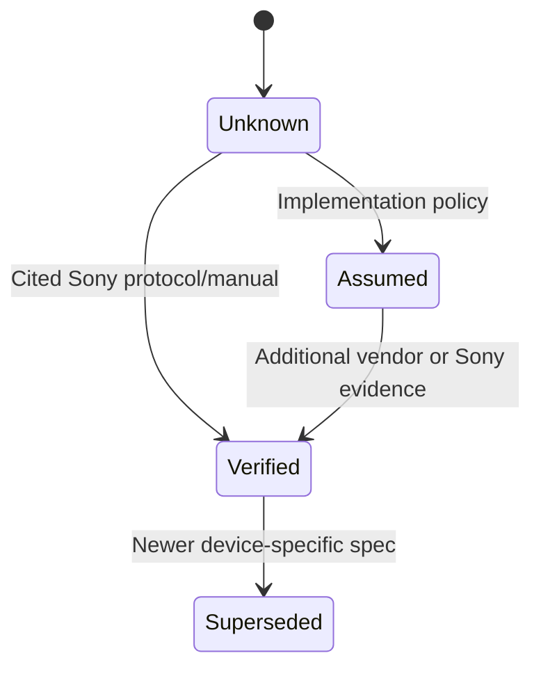

```yaml
---
report_id: visca-control-broadcast-engineering-reference
title: VISCA Control Technical Reference for Broadcast Engineering
topic: VISCA Control
report_version: 0.1.0
generated_date: 2026-08-27
source_access: public
source_cutoff: 2026-06-01
prompt_template: template-new-topic.md
prompt_template_version: 0.1.0
status: draft
---
```

## 1. Executive Summary

VISCA is a Sony-developed camera control protocol, originally for consumer and professional block/remote cameras, and widely used for pan–tilt–zoom (PTZ) control in broadcast and industrial contexts.[1][2][8]  
The protocol exists in multiple transport profiles: an RS‑232/RS‑422 serial form, and later VISCA over IP using IPv4/UDP on a well-known port, with model-specific variations and constraints.[3][8][10][15]

For RS‑232 VISCA, Sony’s EVI series control specification defines a message-based protocol with a header carrying sender and receiver addresses, a fixed terminator byte, and a message body composed of mode, category, and parameter bytes, operating typically at 9600 bps, 8 data bits, 1 start bit, 1 stop bit, and no parity.[3]  
For VISCA over IP, Sony camera manuals define UDP transport on port 52381 with IPv4 and Ethernet interfaces and allow up to five controllers to connect simultaneously over LAN to a single camera.[10][15]

There is no single publicly consolidated “VISCA standard” for all devices; instead, each Sony camera family and many third-party devices publish their own VISCA command sets and capabilities, creating interoperability risks across models, transports, and vendors.[3][5][12]  
Broadcast engineering implementations must therefore treat Sony camera manuals and the EVI series VISCA specification as primary normative sources and vendor command lists as secondary, and explicitly model unverified behaviors such as timing, throughput, and error handling.[3][5][8]

---

## 2. Scope and Boundaries

### 2.1 What VISCA Standardizes (Per Available Sources)

VISCA defines a controller–peripheral communication model in which a controller issues commands and receives responses, and peripheral devices (cameras) execute control functions like power, zoom, pan–tilt, presets, and configuration using structured command messages.[3][5][8]  
Sony documentation describes VISCA as a protocol for controlling camcorders and remote cameras, using RS‑232-based communication and, in later products, VISCA over IP.[2][8][10][15]

The EVI series VISCA/RS‑232C control specification standardizes:  
- Serial communication parameters (bit rate, framing, parity) for RS‑232C.[3]  
- Message framing: header (addresses), message body (mode, category, parameters), terminator byte.[3]  
- Maximum message length.[3]  
- Certain message-level constraints, such as a reserved bit value in the message part.[3]

Sony camera manuals standardize, per model:  
- The maximum number of VISCA devices on a serial bus (up to seven peripherals per controller in RS‑232 implementations).[2][8]  
- The RS‑232 physical and data-link parameters available (e.g., 9600 bps and 38400 bps profiles).[8]  
- VISCA over IP transport parameters: IPv4, UDP, Ethernet speeds, and port number.[10][15]  
- The maximum number of simultaneous IP controllers (up to five).[10][15]  
- Selected VISCA command packets and their functions (e.g., address setting or camera power toggling).[4][5]

### 2.2 What VISCA Does Not Explicitly Standardize (Per Available Sources)

The available public VISCA sources do **not** provide a unified, device-independent normative specification for:  
- End-to-end timing behavior (e.g., command processing latency, inter-command spacing).[3][8][10][15]  
- Error reporting semantics beyond basic protocol framing (e.g., standardized error codes across all devices).[3][5]  
- Transport-independent behavior (e.g., whether all RS‑232 commands must map identically to VISCA over IP).[10][15]  
- Detailed IP session management, retries, and congestion behavior (e.g., loss recovery, keepalives).[10][15]  
- Security or authentication mechanisms for VISCA over IP.[10][15]  

These omissions must be treated as **Unverified** relative to the global “VISCA protocol,” and behavior should be derived on a per-device basis from individual manuals.[3][5][8]

### 2.3 Adjacent Protocols and Common Misconceptions

Sony and secondary sources note that VISCA is often compared to other PTZ control protocols such as Pelco, and is “de facto” standard for block cameras in some markets, but this status is descriptive rather than normative.[1][12]  
Sony support articles highlight that not all cameras supporting PTZ can be controlled by VISCA RS‑232 or RS‑422, and some models require VISCA over IP or different interfaces (e.g., RS‑422 or LAN), which contradicts assumptions that VISCA serial support is universal.[6][9][13]

### 2.4 Source Access Limitations

- The EVI series “VISCA/RS‑232C CONTROL PROTOCOL” specification is available publicly but only partially visible in the excerpt, limiting clause-level detail beyond the snippet.[3]  
- Several Sony camera manuals are public PDF documents with full command tables, but this report relies only on the visible portions referenced.[2][4][8][10][14][15]  
- Vendor-specific VISCA command sets (e.g., AVer, Marshall) are public and include extensive command examples, but they represent implementation-specific extensions and not Sony-wide normative content.[5][7]  
- Some mirrored or translated documents (e.g., Scribd copies of Sony manuals) may have access or completeness limitations and are treated as secondary references for concepts already visible in primary Sony documents.[11]

---

## 3. Standards and Source Map

### 3.1 Primary and Secondary Documents

| Document | Version/date (visible) | Role | Source status | Clause-level visibility |
|---------|-------------------------|------|---------------|-------------------------|
| VISCA™/RS‑232C CONTROL PROTOCOL (EVI series) – Sony | Date not visible in snippet[3] | Primary RS‑232 VISCA protocol specification for EVI cameras | Public PDF[3] | Partial (message structure, serial params, terminator, max length clipped)[3] |
| Sony Color Video Camera manual (F1621001M / SRG-XB25 family) | Date not visible in snippet; Sony manual[2][8] | Primary device manual defining VISCA RS‑232 parameters and topology | Public PDF[2][8] | Partial (RS‑232 parameters, device count, conceptual controller/peripheral definitions)[8] |
| Sony Color Video Camera manual (E0421001M) – VISCA over IP | Date not visible; Sony manual[10] | Primary VISCA over IP transport specification for specific camera | Public PDF[10] | Partial (interface types, IPv4/UDP, port, controller count)[10] |
| Sony SRG-X40UH/H40UH manual (50462901M) – VISCA over IP | Date not visible; Sony manual[15] | Primary VISCA over IP transport specification for other camera family | Public PDF[15] | Partial (same transport parameters as E0421001M, different pages)[15] |
| Sony SRG-A40/A12 manual (50531551M) | Last updated 2024-09-15[14] | Primary camera manual; contains broadcast VISCA header value | Public PDF[14] | Partial (header 88H mention; broader command context not in snippet)[14] |
| Sony Color Video Camera manual (C2091001M) – VISCA commands | Date not visible; Sony manual[4] | Primary command examples (including address setting packet) | Public PDF[4] | Partial (some command packets only)[4] |
| Sony support article: “Can I control the camera with VISCA RS‑232 or RS‑422?” | 2022-12-01; updated 2025-12-11[6][9] | Official support clarification of supported VISCA profiles per model | Public web article[6][9] | Full for the short text (restrictions on RS‑232/RS‑422, VISCA over IP guidance)[6][9] |
| Sony support article: “Can I control the camera with the VISCA RS‑232 protocol?” | Updated 2026-06-01[13] | Official support clarification for specific model (use RS‑422 or LAN instead) | Public web article[13] | Full for the short text (RS‑232 disallowed)[13] |
| Wikipedia: “VISCA (protocol)” | Last updated 2026-05-18[1] | Secondary descriptive reference about VISCA history and default RS‑232 parameters | Public wiki[1] | Full article, non-normative[1] |
| Skoopia blog post “VISCA, Sony VISCA, PELCO” | 2022-01-17[12] | Secondary overview of VISCA usage and RS‑232/RS‑485 implementations | Public blog[12] | Full article, non-normative[12] |
| AVer VISCA command set PDF | Last updated 2025-05-25[5] | Vendor-specific VISCA command list for PTZ cameras | Public PDF[5] | Partial (visible commands and semantics, vendor-specific)[5] |
| Marshall RS‑232 Commands PDF | Last updated 2025-07-03[7] | Vendor-specific RS‑232 VISCA-like command list | Public PDF[7] | Partial (visible commands)[7] |
| Scribd mirror of F1621001M (basic tutorial) | 2025-05-21[11] | Secondary copy of Sony manual, confirm terminology for VISCA equipment | Public, may require account[11] | Partial; overlapping with primary manual[11] |

Source confidence ranking: Sony protocol specification and camera manuals are treated as **high-confidence normative**; Sony support articles as **high-confidence clarifications** but device-specific; Wikipedia and blogs as **medium-confidence descriptive**; vendor command lists as **medium-confidence implementation-specific**.[1][2][3][5][8][12]

---

## 4. Normative Requirements Catalog

IDs use the prefix `VISCA-R-` for clarity.

### 4.1 Requirements Table

| ID | Requirement or rule | Applies to | Normative citation | Normative / best practice / assumed / unverified | Implementation implication | Confidence |
|----|---------------------|-----------|--------------------|--------------------------------------------------|----------------------------|-----------|
| VISCA-R-001 | RS‑232C interface for EVI series cameras shall use 9600 bps, 8 data bits, 1 start bit, 1 stop bit, and no parity. | Serial controllers and EVI-series cameras using RS‑232C | Sony EVI VISCA/RS‑232C spec, communication speed and framing[3] | Normative | Serial ports must be configured exactly to these parameters for baseline VISCA operation on EVI series devices.[3] | High |
| VISCA-R-002 | Communication in VISCA RS‑232C shall begin with a header comprising sender address and receiver address, followed by a message body, and end with a terminator byte. | Serial controllers and VISCA-capable cameras | Sony EVI VISCA/RS‑232C spec, header and terminator description[3] | Normative | Implementations must construct and parse frames as header + message + terminator; processing incomplete or malformed frames is non-conforming.[3] | High |
| VISCA-R-003 | The terminator byte in VISCA RS‑232C messages is fixed to FFh and the controller shall check this value to terminate communication. | Serial controllers | Sony EVI VISCA/RS‑232C spec, terminator requirement[3] | Normative | Controllers must validate that the final byte of a received message is 0xFF before considering the message complete.[3] | High |
| VISCA-R-004 | The VISCA message body comprises communication mode (2 bytes), category code (2 bytes), and parameters, with a maximum message length of 14 bytes. | Serial controllers and cameras implementing EVI-series VISCA | Sony EVI VISCA/RS‑232C spec, message part composition and length[3] | Normative | Implementations must restrict message length to 14 bytes and interpret the first four bytes of the message body as mode and category.[3] | High |
| VISCA-R-005 | Bit 15 (high-order bit in the defined message part field) shall be 0 in VISCA messages. | Serial controllers and cameras implementing EVI-series VISCA | Sony EVI VISCA/RS‑232C spec, bit constraint[3] | Normative | Implementations must ensure this reserved bit remains 0 when constructing messages and treat violations as protocol errors.[3] | High |
| VISCA-R-006 | VISCA RS‑232 communication uses the RS‑232 standard and allows up to seven peripheral devices, including the camera, to be connected to a single controller. | Controllers and VISCA-equipped cameras (e.g., SRG-XB25) | Sony Color Video Camera manual (SRG-XB25), RS‑232 topology[2][8] | Normative | Topology design must not exceed seven VISCA peripheral addresses per controller on the RS‑232 chain.[2][8] | High |
| VISCA-R-007 | In VISCA terminology, the command-issuing device is called the controller, and devices receiving commands (e.g., SRG-XB25 camera) are called peripheral devices. | All VISCA participants | Sony Color Video Camera manual, VISCA terminology[8] | Normative | System documentation and design should use this role terminology consistently.[8] | High |
| VISCA-R-008 | RS‑232 parameters for certain Sony cameras supporting VISCA shall be 9600 bps or 38400 bps, 8 data bits, 1 start bit, and 1 stop bit. | Controllers and specific Sony cameras (e.g., SRG-XB25) | Sony Color Video Camera manual, RS‑232 parameter table[8] | Normative (device-specific) | Controllers must negotiate or configure one of the supported bit rates and match framing to the camera’s manual.[8] | High |
| VISCA-R-009 | For VISCA over IP, the interface shall be RJ‑45 with support for 10BASE‑T/100BASE‑TX/1000BASE‑T and IPv4 over UDP. | Controllers and cameras supporting VISCA over IP (E0421001M, SRG-X40UH/H40UH) | Sony camera manuals, VISCA over IP communication specifications[10][15] | Normative (device-specific) | Network and controllers must support Ethernet and IPv4/UDP with these physical capabilities.[10][15] | High |
| VISCA-R-010 | VISCA over IP communication shall use UDP transport over IPv4 and a camera port address of 52381. | Controllers and cameras supporting VISCA over IP | Sony camera manuals, port and protocol specification[10][15] | Normative (device-specific) | Controllers must send and receive VISCA over IP messages using UDP to port 52381 on the camera’s IPv4 address.[10][15] | High |
| VISCA-R-011 | Up to five controllers can be connected simultaneously to a camera via VISCA over IP. | VISCA over IP controllers and cameras | Sony camera manuals, controller count specification[10][15] | Normative (device-specific) | System design must not exceed five concurrent controllers per camera on the IP profile.[10][15] | High |
| VISCA-R-012 | In broadcast use cases for specified Sony cameras, the VISCA header value shall be 88h in hexadecimal. | Controllers generating VISCA command packets in broadcast contexts | Sony SRG-A40/A12 manual, broadcast header specification[14] | Normative (device- and context-specific) | Controllers must set the header byte to 0x88 for broadcast messages on these cameras.[14] | High |
| VISCA-R-013 | Certain Sony cameras cannot be controlled with VISCA RS‑232 or RS‑422 protocols and must instead use VISCA over IP. | Controllers and specified camera models | Sony support article (VISCA RS‑232/RS‑422 not supported; use VISCA over IP)[6][9] | Normative (device-specific support policy) | Implementations must check camera documentation; attempting RS‑232/RS‑422 VISCA on these models will fail.[6][9] | High |
| VISCA-R-014 | For some Sony cameras, control via VISCA RS‑232 is not possible and control must be via VISCA RS‑422 or LAN. | Controllers and specified camera models | Sony support article (RS‑232 not possible; use RS‑422 or LAN)[13] | Normative (device-specific support policy) | System designs must provision RS‑422 or LAN interfaces instead of RS‑232 for these models.[13] | High |

Any rule or behavior not represented in this table must be treated as **Unverified** and derived from device manuals or implementation practice on a per-case basis.[3][5][8]

---

## 5. Engineering Model

### 5.1 Core Roles and Objects

Sony VISCA documentation defines the following roles:[8][11]  
- **Controller**: Device that issues VISCA commands (e.g., computer, hardware remote). Controllers send frames and interpret responses.[8][11]  
- **Peripheral device**: VISCA-controlled equipment such as cameras that receive commands and execute actions.[8][11]  

VISCA equipment is described as having VISCA IN and VISCA OUT connectors, enabling daisy-chain connections of multiple peripheral devices to one controller.[11]  
In RS‑232 topologies, one controller can connect to up to seven peripheral devices including the camera, forming a multi-drop chain within RS‑232 constraints.[2][8]

In the EVI RS‑232 VISCA specification, the fundamental **frame** object is composed of:[3]  
- Header: sender address + receiver address.[3]  
- Message part: communication mode (2 bytes), category code (2 bytes), parameters (up to remaining bytes, total message length ≤ 14 bytes).[3]  
- Terminator: FFh; fixed and checked by controller.[3]

The message part’s bit 15 (as defined in the specification’s message structure) is constrained to 0.[3]  
While device-specific manuals show example commands and packets, such as address setting, these are particular to each camera family.[4][5]

### 5.2 Transport Profiles

#### RS‑232 based VISCA

Sony’s EVI series specification defines RS‑232C serial parameters as follows:[3]  
- Bit rate: 9600 bps.[3]  
- Data bits: 8.[3]  
- Start bits: 1.[3]  
- Stop bits: 1.[3]  
- Parity: none.[3]

For some newer cameras, Sony manuals extend available bit rates to include 38400 bps while keeping data length and start/stop bits fixed.[8]  
Physical connector types for VISCA RS‑232 include DE‑9, 8‑pin DIN, RJ45 or RJ11 in daisy-chain configurations, as described in secondary sources.[1]  

#### VISCA over IP

Sony VISCA over IP manuals state:[10][15]  
- Interface: RJ‑45 supporting 10BASE‑T/100BASE‑TX/1000BASE‑T (auto-negotiated).[10][15]  
- Internet protocol: IPv4.[10][15]  
- Transport protocol: UDP.[10][15]  
- Port address: 52381.[10][15]  
- IP address: set by an IP setting command described in the manual.[10][15]  
- Up to five controllers may connect simultaneously to one camera.[10][15]

The manuals do not expose the full IP message framing or any higher-level session semantics in the snippet; these aspects remain **Unverified**.[10][15]

### 5.3 Control-Flow Semantics

The EVI specification describes the basic communication flow:[3]  
1. Controller constructs a VISCA frame: header (sender/receiver addresses), message body (mode, category, parameters), terminator FFh.[3]  
2. Controller sends the frame over the RS‑232 link configured per the specification.[3]  
3. Peripheral devices receive the frame, parse header and message, check terminator, and execute commands according to their internal command sets.[3][4]  
4. Response semantics (acknowledgment, completion, error) are not visible in the snippet and are **Unverified**.[3]

VISCA over IP follows analogous controller–camera messaging over UDP, but details such as request/response structure, retransmission, or acknowledgement are not visible in the referenced manuals and remain **Unverified**.[10][15]

### 5.4 Boundary Between Standardized Behavior and Implementation Policy

Standardized/NORMATIVE (per visible sources):  
- RS‑232C physical and link settings for EVI series; extended RS‑232 settings for specified cameras.[3][8]  
- Frame structure: header, message body (mode + category + parameters), terminator.[3]  
- Maximum message length and reserved bit constraints.[3]  
- VISCA over IP transport parameters: IPv4, UDP, port 52381, Ethernet speeds, controller count.[10][15]  
- Role definitions (controller vs peripheral).[8][11]  
- Specific examples of command packets for some cameras (address setting, power, zoom) as device-specific normative behavior.[4][5]

Implementation-dependent/Unverified:  
- Address numbering scheme beyond “up to seven” devices (e.g., exact header byte meanings) where not shown.[2][3]  
- Detailed error responses and retry logic.[3][10][15]  
- Timing constraints between commands.[3][8][10][15]  
- Mapping between RS‑232 VISCA and VISCA over IP commands for all devices.[10][15]  
- Multi-vendor compatibility and RS‑485 or RS‑422 variants cited in secondary sources.[12]

A safe engineering model must treat any behavior not explicitly described in the cited Sony protocols and manuals as implementation policy, documented per device and labeled **Unverified** for cross-device use.[3][8][10][12]

---

## 6. Formulas, Calculations, and Worked Examples

No explicit numeric formulas (e.g., throughput, timing, or rate calculations) are presented in the visible VISCA normative sources; instead, they specify discrete configuration values (e.g., 9600 bps, maximum message length of 14 bytes).[3][8][10][15]  
In line with the requirement to avoid invented formulas, this section documents only directly stated constraints and flags potential engineering calculations as **Unverified**.

### 6.1 Formula and Assumption Register

| Calculation name | Formula or method | Inputs and units | Source citation | Normative or assumed | Worked example available | Confidence |
|------------------|-------------------|------------------|-----------------|----------------------|---------------------------|-----------|
| RS‑232 configuration profile | Set serial port to specified bit rate, data bits, start/stop bits, and parity values. | Bit rate (bps), data bits (count), start bits (count), stop bits (count), parity (mode) | EVI VISCA RS‑232C spec; Sony camera manual RS‑232 parameters[3][8] | Normative | No (device-specific) | High |
| VISCA message length limit | Ensure total message part length does not exceed 14 bytes. | Message part length (bytes) | EVI VISCA RS‑232C spec, maximum message length[3] | Normative | No | High |
| Controller count limit (IP) | Limit number of simultaneous VISCA over IP controller connections to five. | Controller count (integer) | Sony VISCA over IP manuals[10][15] | Normative (device-specific) | No | High |

No timing or throughput formulas are present in the cited sources; any such calculations (e.g., maximum command rate) would be implementation-derived and are **Unverified**.[3][8]

---

## 7. Interoperability Risks and Ambiguity Register

### 7.1 Risk Table

| Risk or ambiguity | Evidence | Normative status | Failure symptom | Mitigation or modeling rule |
|-------------------|----------|------------------|-----------------|-----------------------------|
| RS‑232 parameter mismatch between controller and camera | EVI specification mandates 9600 bps, 8N1, no parity; some cameras allow 38400 bps but same framing.[3][8] | Normative | No communication, framing errors, or corrupted VISCA frames. | Always configure serial ports strictly according to the camera’s manual; treat 9600 bps/8N1/no parity as baseline and 38400 bps as an optional per-device profile.[3][8] |
| Device-specific VISCA support (RS‑232/RS‑422 vs IP) | Sony support articles state some cameras cannot be controlled via VISCA RS‑232/RS‑422 and must use VISCA over IP or RS‑422/LAN.[6][9][13] | Normative (per device) | Controller fails to control the camera over unsupported interface. | For each camera, consult its manual/support article; model VISCA transport capabilities as device-specific and do not assume RS‑232 support.[6][9][13] |
| Variations in VISCA command sets and extended functions | Vendor command lists (e.g., AVer) show extended commands (factory reset, AI facial tracking) not described in Sony EVI spec.[5] | Implementation-specific | Commands may be silently ignored or lead to undefined behavior on non-matching devices. | Treat non-Sony command sets as vendor overlays; only use commands documented for the target device. Flag cross-vendor use as Unverified.[5] |
| Header value usage and broadcast semantics | SRG-A40/A12 manual specifies header 88h for broadcast; other devices may use different header addressing.[14][3] | Normative (device-specific) and Unverified (global) | Broadcast commands may be misrouted or ignored on devices expecting different header semantics. | Model header value as device- and profile-specific; when using broadcast, follow the exact header specification in the camera manual and do not generalize 0x88 beyond those devices.[14][3] |
| Incomplete IP protocol details | VISCA over IP manuals specify UDP/IPv4 and port but not message framing or error handling.[10][15] | Unverified | Lost commands, ambiguous failure modes, unpredictable behavior under packet loss. | Treat VISCA over IP messaging structure and error handling as device-specific; require empirical validation or deeper vendor documentation per device.[10][15] |
| RS‑485 and other physical-layer variants | Secondary sources mention RS‑485 VISCA implementations not detailed in Sony specs.[12] | Unverified | Misconfigured physical layers and non-functional control links. | Do not assume RS‑485 VISCA behavior; require explicit vendor documentation before deployment.[12] |

---

## 8. Implementation Guidance

This section provides **derived best-practice guidance**, explicitly distinguished from normative requirements.

### 8.1 Recommended Configuration and Checks

1. **Per-device transport selection**  
   - Use RS‑232C VISCA only when camera manuals explicitly list RS‑232 VISCA support and parameters.[2][8][13]  
   - For cameras documented as not supporting VISCA RS‑232/RS‑422, configure VISCA over IP (UDP/IPv4 on port 52381) or RS‑422/LAN as indicated.[6][9][13]

2. **Serial-port setup**  
   - Configure serial ports to 9600 bps, 8 data bits, 1 start bit, 1 stop bit, no parity when using EVI-series VISCA or when the camera lists only this profile.[3][8]  
   - If the camera manual offers 38400 bps, treat it as an optional higher-rate profile; ensure both controller and camera use the same selected bit rate.[8]

3. **Frame construction and validation**  
   - Always construct VISCA frames as: header (sender/receiver addresses) + message body (mode/category/parameters) + terminator FFh.[3]  
   - Validate on receive that the last byte is FFh before attempting to parse the message body.[3]  
   - Check message length does not exceed the 14-byte limit; discard or flag longer messages as protocol violations.[3]

4. **Device addressing and header usage**  
   - Maintain a mapping of controller and peripheral addresses per RS‑232 chain, respecting the maximum of seven peripherals.[2][8]  
   - For cameras where broadcast header 88h is specified, maintain separate logic for unicast and broadcast messages and set header bytes accordingly.[14]

5. **VISCA over IP session modeling**  
   - Limit concurrent controllers to five per camera and ensure that controller connection logic tracks this limit to avoid unexpected rejection or instability.[10][15]  
   - Use UDP sockets configured for IPv4 and port 52381 and ensure camera IP addresses are set via documented IP setting commands.[10][15]

### 8.2 Modeling Unverified or External Behaviors

Because error codes, timing, and IP message framing are not fully documented in the accessible sources, implementations should:[3][10][15]  
- Treat any assumed retry or timeout policy as configuration, not protocol behavior, and document it as site-specific.  
- Record observed response patterns (acknowledgments, error responses) per device during integration testing and store them as empirical profiles.  
- Avoid cross-device assumptions; what works on one Sony camera or third-party device may not generalize.

---

## 9. Validation Checklist

This checklist is derived from normative requirements, suitable for implementation or automated validation.

1. **Transport capability verification**  
   - Confirm the camera manual lists VISCA RS‑232, RS‑422, or VISCA over IP as supported control interfaces for the target model.[2][8][10][13]  
   - If the manual or support article states RS‑232 is not supported, ensure the design uses RS‑422 or LAN/VISCA over IP accordingly.[6][9][13]

2. **RS‑232 configuration validation**  
   - Check that the controller serial port bit rate matches the camera (9600 bps; optionally 38400 bps per manual).[3][8]  
   - Verify 8 data bits, 1 start bit, 1 stop bit, and no parity configured.[3][8]

3. **VISCA message structural validation**  
   - Confirm every transmitted VISCA frame is composed of header + message body + terminator.[3]  
   - Ensure terminator byte equals 0xFF for all messages.[3]  
   - Validate that the message body includes 2 bytes of communication mode and 2 bytes of category code before parameters.[3]  
   - Check message body length does not exceed 14 bytes.[3]  
   - Verify that bit 15 in the defined message field is 0.[3]

4. **Topology and addressing validation**  
   - Confirm the number of connected peripheral devices on an RS‑232 chain does not exceed seven per controller.[2][8]  
   - Validate header values (e.g., 0x88 for broadcast for SRG-A40/A12) match the camera manual’s specification.[14]

5. **VISCA over IP configuration validation**  
   - Ensure camera and controller are connected via RJ‑45 Ethernet supporting at least 10/100/1000BASE‑T.[10][15]  
   - Confirm the controller uses IPv4 and UDP, sending VISCA messages to port 52381 on the camera.[10][15]  
   - Verify that the number of simultaneously connected controllers to a camera does not exceed five.[10][15]

Any checklist item that cannot be tied to a specific cited source should be treated as **Unverified** and excluded or clearly marked.

---

## 10. Open Questions / Unverified Items

The following items remain **Unverified** given the accessible sources:

1. **Complete VISCA command set and categories for all devices**  
   - Only partial command examples (e.g., address setting) are visible, and vendor command lists show extended feature sets.[4][5]  
   - There is no consolidated, public, device-independent VISCA command registry.

2. **Error reporting and acknowledgment semantics**  
   - The EVI specification snippet references message structure but does not show response formats or error codes.[3]  
   - VISCA over IP manuals do not describe packet-level acknowledgments or error semantics.[10][15]

3. **Detailed IP framing and session behavior**  
   - Beyond stating UDP/IPv4 and port 52381, the manuals do not specify message encapsulation details or session lifecycle.[10][15]

4. **RS‑485 and cross-transport compatibility**  
   - Secondary sources mention RS‑485 implementations of VISCA, but no Sony normative specification is visible.[12]  
   - Behavior when translating between RS‑232, RS‑422, RS‑485, and VISCA over IP is undocumented.

5. **Universal header addressing conventions**  
   - EVI specification and SRG-A40/A12 manual mention header structure and a specific broadcast header value, but a universal addressing schema across all devices is not published.[3][14]

6. **Timing constraints and performance limits**  
   - No normative statements on maximum command rate, response latency, or required inter-command delays are present.[3][8][10][15]

Engineers and future AI-assisted systems must treat these areas as requiring either direct vendor documentation or empirical characterization per deployment.

---

## 11. Sources

Each source is listed with its role and classification; clause-level references are based on visible excerpts.

1. **VISCA (protocol)** – Wikipedia article describing VISCA as a professional camera control protocol based on RS‑232 communications (9600 bit/s, 8N1, no flow control) and used for PTZ cameras; includes overview of connectors and daisy-chain usage.[1]  
2. **Sony Color Video Camera manual (F1621001M / SRG-XB25)** – Sony manual explaining VISCA as a Sony-developed camcorder control protocol, defining controller vs peripheral roles, using RS‑232 communication and allowing connection of up to seven peripheral devices per controller with specified RS‑232 parameters.[2][8][11]  
3. **VISCA™/RS‑232C CONTROL PROTOCOL (EVI series)** – Sony control specification for EVI series cameras defining RS‑232C communication speed and framing, header with sender/receiver addresses, message body structure (mode, category, parameters), maximum message length (14 bytes), terminator FFh, and reserved bit constraints.[3]  
4. **Sony Color Video Camera manual (C2091001M)** – Sony manual containing example VISCA command packets (e.g., address setting) and illustrating command syntax.[4]  
5. **AVer VISCA Command Set PDF** – Vendor-specific command list showing VISCA-like packets (e.g., IF_Clear broadcast, zoom control, preset speed, facial tracking, factory reset) for AVer PTZ cameras; represents implementation-specific extensions beyond Sony EVI spec.[5]  
6. **Sony support article “Can I control the camera with the VISCA RS‑232 or RS‑422 protocols?”** – Support article stating that certain cameras cannot be controlled with VISCA RS‑232 or RS‑422 but can be controlled via VISCA over IP.[6][9]  
7. **Marshall RS‑232 Commands PDF** – Vendor-specific RS‑232 command list for Marshall CV620 IP/NDI cameras providing VISCA-like control examples.[7]  
8. **Sony Color Video Camera manual (Japanese; SRG-XP1/SRG-XB25)** – Manual describing VISCA terminology, RS‑232 communication parameters (9600/38400 bps, 8-bit data, 1 start/stop bit), and maximum of seven peripheral devices connected to one controller.[8]  
9. **Sony support article duplicate (VISCA RS‑232/RS‑422)** – Alternate regional version of article describing VISCA RS‑232/RS‑422 limitations; content consistent with [6].[9]  
10. **Sony Color Video Camera manual (E0421001M)** – Manual defining VISCA over IP: RJ‑45 interface, Ethernet speeds (10/100/1000BASE‑T), IPv4, UDP transport, port 52381, up to five simultaneous controllers, and IP address set by IP setting command.[10]  
11. **Scribd mirror of F1621001M** – Secondary copy confirming VISCA terminology and RS‑232 control behavior with DTR/DTR settings; overlaps with primary Sony manual.[11]  
12. **Skoopia blog “VISCA, Sony VISCA, PELCO”** – Secondary descriptive article explaining VISCA’s introduction by Sony, its use as de facto standard for block cameras, and noting default RS‑232 basis and known RS‑485 implementations.[12]  
13. **Sony support article “Can I control the camera with the VISCA RS‑232 protocol?”** – Support article stating that some cameras cannot be controlled via VISCA RS‑232 and must be controlled via VISCA RS‑422 or LAN.[13]  
14. **Sony SRG-A40/A12 manual (50531551M)** – Manual noting that in broadcast applications, the VISCA header should be 88h (hex) and providing other device-specific command guidance.[14]  
15. **Sony SRG-X40UH/H40UH manual (50462901M)** – Manual mirroring E0421001M for VISCA over IP, specifying RJ‑45 interface, Ethernet speeds, IPv4, UDP, port 52381, and up to five controllers.[15]

---

```mermaid
flowchart TD
    sourceDoc[VISCA Normative Docs (Sony EVI spec & camera manuals)] --> reqCatalog[Normative Requirements Catalog]
    reqCatalog --> model[Engineering Model (Roles, Frames, Transports)]
    model --> validation[Validation Checklist]
    validation --> risks[Interoperability Risk Register]
```

