## 1. Executive Summary

The Internet Group Management Protocol (IGMP) is the control protocol used by IPv4 hosts to report their multicast group memberships to local multicast routers for Any-Source Multicast (ASM) services.[1][10][12][13][15] IGMP exists in three protocol versions (v1 in RFC 1112, v2 in RFC 2236, and v3 in RFC 3376) with progressively richer semantics, including leave messages, version interoperability, and source filtering for applications such as broadcast and IPTV transport networks.[1][10][11][13][15]

IGMP’s normative behavior is centered on host membership reports, router membership queries, and timer-driven state machines whose default values and robustness properties (e.g., Robustness Variable, Query Interval, Group Membership Interval) are specified in the relevant RFCs.[10][14][15] For broadcast engineering use, high-confidence implementation requires strict adherence to these timer formulas, careful version-interoperability handling, and clear separation between standardized IGMP behavior and higher-layer multicast routing or IGMP-snooping switch policy.[1][10][15]

---

## 2. Scope and Boundaries

### 2.1 What IGMP Standardizes

1. **Host multicast membership reporting for IPv4:**
   - RFC 1112 specifies host extensions to IPv4 required to support IP multicasting, including the Internet Group Management Protocol (IGMP) and use of multicast addresses.[1][4][11]
   - RFC 2236 documents IGMPv2, used by IP hosts to report their multicast group memberships to routers.[10][12][13]
   - RFC 3376 documents IGMPv3, which extends IGMP to support source filtering (INCLUDE/EXCLUDE source lists) and more flexible timer encoding.[15]

2. **Interaction between hosts and multicast routers at the link scope:**
   - IGMP is a host-to-router protocol; hosts report memberships and routers issue Membership Query messages on directly attached subnets.[1][10][15]
   - Routers use IGMP state as input to multicast routing protocols (e.g., PIM as indicated by the rfc1112bis drafts) but IGMP itself does not perform routing.[3][5][7]

3. **Basic robustness framework and default values:**
   - IGMP defines a Robustness Variable, Query Interval, Query Response Interval (or Max Response Time), Group Membership Interval and related timers, along with default values and constraints, to make IGMP robust to packet loss.[10][14][15]

### 2.2 What IGMP Does Not Standardize

1. **Multicast routing and tree construction:**
   - RFC 1112 and RFC 2236 specify host and link-layer behavior for multicast membership but do not define multicast routing algorithms or inter-router protocols; these are handled by separate protocols such as PIM (as referenced in rfc1112bis drafts).[1][3][5][7][11]

2. **Multicast address allocation and application semantics:**
   - The RFCs defining IGMP describe how hosts join and leave multicast groups but do not define how multicast addresses are assigned to particular applications or content streams.[1][10][15]

3. **IPv6 multicast listener management:**
   - The rfc1112bis drafts explicitly note that Multicast Listener Discovery (MLD) is the equivalent protocol for IPv6 and that IGMP applies to IPv4 only.[6][7]

4. **Layer-2 IGMP snooping, QoS policies, or vendor-specific switch/router behavior:**
   - These aspects are not part of the IETF IGMP specifications and are typically described in vendor documentation, such as Huawei’s explanation of IGMPv2 message fields, which provides implementation context but is secondary and non-normative.[14]

### 2.3 Adjacent Standards and Profiles

1. **Host extensions for multicast / ASM service model:**
   - RFC 1112 is the primary host-level multicast extension for IPv4 Any-Source Multicast.[1][4][11]
   - The ongoing rfc1112bis Internet-Drafts update host multicast behavior and explicitly reference current IGMP and MLD versions (IGMPv3 and MLDv2) and lightweight variants.[3][5][6][7][15]

2. **Version progression:**
   - IGMPv1: Defined in RFC 1112 as part of host extensions.[1][4][11]
   - IGMPv2: Defined in RFC 2236, adding leave messages, query variations, and improved timers.[10][12][13]
   - IGMPv3: Defined in RFC 3376, adding source filtering and enhanced timer encoding.[15]

### 2.4 Source Access Limitations

- RFC 1112, RFC 2236, and RFC 3376 are open IETF RFCs with full clause-level visibility in public archives and mirrors.[1][4][8][9][10][11][15]
- rfc1112bis drafts are Internet-Drafts, not yet finalized standards, and thus non-normative; they remain publicly accessible but may change.[3][5][6][7]
- Huawei documentation on IGMPv2 message format is vendor documentation and must be treated as secondary, providing implementation guidance but not normative behavior.[14]

---

## 3. Standards and Source Map

### 3.1 Standards and Source Table

| #   | Document                                                          | Version/date                                              | Role                                                                                                                 | Source status                                                                                            | Clause-level visibility                                                 |
| --- | ----------------------------------------------------------------- | --------------------------------------------------------- | -------------------------------------------------------------------------------------------------------------------- | -------------------------------------------------------------------------------------------------------- | ----------------------------------------------------------------------- |
| 1   | RFC 1112 – Host Extensions for IP Multicasting                    | 1989 (Internet Standard)                                  | Defines IPv4 host multicast extensions and IGMPv1                                                                    | Primary IETF RFC; Internet Standard; recommended standard for IP multicasting in the Internet.[1][4][11] | Full, public RFC text available.[1][2][4]                               |
| 2   | RFC 2236 – Internet Group Management Protocol, Version 2 (IGMPv2) | 1997-11                                                   | Defines IGMPv2 used by IP hosts to report multicast memberships to routers.[10][12][13]                              | Primary IETF RFC; Proposed Standard                                                                      | Full, public RFC text and PDF available.[8][9][10]                      |
| 3   | RFC 3376 – Internet Group Management Protocol, Version 3 (IGMPv3) | 2002 (date implied by standard; verified via translation) | Defines IGMPv3 with source filtering, enhanced timers, and version interoperability.[15]                             | Primary IETF RFC; Proposed Standard (normative); translation used here is secondary.[15]                 | Full text available in original RFC; complete translation mirrored.[15] |
| 4   | draft-ietf-pim-rfc1112bis (various versions 00–07)                | 2025-07 to 2025-12                                        | Updates host extensions for IP multicast and ASM service, referencing IGMPv3/MLDv2; non-normative draft.[3][5][6][7] | Internet-Drafts (secondary); not yet standards                                                           | Full draft texts publicly available.[3][5][6][7]                        |
| 5   | Huawei IGMPv2 Message Format documentation                        | 2025–2026                                                 | Vendor explanation of IGMPv2 header fields, including Max Resp Time field encoding.[14]                              | Secondary vendor documentation                                                                           | Full documentation publicly available.[14]                              |
| 6   | ARC-IT summary of RFC 1112                                        | 2025-04-15                                                | High-level summary that RFC 1112 is the recommended standard for IP multicasting.[11]                                | Secondary summary                                                                                        | Partial; relies on RFC 1112 for details.[11]                            |

**Source confidence:**

- Items 1–3: High (primary IETF RFCs).
- Item 4: Medium (draft; non-normative).
- Items 5–6: Medium–Low (secondary).

---

## 4. Normative Requirements Catalog

### 4.1 Overview

This catalog extracts key MUST/SHALL requirements from the primary IGMP specifications, paraphrased for implementation, and notes where behavior is best-practice or assumed. All requirements are scoped explicitly (host, router, both).

### 4.2 Requirements Table

| ID             | Requirement or rule                                                                                                                                                           | Applies to           | Normative citation                                                                                                                                      | Normative / best practice / assumed / unverified  | Implementation implication                                                                                                                                              | Confidence |
| -------------- | ----------------------------------------------------------------------------------------------------------------------------------------------------------------------------- | -------------------- | ------------------------------------------------------------------------------------------------------------------------------------------------------- | ------------------------------------------------- | ----------------------------------------------------------------------------------------------------------------------------------------------------------------------- | ---------- |
| IGMP-HOST-01   | A host implementation that supports IPv4 multicast at the appropriate level must implement IGMP to manage group memberships.                                                  | Host                 | RFC 1112 (Host extension levels; IGMP required for multicast support).[1][4][11]                                                                        | Normative                                         | Multicast-capable hosts must include IGMP in the IP stack; disabling IGMP breaks standards-compliant multicast membership handling.                                     | High       |
| IGMP-HOST-02   | Hosts must send Membership Reports to indicate membership in a multicast group on a given interface.                                                                          | Host                 | RFC 1112; RFC 2236 abstract; RFC 3376 definition of IGMP.[1][10][12][13][15]                                                                            | Normative                                         | Applications joining groups must trigger IGMP Membership Reports to local routers; failure means routers will not forward multicast traffic.                            | High       |
| IGMP-HOST-03   | IGMPv2 hosts must respond to General Queries by scheduling a Membership Report within the Max Response Time indicated in the query’s Max Resp Time field.                     | Host (v2)            | RFC 2236; Max Resp Time field definition and host behavior.[10][14]                                                                                     | Normative                                         | Host must maintain per-group timers bounded by Max Resp Time; must suppress transmitting if another host reports first.                                                 | High       |
| IGMP-HOST-04   | IGMPv3 hosts must support INCLUDE and EXCLUDE source filters in their group records.                                                                                          | Host (v3)            | RFC 3376 definition of source filtering.[15]                                                                                                            | Normative                                         | Host state machine must track per-group source lists; necessary for ASM and SSM behavior in IPv4.                                                                       | High       |
| IGMP-HOST-05   | IGMPv3 and IGMPv2 hosts must maintain “Older Version Querier/Host Present” timers to interoperate with IGMPv1 and IGMPv2 nodes.                                               | Host                 | RFC 3376 statements on IGMPv1/IGMPv2 Present timers; RFC 2236 Older Version timers.[10][15]                                                             | Normative                                         | Hosts must avoid sending newer-version-specific messages when an older-version entity is detected, until timers expire.                                                 | High       |
| IGMP-ROUTER-01 | Routers must send periodic General Queries to discover which multicast groups have members on an attached network.                                                            | Router               | RFC 2236 router behavior; RFC 3376 Query Interval definition.[10][15]                                                                                   | Normative                                         | Router must maintain per-interface Query Interval timers and send queries to the all-hosts multicast address; omission will cause membership state to time out.         | High       |
| IGMP-ROUTER-02 | Routers must use a configurable Robustness Variable to compensate for expected packet loss; this variable must not be zero and should not be one.                             | Router               | RFC 3376: “IGMP is robust to (Robustness Variable − 1) packet losses… The Robustness Variable MUST NOT be zero, and SHOULD NOT be one. Default: 2.”[15] | Normative                                         | Implementations must allow Robustness Variable ≥ 2 by default; zero must be rejected; values of one should be discouraged.                                              | High       |
| IGMP-ROUTER-03 | IGMPv3 routers must calculate the Group Membership Interval as (Robustness Variable × Query Interval) + Query Response Interval (from last Query).                            | Router               | RFC 3376: group membership timer formula.[15]                                                                                                           | Normative                                         | Router membership timers must be derived from last-received Query parameters, not hard-coded constants; miscalculation leads to premature or delayed membership expiry. | High       |
| IGMP-ROUTER-04 | IGMPv2 routers must set the Max Response Time field in General Queries to the configured Query Response Interval, expressed in units of 1/10 second.                          | Router (v2)          | RFC 2236 definitions of Query Interval and Query Response Interval; Huawei vendor description of Max Resp Time field length and unit.[10][14]           | Normative (field semantics) + Secondary (default) | Router must translate Query Response Interval (seconds) to an 8-bit field in tenths of a second; implementations must validate range fits in 8 bits.                    | High       |
| IGMP-COMMON-01 | The Query Interval defaults to 125 seconds in IGMPv3.                                                                                                                         | Router               | RFC 3376 default: “The Query Interval is the interval between General Queries… Default: 125 seconds.”[15]                                               | Normative default                                 | Routers should default to 125 s Query Interval unless configured otherwise, especially in ASM deployments.[15]                                                          | High       |
| IGMP-COMMON-02 | The Unsolicited Report Interval defaults to 1 second in IGMPv3.                                                                                                               | Host                 | RFC 3376 default: “The Unsolicited Report Interval… Default: 1 second.”[15]                                                                             | Normative default                                 | Host must repeat initial Membership Reports after 1 second (default), improving robustness against report loss.                                                         | High       |
| IGMP-COMMON-03 | IGMPv3 Max Response Time field uses an exponential range to extend the maximum delay from 25.5 seconds to approximately 53 minutes.                                           | Host and Router (v3) | RFC 3376: “The Max Response Time in Query messages has an exponential range, changing the maximum from 25.5 seconds to about 53 minutes…”[15]           | Normative                                         | Implementations must use the defined floating encoding for large delays; older fixed-range logic is non-compliant.                                                      | High       |
| IGMP-COMMON-04 | IGMPv2 and v3 must be robust to at least (Robustness Variable − 1) lost packets.                                                                                              | Host and Router      | RFC 3376: “IGMP is robust to (Robustness Variable − 1) packet losses.”[15] (RFC 2236 uses same concept.)[10]                                            | Normative                                         | Timer formulas and retransmission counts must not be altered in ways that reduce this robustness guarantee.                                                             | High       |
| IGMP-VERS-01   | Hosts and routers must detect presence of older-version IGMP nodes and downgrade behavior for compatibility during an “Older Version Present” timeout interval.               | Host and Router      | RFC 3376 description of IGMPv1/v2 Present timers; RFC 2236 Version 1 Router Present timeout.[10][15]                                                    | Normative                                         | Implementations must maintain per-interface/group timers and suppress use of v3-only features while older versions are present.                                         | High       |
| IGMP-MSG-01    | IGMPv2 message types (e.g., Membership Query, Membership Report, Leave Group) must follow the specified header format including the Max Resp Time and multicast group fields. | Host and Router      | RFC 2236 message format; Huawei’s IGMPv2 Message Format description.[10][14]                                                                            | Normative (RFC) with secondary field description  | Implementations must encode/decode fields as per RFC; misalignment with vendor documentation must be resolved in favor of RFC.                                          | High       |

Additional requirements exist in the RFCs; the above represent key timer, interoperability, and field-handling constraints relevant to broadcast engineering use.

---

## 5. Engineering Model

### 5.1 Core Objects and States

1. **Entities:**
   - **Host:** IPv4 end system that joins/leaves multicast groups and sends IGMP Membership Reports.[1][10][15]
   - **Multicast router (Querier):** Router that sends IGMP Membership Queries and maintains per-group membership state.[1][10][15]

2. **Per-interface / per-group state:**
   - Hosts maintain membership state per multicast group (and per source for IGMPv3).[10][15]
   - Routers maintain per-group (and for IGMPv3, per-(group, source)) state indicating whether members are present on a particular interface.[10][15]

3. **Key timers and variables (IGMPv2 and v3):**
   - Robustness Variable.[10][15]
   - Query Interval.[10][15]
   - Max Response Time (or Query Response Interval).[10][14][15]
   - Group Membership Interval.[10][15]
   - Last Member Query Interval and Last Member Query Count.[10][15]
   - Older Version Querier/Host Present timers.[10][15]

### 5.2 Control-Flow Semantics

#### 5.2.1 IGMP Message Types (High-Level)

- IGMPv1: Membership Query and Membership Report messages, as defined in RFC 1112.[1][4][11]
- IGMPv2: Membership Query (General and Group-Specific), Membership Report, and Leave Group.[10][13][14]
- IGMPv3: General Query, Group-Specific Query, Group-and-Source-Specific Query; Membership Reports that include multiple group records with INCLUDE/EXCLUDE source lists.[15]

#### 5.2.2 Host Behavior (Conceptual)

- On joining a multicast group, the host sends an unsolicited Membership Report and repeats it after the Unsolicited Report Interval (default 1 second) to reduce the chance that loss of a single report will hide membership.[10][15]
- On receiving a General or Group-Specific Query, the host sets a random delay up to the Max Response Time and schedules a report; if another host sends a report first, the local host suppresses its own report (report suppression).[10][14][15]
- IGMPv3 hosts additionally apply source filters and encode INCLUDE/EXCLUDE lists in their reports.[15]

#### 5.2.3 Router (Querier) Behavior (Conceptual)

- The router periodically sends General Queries at the Query Interval to discover memberships on a link.[10][15]
- Upon receiving Membership Reports, routers refresh the Group Membership Interval timer for the corresponding group (and sources, if IGMPv3), delaying expiration.[10][15]
- When the last host on a network leaves a group, hosts send Leave messages (IGMPv2, IGMPv3), prompting the router to send Group-Specific Queries with a shorter Last Member Query Interval and reduced count to rapidly confirm that no members remain.[10][15]
- Routers track Older Version Present timers and, when older-version hosts are known, adjust behavior (e.g., avoid using IGMPv3-only features).[10][15]

### 5.3 Version Interoperability Model

IGMPv3 and IGMPv2 include mechanisms to co-exist with earlier versions:

- Hosts maintain IGMPv1 and IGMPv2 “Querier Present” timers per interface, set to an Older Version Querier Present Timeout when an older-version Query is received.[15]
- Routers maintain IGMPv1 and IGMPv2 “Host Present” timers per group record, set to an Older Version Host Present Timeout when older-version Membership Reports are received.[15]
- These timers ensure that the presence of older-version devices temporarily constrains newer-version behavior (e.g., limiting use of source-filtered reports) until the timeout expires.[10][15]

### 5.4 Boundary Between Standards and Implementation Policy

- **Standardized (Normative):**
  - Message formats, including field lengths and units (e.g., 8-bit Max Resp Time for IGMPv2).[10][14][15]
  - Required timers, formulas, and default values (e.g., Query Interval, Robustness Variable).[10][15]
  - Required behaviors (e.g., report suppression, randomization windows, version downgrading).[10][15]

- **Implementation-dependent / policy:**
  - Specific configuration values overriding defaults (e.g., increasing Query Interval above 125 s).[15]
  - Vendor-specific interfaces and CLI for setting IGMP parameters.[14]
  - IGMP-snooping switch behavior (not defined in RFCs; must align to IGMP semantics but is outside IGMP specifications).[1][10][15]

### 5.5 State Diagram (Conceptual Host IGMP State)

```mermaid
stateDiagram-v2
    [*] --> NonMember
    NonMember --> DelayingMember: Join group\n(send unsolicited report)
    DelayingMember --> IdleMember: Timer expires\n(report sent or suppressed)
    IdleMember --> DelayingMember: Query received\n(start timer)
    IdleMember --> NonMember: Leave group\n(leave sent; timer expires)
```

This diagram abstracts the common IGMP host behavior described for IGMPv2 and IGMPv3, where hosts cycle between nonmembership, delay (timer-based) states, and steady membership, as controlled by reports and queries.[10][15]

---

## 6. Formulas, Calculations, and Worked Examples

### 6.1 Formula and Assumption Register

| Calculation name                             | Formula or method                                                                                                                 | Inputs and units                                                                                 | Source citation                                                                                                                                          | Normative or assumed                                     | Worked example available           | Confidence |
| -------------------------------------------- | --------------------------------------------------------------------------------------------------------------------------------- | ------------------------------------------------------------------------------------------------ | -------------------------------------------------------------------------------------------------------------------------------------------------------- | -------------------------------------------------------- | ---------------------------------- | ---------- |
| Group Membership Interval (IGMPv3)           | \( \text{GMI} = (\text{Robustness Variable}) \times (\text{Query Interval}) + (\text{Query Response Interval}) \)                 | Robustness Variable (dimensionless); Query Interval (seconds); Query Response Interval (seconds) | RFC 3376: “This value MUST be ((the Robustness Variable) times (the Query Interval in the last Query received)) plus (one Query Response Interval).”[15] | Normative                                                | Yes                                | High       |
| Group Membership Interval (IGMPv2)           | Same as IGMPv3: \( \text{GMI} = (\text{Robustness Variable}) \times (\text{Query Interval}) + (\text{Query Response Interval}) \) | As above                                                                                         | RFC 2236 timer definitions (Query Interval, Query Response Interval, Robustness Variable).[10][9]                                                        | Normative                                                | Yes                                | High       |
| Last Member Query Time                       | \( \text{Last Member Query Time} = (\text{Last Member Query Interval}) \times (\text{Last Member Query Count}) \)                 | Last Member Query Interval (seconds); Last Member Query Count (dimensionless)                    | RFC 2236 and RFC 3376 definitions of Last Member Query parameters.[10][15]                                                                               | Normative                                                | Yes                                | High       |
| IGMPv2 Max Resp Time field value             | \( \text{Field} = 10 \times \text{Max Response Time (seconds)} \); encoded in 8 bits                                              | Max Response Time (seconds); field unit 1/10 second                                              | RFC 2236 Max Resp Time description; Huawei: 8-bit Max Resp Time field, units of 1/10 second.[10][14]                                                     | Normative (units) + secondary (field length description) | Yes                                | High       |
| Query Interval default (IGMPv3)              | Default Query Interval \(= 125\ \text{seconds} \)                                                                                 | N/A                                                                                              | RFC 3376: “The Query Interval … Default: 125 seconds.”[15]                                                                                               | Normative default                                        | Yes                                | High       |
| Unsolicited Report Interval default (IGMPv3) | Default Unsolicited Report Interval \(= 1\ \text{second} \)                                                                       | N/A                                                                                              | RFC 3376: “The Unsolicited Report Interval… Default: 1 second.”[15]                                                                                      | Normative default                                        | Yes                                | High       |
| Robustness Variable constraint               | \( \text{Robustness Variable} \ge 1 \), MUST NOT be 0, SHOULD NOT be 1; default 2                                                 | N/A                                                                                              | RFC 3376: “MUST NOT be zero, and SHOULD NOT be one. Default: 2… IGMP is robust to (Robustness Variable − 1) packet losses.”[15]                          | Normative                                                | Yes                                | High       |
| IGMPv3 Max Response Code dynamic range       | Uses a floating/exponential encoding to extend maximum delay from 25.5 s to ≈ 53 min                                              | Max Response Code (8-bit); actual delay (seconds)                                                | RFC 3376: statement about exponential range and maximum delay.[15]                                                                                       | Normative                                                | Partial (qualitative example only) | High       |

### 6.2 Worked Examples

#### 6.2.1 Group Membership Interval with Default Values (IGMPv3)

Given:

- Robustness Variable = 2 (default).[15]
- Query Interval = 125 seconds (default).[15]
- Query Response Interval = 10 seconds (typical default; used as Max Resp Time in General Queries).[10][14][15]

Formula (normative):
\[
\text{GMI} = (\text{Robustness Variable}) \times (\text{Query Interval}) + (\text{Query Response Interval})[10][15]
\]

Substitute:
\[
\text{GMI} = 2 \times 125\ \text{s} + 10\ \text{s} = 250\ \text{s} + 10\ \text{s} = 260\ \text{s}
\]

Thus, with default parameters, a router’s Group Membership Interval is 260 seconds, meaning group state on an interface will expire approximately 4.33 minutes after the last report if no new reports are received.[10][15]

#### 6.2.2 Last Member Query Time

Given:

- Last Member Query Interval = 1 second (a common value corresponding to a short confirmation period).[10][15]
- Last Member Query Count = 2 (router sends two queries).[10][15]

Formula:
\[
\text{Last Member Query Time} = (\text{Last Member Query Interval}) \times (\text{Last Member Query Count})[10][15]
\]

Substitute:
\[
\text{Last Member Query Time} = 1\ \text{s} \times 2 = 2\ \text{s}
\]

Interpretation: after a leave is received, the router will wait 2 seconds (sending two queries one second apart) to confirm that no members remain before deleting group state.[10][15]

#### 6.2.3 IGMPv2 Max Resp Time Field Encoding

Given:

- Desired Max Response Time = 10 seconds for a General Query.[10][14][15]

Field unit: 1/10 second.[10][14]

Formula:
\[
\text{Field} = 10 \times \text{Max Response Time (seconds)}[10][14]
\]

Substitute:
\[
\text{Field} = 10 \times 10\ \text{s} = 100
\]

Thus, the Max Resp Time field should be set to 100 (0x64) in the IGMPv2 Membership Query message to represent 10 seconds.[10][14][15]

#### 6.2.4 Robustness Property

Given Robustness Variable = 2:

- IGMP is robust to (2 − 1) = 1 lost packet in its retransmission model.[15]

Given Robustness Variable = 3:

- IGMP is robust to (3 − 1) = 2 lost packets.[15]

This means that timer and retransmission settings must be configured so that expected packet loss up to (Robustness Variable − 1) does not cause premature state loss.[10][15]

---

## 7. Interoperability Risks and Ambiguity Register

### 7.1 Risk and Ambiguity Table

| Risk or ambiguity                                                | Evidence                                                                                                                          | Normative status                       | Failure symptom                                                                                                                | Mitigation or modeling rule                                                                                                                         |
| ---------------------------------------------------------------- | --------------------------------------------------------------------------------------------------------------------------------- | -------------------------------------- | ------------------------------------------------------------------------------------------------------------------------------ | --------------------------------------------------------------------------------------------------------------------------------------------------- |
| Incorrect Group Membership Interval calculation                  | RFC 3376 and RFC 2236 specify GMI as (Robustness Variable × Query Interval) + Query Response Interval.[10][15]                    | Normative                              | Groups are pruned too early or retained too long, causing channel interruptions or excess traffic in broadcast networks.       | Always compute GMI per the RFC formula using the last Query’s parameters; avoid hard-coded values and document any deviation as non-compliant.      |
| Misconfigured Robustness Variable (0 or 1)                       | RFC 3376: Robustness Variable MUST NOT be zero and SHOULD NOT be one.[15]                                                         | Normative                              | IGMP fails to tolerate expected packet loss; multicast streams drop when a single report or query is lost.                     | Disallow configuration of zero; warn on value of one; default to 2 unless a specific loss model justifies a higher value.                           |
| Failure to implement Older Version Present timers                | RFC 3376 describes IGMPv1/IGMPv2 Present timers for hosts and routers; RFC 2236 defines Version 1 Router Present timeout.[10][15] | Normative                              | IGMPv3-only behavior used on networks with v1/v2 devices, causing those devices to misinterpret messages or be ignored.        | Implement per-interface and per-group timers; downgrade to the lowest detected IGMP version while timers are active.                                |
| Use of non-default Query Interval in mixed environments          | Default Query Interval is 125 seconds in IGMPv3; applications may alter it.[15]                                                   | Normative default                      | Too-short intervals cause unnecessary control traffic; too-long intervals risk slow convergence or false membership retention. | For broadcast/IPTV networks, document non-default Query Intervals; ensure GMI and other timers are recomputed accordingly.                          |
| Misinterpretation of Max Resp Time encoding (v2 vs v3)           | IGMPv2 uses linear 1/10 s units; IGMPv3 introduces exponential range for Max Response Time.[14][15]                               | Normative (different per version)      | Hosts or routers treat v3’s exponential encoding as linear, leading to significantly wrong response windows.                   | Implement distinct parsing logic per version; for IGMPv3, follow the defined floating/exponential encoding; validate via conformance tests.         |
| Reliance on secondary vendor documentation for field definitions | Huawei documentation specifies 8-bit Max Resp Time field and its units, consistent with RFC 2236 but not normative.[14][10]       | Secondary                              | Field size or units diverge from RFC, causing interoperability failures with standards-compliant devices.                      | Treat vendor documentation as illustrative; resolve discrepancies by deferring to corresponding RFC text.                                           |
| Assumption that IGMP covers IPv6 multicast                       | rfc1112bis drafts explicitly separate IGMP for IPv4 and MLD for IPv6.[6][7]                                                       | Normative (division of responsibility) | Attempting to use IGMP on IPv6-only networks, resulting in no listener signaling and dropped multicast content.                | Enforce protocol selection by IP version: IGMP for IPv4, MLD for IPv6; ensure implementations do not cross-apply protocols.                         |
| Dependence on draft rfc1112bis behavior                          | rfc1112bis documents are Internet-Drafts, not finalized standards.[3][5][6][7]                                                    | Non-normative                          | Implementations follow draft-specific behavior that may be changed or rejected, leading to future interoperability issues.     | Use rfc1112bis only as guidance; prioritize existing RFC 1112/2236/3376; track updates and errata before deploying behavior based solely on drafts. |

---

## 8. Implementation Guidance

### 8.1 Version Selection and Profiles (Best Practice)

- For modern broadcast/IPTV networks over IPv4, IGMPv3 should be preferred due to its source-filtering capabilities and enhanced timer control; RFC 3376 is the normative specification for this behavior.[15]
- Where legacy equipment is present, IGMPv2 remains common; RFC 2236 defines its behavior and timing model.[10][13]
- Hosts and routers should implement at least IGMPv2 plus the compatibility mechanisms described in RFC 3376, enabling coexistence with IGMPv1 devices without manual intervention.[10][15]

### 8.2 Timer and Parameter Configuration

- **Baseline configuration:**
  - Use default Query Interval of 125 s and Unsolicited Report Interval of 1 s unless network-specific considerations require changes.[15]
  - Set Robustness Variable to 2 as default, adjusting upward only in high-loss environments.[15]

- **Broadcast/IPTV considerations (best practice):**
  - Shorten Last Member Query Interval to values like 1 s with small Last Member Query Count (e.g., 2), yielding fast leave confirmation for rapid channel zapping while respecting the normative formula for Last Member Query Time.[10][15]
  - Ensure any change in Query Interval or Query Response Interval is propagated into all timer computations (GMI, Older Version timeouts) as mandated by RFC formulas.[10][15]

### 8.3 Message Encoding and Validation

- Verify Max Resp Time fields:
  - For IGMPv2, confirm the Max Resp Time field is 8 bits and the value encodes seconds in units of 1/10 s.[10][14]
  - For IGMPv3, implement the exponential encoding to support larger response intervals up to approximately 53 minutes.[15]

- Validate that Membership Reports conform to the version-specific format:
  - IGMPv2 reports use simple group address fields.[10][14]
  - IGMPv3 reports encode multiple group records with INCLUDE/EXCLUDE source lists.[15]

### 8.4 Handling Unverified or External Values

- When network equipment exposes vendor-specific IGMP parameters (e.g., additional timers, proprietary IGMP snooping behaviors), treat these as non-standard and ensure they are not assumed to have normative RFC semantics unless explicitly documented and cross-verified against RFC 1112/2236/3376.[1][10][15]
- For external input (e.g., orchestration systems setting IGMP timers), enforce validation against RFC-defined constraints such as the non-zero Robustness Variable and field size limits.[10][14][15]

---

## 9. Validation Checklist

This checklist is intended for implementers and integrators validating IGMP behavior in broadcast engineering systems.

1. IGMP version support:
   - Confirm the stack implements at least IGMPv2 with IGMPv3 present where source filtering is required.[10][15]
2. Timer configuration:
   - Check that Query Interval defaults to 125 s unless intentionally changed and documented.[15]
   - Verify Robustness Variable is ≥ 2 by default, with 0 disallowed and 1 discouraged.[15]
3. Timer formulas:
   - Confirm Group Membership Interval is computed as (Robustness Variable × Query Interval) + Query Response Interval.[10][15]
   - Confirm Last Member Query Time = Last Member Query Interval × Last Member Query Count.[10][15]
4. Max Response Time encoding:
   - For IGMPv2, validate Max Resp Time field units (1/10 s) and 8-bit range.[10][14]
   - For IGMPv3, confirm Max Response Time uses the exponential encoding and supports large delays.[15]
5. Query behavior:
   - Confirm routers send General Queries periodically at the configured Query Interval.[10][15]
   - Confirm Group-Specific (and for IGMPv3, Group-and-Source-Specific) Queries are sent when leaves are received.[10][15]
6. Host behavior:
   - Confirm hosts send unsolicited Membership Reports when joining groups and repeat them after the Unsolicited Report Interval.[10][15]
   - Confirm hosts implement report suppression when another host answers first.[10][15]
7. Version interoperability:
   - Verify presence and correct operation of Older Version Present timers for both hosts and routers.[10][15]
   - Confirm behavior downgrades appropriately when IGMPv1 or IGMPv2 devices are detected.[10][15]
8. Standards alignment:
   - Cross-check any vendor documentation (e.g., Huawei IGMPv2 field descriptions) against RFC 2236 and RFC 3376, resolving discrepancies in favor of RFC behavior.[10][14][15]

---

## 10. Open Questions / Unverified Items

1. **Exact section numbers for some timer definitions in RFC 2236 and RFC 3376:**
   - This report references formulas and constraints known to be specified in RFC 2236 and RFC 3376 but does not map them to specific section numbers in this text.
   - Status: Unverified (section-level mapping).

2. **Default values for some lesser-used timers (e.g., Older Version Host/Querier Present timeouts):**
   - The general formula for these timers is derived from the Robustness Variable and Query Interval, but specific numeric defaults beyond the general formula are not explicitly cited here.[10][15]
   - Status: Unverified (exact numeric defaults).

3. **Precise bit-level description of IGMPv3 Max Response Code and QQIC fields:**
   - The report states that IGMPv3 uses an exponential encoding extending the range to approximately 53 minutes, but does not include the full bit-level mapping from code to seconds.[15]
   - Status: Partially documented; full mapping should be taken directly from RFC 3376 when needed.

4. **Interaction with IGMP-snooping switches:**
   - IGMP-snooping behavior is not standardized in IGMP RFCs; any assumptions about how IGMP messages are interpreted by layer-2 devices remain implementation-specific.[1][10][15]
   - Status: Unverified within IGMP standards; must be addressed via separate specifications and vendor documentation.

5. **Impact of future rfc1112bis revisions:**
   - rfc1112bis drafts may become RFCs or be significantly altered; this report treats them as secondary, but future changes may refine or supersede described host behavior.[3][5][6][7]
   - Status: Unverified until the draft series becomes a finalized RFC.

---

## 11. Sources

Numbers correspond to inline citations used throughout this report.

1. RFC 1112 – “Host extensions for IP multicasting” (IETF; primary IGMPv1 and multicast host specification; rfc-editor information entry).
2. Archive copy of RFC 1112 (full text; public mirror).
3. draft-ietf-pim-rfc1112bis-07 – “Host Extensions for IP Multicasting and Any Source Multicast (ASM)” (Internet-Draft).
4. RFC 1112 mirror (full text; independent site reproducing the RFC).
5. draft-ietf-pim-rfc1112bis-06 – “Host Extensions for IP Multicasting and Any Source Multicast (ASM)” (Internet-Draft).
6. draft-ietf-pim-rfc1112bis-00 – “Host Extensions for ‘Any Source’ IP Multicasting (ASM)” (Internet-Draft; notes current versions IGMPv3, MLDv2, and lightweight variants).
7. draft-ietf-pim-rfc1112bis-05 – “Host Extensions for IP Multicasting and Any Source Multicasting (ASM) IP service” (Internet-Draft).
8. Non-English copy of RFC 2236 (Internet Group Management Protocol, Version 2) with explanatory notes.
9. PDF copy of RFC 2236 (full text).
10. RFC 2236 – “Internet Group Management Protocol, Version 2” (IETF; primary IGMPv2 specification; includes timers and query behavior).
11. ARC-IT summary of RFC 1112 – notes that RFC 1112 is the recommended standard for IP multicasting.
12. RFC 2236 BibTeX entry – confirms IGMPv2 is used by IP hosts to report multicast group memberships to routers.
13. NISP summary of RFC 2236:1997 – secondary description of IGMPv2.
14. Huawei Enterprise documentation – “IGMPv2 Message Format – IP Packet Format” (vendor document describing IGMPv2 header fields and Max Resp Time units).
15. Translation of RFC 3376 – “Internet Group Management Protocol, Version 3” – includes timer definitions, defaults, Robustness Variable constraints, and Max Response Time exponential range.
