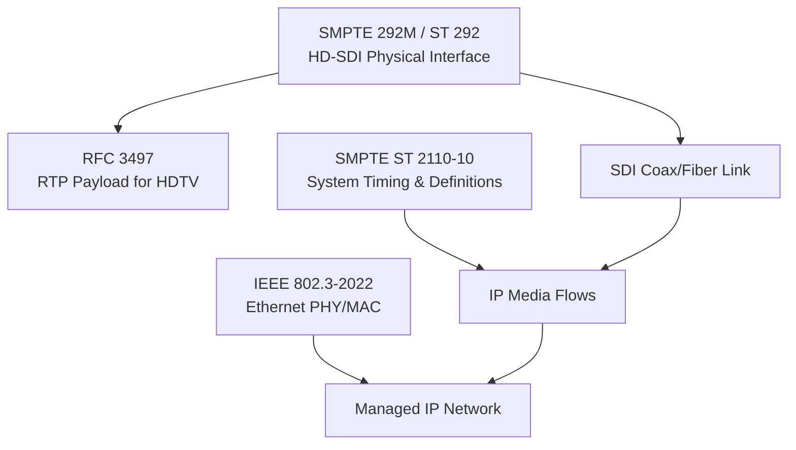

## 1. Executive Summary

Physical networking in broadcast engineering is primarily built on two families of standards: serial digital interfaces (SDI) over coaxial or fiber media, and professional media over managed IP networks using Ethernet. SMPTE 292M/ST 292 defines a bit‑serial coaxial and fiber‑optic interface for HDTV component signals at fixed data rates of 1.485 Gb/s and 1.485/1.001 Gb/s, with 10‑bit source words and interleaved luminance/chrominance streams.[3][10][11][14] SMPTE ST 2110‑10:2022 defines timing, system definitions, transport protocol, datagram size limits, SDP requirements, and clocks for professional media over managed IP networks, with compliant devices interconnected at the data‑plane by a network.[4][6][9][12]

Ethernet physical networking for broadcast IP media is governed by IEEE 802.3 and its amendments, which define the wired Ethernet physical layer and MAC sub‑layer, including encoding/decoding of frames and modulation tied to speed, medium, and supported link length.[7][8][13][15] Normatively, SDI links must use 75 Ω coaxial cable (for the electrical interface) and comply with the specified data rate and word size, while IP media flows must operate over a managed IP network whose physical layer conforms to appropriate IEEE 802.3 specifications for the required data rate and medium.[1][3][10][13]

Due to paywalled and partially accessible SMPTE and IEEE texts, this report provides a conservative catalog of clearly visible normative requirements, identifies gaps and ambiguities, and offers implementation-oriented guidance and validation rules based on the accessible clauses and high-confidence secondary material.[1][3][4][7][10][11][13]

---

## 2. Scope and Boundaries

### 2.1 What This Topic Covers

1. Serial Digital Interface (SDI) physical networking for HDTV component signals using SMPTE 292M/ST 292 over coaxial and fiber‑optic media.[3][10][11][14]
2. Physical networking aspects of professional media over IP using SMPTE ST 2110‑10:2022 system timing and definitions, running over Ethernet physical layers defined by IEEE 802.3 and related amendments.[4][6][7][8][12][13]
3. Normative requirements and best‑practice guidance for link characteristics that affect interoperability between broadcast equipment (e.g., cameras, encoders, VTRs, IP media devices).[11][14]

### 2.2 What Is Explicitly Standardized

- **SMPTE 292M/ST 292 (HD-SDI)**
  - A bit‑serial digital coaxial and fiber‑optic interface for HDTV component signals operating at 1.485 Gb/s and 1.485/1.001 Gb/s.[10]
  - A transport defining a bit‑serial data structure for a digital coaxial cable interface for nominal 1.5 Gb/s component signals, SDTV signals mapped into the SMPTE 292M payload, and formatted packetized data.[3]
  - Source data shall be 10‑bit words, supporting either packetized data or uncompressed video sources.[3][11][14]
  - Total data rate shall be either 1.485 Gb/s or 1.485/1.001 Gb/s.[3][11][14]
  - The electrical cabling uses coaxial cable with nominal impedance of 75 Ω.[1]
  - HDTV lines are composed of two interleaved streams: luminance (Y) and chrominance (CrCb), with chrominance horizontally subsampled (4:2:2 coding).[11][14]

- **SMPTE ST 2110‑10:2022 (IP media system timing and definitions)**
  - Devices compliant to ST 2110‑10 are interconnected at the data‑plane by a network.[4][6]
  - ST 2110‑10 defines the transport‑layer protocol, datagram size limitations, SDP requirements, and clocks along with their timing relationships for professional media over managed IP networks.[9][12]

- **IEEE 802.3 and Amendments (Ethernet physical layer)**
  - IEEE 802.3 defines the physical layer and data link layer MAC of wired Ethernet, including transmission over coaxial cable, twisted‑pair copper, fiber‑optic cable, and electrical backplanes.[7][8]
  - The physical layer encodes frames for transmission and decodes received frames with modulation specified for speed of operation, transmission medium, and supported link length.[13]
  - IEEE 802.3cy‑2023 further defines MAC parameters, physical layer specifications, and management objects for serial transfer of Ethernet frames at 2.5 Gb/s and 5 Gb/s over electrical backplanes (adjacent but not specifically broadcast‑oriented).[5]

### 2.3 What Is Not Explicitly Standardized (Visible Excerpts)

- SMPTE 292M publicly visible excerpts do not specify end‑to‑end facility cabling practices (e.g., maximum recommended coax length, attenuation budgets) in the accessible text used here; such details are likely in sections not visible.[3][10] **Unverified**
- ST 2110‑10 visible excerpts do not fully specify physical network design (topology, redundancy schemes, QoS policies), focusing instead on timing, protocol, and network definitions.[4][6][9][12]
- IEEE 802.3 descriptions accessed here do not enumerate specific broadcast profiles or application‑layer behaviors (e.g., buffer sizing for live media), only generic Ethernet physical/MAC specifications.[7][8][13][15]

### 2.4 Adjacent Standards and Common Misconceptions

- SMPTE 292 expands upon SMPTE 259 and SMPTE 344, forming part of a family of serial digital interface standards; this can be misconstrued as implying full backward compatibility, which is not asserted in the accessible text.[1]
- RFC 3497 defines an RTP payload format for uncompressed HDTV as defined by SMPTE 292M, using the SMPTE 292M bit‑serial interface as a reference “universal medium of interchange.”[11][14] This payload format is **adjacent** to physical networking but does not itself define physical link characteristics.
- IEEE 802.3 is sometimes treated in broadcast practice as implicitly guaranteeing suitability for ST 2110 media transport; accessible texts only guarantee Ethernet behavior, not media‑specific jitter or QoS constraints.[7][8][13]

### 2.5 Source Access Limitations

- **SMPTE 292M/ST 292**: Official SMPTE standards are typically paywalled; the accessible DOC/PDF copies used here may reflect particular revisions and may not include the latest errata.[3][10]
- **SMPTE ST 2110‑10:2022**: The PDF is accessible but only limited clauses are visible in excerpts; full clause‑level details on timing and SDP requirements are not available in this summary.[4][6]
- **IEEE 802.3‑2022 and amendments**: Official standards may be behind paywalls or require registration; accessible summaries provide scope but not full clause‑level physical layer parameters.[7][13][15]

---

## 3. Standards and Source Map

### 3.1 Primary and Secondary Documents

| Document | Version/date | Role | Source status | Clause-level visibility |
|---------|--------------|------|---------------|-------------------------|
| SMPTE 292M / ST 292 “Bit-Serial Digital Interface for HDTV Systems” | CD Rev6 (draft) and undated PDF; HDTV interface text referenced circa mid-2000s[3][10] | Primary SDI physical interface for HDTV | Primary, partial (copies of standard text; may not be latest official) | Moderate (visible sections include scope and data rate/word size clauses; other clauses not visible)[3][10] |
| SMPTE ST 2110-10:2022 “Professional Media over Managed IP Networks: System Timing and Definitions” | 2022-03-28 publication; latest ST 2110-10[4][6] | Primary system timing and network definitions for IP media | Primary, partial (official PDF, but only limited clauses referenced) | Low–moderate (network interconnection statement visible; full timing definitions not) [4][6] |
| IEEE 802.3-2022 “Ethernet” | 2022-07-29[13] | Primary wired Ethernet physical/MAC standard | Primary, partial (scope and physical layer description only) | Low (general physical layer description; detailed PHY specs not visible)[13] |
| IEEE 802.3cy-2023 amendment | 2023-08-11[5] | Adjacent: 2.5/5 Gb/s backplane PHY | Primary amendment, partial | Low (specific speeds and backplane focus visible)[5] |
| RFC 3497 “RTP Payload Format for Uncompressed HDTV (SMPTE 292M)” | 2003 (exact date not visible in excerpt)[11][14] | Primary payload mapping from SMPTE 292M SDI to RTP | Primary for RTP payload; uses SMPTE 292M as normative reference | High for payload and interpretation of SMPTE 292M’s line structure and word size (within RTP context)[11][14] |
| SMPTE ST 2110-10 “IP Network Fundamentals” explanatory material (QxL, repost) | 2025-01-01 and 2025 repost[9][12] | Secondary guidance on ST 2110-10 timing and SDP | Secondary (interpretive/vendor content) | Moderate; summarizes ST 2110-10 roles and requirements but not clause numbers[9][12] |
| SMPTE 292 / HD-SDI articles | 2006-03-05 page; updated 2026-06-18 and 2026-04-29[1][2] | Secondary descriptive reference | Secondary (encyclopedic) | Moderate; describes data rates, cabling type, relation to other SMPTE standards[1][2] |
| IEEE 802.3 descriptive pages | Various, 2001 onward; updated 2026-08-26[7][8][15] | Secondary overview of Ethernet | Secondary | Low–moderate; high-level descriptions only[7][8][15] |

**Source confidence**: SMPTE and IEEE documents are treated as normative where their text is directly visible; Wikipedia and vendor/explanatory materials are treated as secondary and used only for descriptive context.[1][3][4][7][9][10][11][13]

---

## 4. Normative Requirements Catalog

### 4.1 Table of Requirements

| ID | Requirement or rule | Applies to | Normative citation | Normative / best practice / assumed / unverified | Implementation implication | Confidence |
|----|---------------------|-----------|---------------------|-----------------------------------------------|----------------------------|-----------|
| NR-SDI-001 | The interface shall be a bit-serial digital coaxial and fiber-optic interface for HDTV component signals operating at data rates of 1.485 Gb/s and 1.485/1.001 Gb/s.[10] | SDI transmitters, receivers, links | SMPTE 292M/ST 292 HDTV interface description[10] | Normative | Hardware and link design must support these two exact data rates; other rates require different standards or profiles. | High |
| NR-SDI-002 | This standard defines a transport bit-serial data structure as a digital coaxial cable interface for nominal 1.5 Gb/s component signals, SDTV mapped into the payload, and formatted packetized data.[3] | SDI system designers | SMPTE 292M clause 1.1 (scope)[3] | Normative | Implementations must serialize bit-parallel source data into the specified bit-serial structure; SDTV and packetized data mappings must follow referenced format documents. | High |
| NR-SDI-003 | For this interface, source data shall be 10-bit words; source data may be packetized data or an uncompressed video source.[3][11][14] | SDI source devices | SMPTE 292M clause (source data), RFC 3497 summary[3][11][14] | Normative | Video processing pipeline must produce 10-bit words; packetizers and serializers must preserve 10-bit granularity. | High |
| NR-SDI-004 | The total data rate shall be either 1.485 Gb/s or 1.485/1.001 Gb/s.[3][11][14] | SDI links | SMPTE 292M clause, RFC 3497 description[3][11][14] | Normative | Link clocks and serializers must be configured to one of these two rates; rate negotiation outside these is non-compliant. | High |
| NR-SDI-005 | The electrical cabling for SMPTE 292 SDI uses coaxial cable with nominal impedance of 75 Ω.[1] | SDI cabling (electrical) | SMPTE 292 descriptive article (secondary)[1] | Best practice (secondary, widely accepted) | Cable plant should use 75 Ω broadcast-grade coax; impedance mismatches may cause reflections and eye pattern degradation. | Medium |
| NR-SDI-006 | A SMPTE 292M television line comprises two interleaved streams: one containing luminance (Y) samples, the other chrominance (CrCb) values; chrominance is horizontally subsampled (4:2:2 coding).[11][14] | SDI payload structure | RFC 3497 payload description (normatively referencing SMPTE 292M)[11][14] | Normative for payload mapping; interpretive for physical interface | Receivers must correctly de-interleave Y and CrCb streams and account for 4:2:2 subsampling when reconstructing video frames. | High |
| NR-SDI-007 | SMPTE 292M provides a universal medium of interchange for uncompressed HDTV between various types of video equipment (cameras, encoders, VTRs).[11][14] | SDI equipment interoperability | RFC 3497 scope section referencing SMPTE 292M[11][14] | Normative characterization | Systems should treat SMPTE 292M SDI links as the baseline interchange interface for uncompressed HDTV, ensuring compatible word size and rate. | High |
| NR-IP-001 | Devices compliant to ST 2110-10 are interconnected at the data-plane by a network.[4][6] | ST 2110-10 compliant devices | ST 2110-10 network definition statement[4][6] | Normative | Implementations must assume an IP network as the data-plane interconnect; point-to-point physical links without network semantics are non-compliant. | High |
| NR-IP-002 | ST 2110-10 defines the transport-layer protocol, datagram size limitations, SDP requirements, and clocks along with their timing relationships for professional media over managed IP networks.[9][12] | ST 2110-10 senders/receivers | Secondary ST 2110-10 guidance summarizing the standard[9][12] | Normative content (via secondary summary); treated with caution | Devices must implement specified transport protocol and respect datagram size limits and SDP signaling to interoperate. | Medium |
| NR-Eth-001 | IEEE 802.3 defines the physical layer and data link layer MAC of wired Ethernet, specifying transmission over coaxial cable, twisted-pair copper, fiber optic cable, and electrical backplanes.[7][8] | Ethernet physical networks | IEEE 802.3 overview[7][8] | Normative scope | Broadcast IP networks must select IEEE 802.3 physical variants appropriate to required data rates and media (e.g., fiber for longer runs). | High |
| NR-Eth-002 | The physical layer encodes frames for transmission and decodes received frames with modulation specified for speed of operation, transmission medium, and supported link length.[13] | Ethernet PHY implementations | IEEE 802.3-2022 description[13] | Normative | Device PHYs must implement modulation schemes matching both configured speed and physical medium to ensure reliable frame transmission. | High |
| NR-Eth-003 | IEEE 802.3cy-2023 defines MAC parameters, physical layer specifications, and management objects for serial transfer of Ethernet frames at 2.5 Gb/s and 5 Gb/s over electrical backplanes.[5] | Backplane Ethernet implementations | IEEE 802.3cy amendment[5] | Normative for those PHYs | Designs using backplane Ethernet at these speeds must conform to 802.3cy for physical layer behavior; broadcast use is optional. | High |

---

## 5. Engineering Model

### 5.1 Core Objects and Link Types

1. **SDI Source**: Device producing uncompressed HDTV (or mapped SDTV/packetized data) as 10‑bit words at a total data rate of 1.485 Gb/s or 1.485/1.001 Gb/s.[3][10][11][14]
2. **SDI Serializer/Deserializer (SerDes)**: Logic that converts bit‑parallel 10‑bit words into a bit‑serial stream for transmission over coaxial/fiber and reconstructs 10‑bit words at the receiver.[3][10]
3. **SDI Link (Electrical)**: 75 Ω coaxial cable segment carrying the serial bitstream defined by SMPTE 292M.[1][10]
4. **SDI Link (Optical)**: Fiber‑optic medium carrying the same serialized data as the coaxial interface, per SMPTE 292M HDTV interface definition.[10]
5. **SDI Line Structure**: Interleaved Y and CrCb streams forming each television line, with 4:2:2 subsampling of chrominance.[11][14]

6. **IP Media Sender**: Device implementing ST 2110‑10 transport, timing, and SDP signaling, encapsulating media into datagrams on a managed IP network.[4][6][9][12]
7. **IP Media Receiver**: Device consuming ST 2110‑10 flows and reconstructing media with correct timing and clock relationships.[4][6][9][12]
8. **Media Network (Data-Plane)**: IP network interconnecting ST 2110‑10 compliant devices at the data-plane.[4][6]
9. **Ethernet PHY/MAC**: IEEE 802.3 conformant physical layer and MAC sub‑layer responsible for frame encoding, transmission, and decoding using appropriate modulation for link speed, medium, and length.[7][8][13]

### 5.2 Data-Flow Semantics (SDI)

- **Source to Link**: Bit-parallel 10‑bit words derived from HDTV component signals are multiplexed and serialized to form a bit‑serial stream.[3][10]
- **Payload Composition**: SDTV signals and formatted packetized data may be mapped into the SMPTE 292M payload according to mapping documents; these mappings determine the precise interface clock frequency (not visible in excerpts).[3] **Unverified for detailed mapping**
- **Line Interleaving**: Each television line consists of interleaved luminance (Y) and chrominance (CrCb) streams; the lengths of the two streams match due to 4:2:2 subsampling.[11][14]

### 5.3 Data-Flow Semantics (IP Media)

- **Transport Layer**: ST 2110‑10 defines a transport layer protocol for media flows, including datagram size limitations.[9][12]
- **Signaling**: SDP requirements govern session description and convey transport and timing attributes needed for interoperability.[9][12]
- **Clocks and Timing**: ST 2110‑10 defines clocks and their timing relationships, establishing how media streams are synchronized over the network.[9][12]
- **Network Interconnection**: Devices compliant to ST 2110‑10 are interconnected at the data-plane by a network; traffic flows through one or more IP routers/switches depending on the managed IP network design.[4][6]

### 5.4 Control-Flow and Configuration Boundaries

- SDI configuration (e.g., selecting 1.485 vs 1.485/1.001 Gb/s) is determined by the source format or mapping documents referenced by SMPTE 292M, which determine the precise interface clock frequency.[3]
- IP media configuration is governed by ST 2110‑10 SDP parameters and network policies (e.g., QoS, multicast); ST 2110‑10 defines the protocol and timing, but specific network engineering choices are left to implementation or other documents. **Assumed; not fully visible**[9][12]
- Ethernet PHY configuration (speed, medium, link length) is constrained by IEEE 802.3 clauses; accessible descriptions emphasize that modulation and link length are tied to physical layer specification.[13]

### 5.5 Boundary Between Standards-Defined Behavior and Implementation Policy

- **Standards-defined**:
  - SDI bit-serial structure, 10‑bit word requirement, supported data rates, and payload composition principles are defined by SMPTE 292M/ST 292.[3][10][11][14]
  - IP media transport protocol, datagram size limits, SDP requirements, and timing/clock relationships are defined by ST 2110‑10.[4][6][9][12]
  - Ethernet physical/MAC operations and supported media types are defined by IEEE 802.3.[7][8][13][5]

- **Implementation policy (outside visible clauses)**:
  - Choice of cable types, lengths, and redundancy schemes within SDI and IP networks. **Unverified**
  - Specific QoS mechanisms, buffering strategies, and redundancy topologies for ST 2110 media networks. **Unverified**
  - Mapping of SDTV and packetized data into SMPTE 292M payload beyond high-level statement. **Unverified**[3]

### 5.6 Simple Relationship Diagram

---

## 6. Formulas, Calculations, and Worked Examples

### 6.1 Formula and Assumption Register

| Calculation name | Formula or method | Inputs and units | Source citation | Normative or assumed | Worked example available | Confidence |
|------------------|-------------------|------------------|-----------------|----------------------|--------------------------|-----------|
| SDI total data rate options | \( R_{\mathrm{total}} \in \{1.485 \times 10^{9}, \frac{1.485}{1.001} \times 10^{9}\} \) bits/s | Nominal total data rates in Gb/s | SMPTE 292M text and RFC 3497 description[3][10][11][14] | Normative constants | Yes | High |
| SDI word size | \( N_{\mathrm{bits,word}} = 10 \) bits | Source data word size | SMPTE 292M source data clause; RFC 3497[3][11][14] | Normative constant | Yes | High |
| Derived SDI word rate (Assumed) | \( f_{\mathrm{word}} = \frac{R_{\mathrm{total}}}{N_{\mathrm{bits,word}}} \) | Total data rate (bits/s), bits per word | Derived from normative constants[3][11][14] | Assumed (not explicitly stated in standard excerpts) | Yes | Medium |
| IP datagram size constraint (Qualitative) | Datagrams must not exceed ST 2110-10-defined size limits (no explicit numeric formula visible). | Datagram size in octets | ST 2110-10 summary[9][12] | Normative principle, numeric values unverified | No | Medium |
| Ethernet frame encoding behavior | Physical layer encodes and decodes frames using modulation determined by PHY specification; no explicit numeric formula visible. | Frame bits, modulation scheme | IEEE 802.3 description[13] | Normative behavior, no explicit formula | No | High |

### 6.2 Worked Example: SDI Total Data Rate and Word Rate

**Given**: SMPTE 292M total data rate is 1.485 Gb/s or 1.485/1.001 Gb/s; source data words are 10 bits.[3][10][11][14]

1. **Total data rate (case 1)**
   \[
   R_{\mathrm{total,1}} = 1.485 \times 10^{9} \ \mathrm{bits/s}
   \][3][10][11][14]

2. **Total data rate (case 2)**
   \[
   R_{\mathrm{total,2}} = \frac{1.485}{1.001} \times 10^{9} \ \mathrm{bits/s}
   \][3][11][14]

3. **Word size**
   \[
   N_{\mathrm{bits,word}} = 10 \ \mathrm{bits}
   \][3][11][14]

4. **Derived word rate (Assumed)**
   Using the relationship \( f_{\mathrm{word}} = \frac{R_{\mathrm{total}}}{N_{\mathrm{bits,word}}} \), for case 1:
   \[
   f_{\mathrm{word,1}} = \frac{1.485 \times 10^{9}}{10} = 1.485 \times 10^{8} \ \mathrm{words/s}
   \][3][11][14]

   This calculation is **assumed** based on basic digital communications math, not explicitly shown in the accessible SMPTE text. **Unverified as an explicit clause.**

### 6.3 Qualitative Timing and Datagram Constraints (IP Media)

- ST 2110‑10 defines datagram size limitations but accessible summaries do not provide numeric maxima or formulas.[9][12]
- ST 2110‑10 defines clocks and timing relationships but no specific numeric jitter or offset formulas are visible in excerpts.[9][12]

These aspects should be treated as **Unverified** at the numeric/formula level pending access to full ST 2110‑10 clause text.

---

## 7. Interoperability Risks and Ambiguity Register

| Risk or ambiguity | Evidence | Normative status | Failure symptom | Mitigation or modeling rule |
|-------------------|----------|------------------|-----------------|-----------------------------|
| Use of non-75 Ω coax for SMPTE 292 SDI | SMPTE 292 HD-SDI description calls for 75 Ω coaxial cable for the electrical interface.[1] | Best practice (secondary source; primary clause not visible) | Signal reflections, eye closure, increased BER, intermittent SDI lock issues. | Model cabling requirement as 75 Ω nominal; flag deviations as risk; require lab validation for non-standard cable types. |
| Confusion between 1.485 Gb/s and 1.485/1.001 Gb/s rates | SMPTE 292M defines both rates as permissible total data rates.[3][10][11][14] | Normative allowance | Rate mismatch between devices leading to loss of lock or picture instability. | Require explicit rate capability negotiation or configuration; validation must confirm both devices operate at the same of the two defined rates. |
| Lack of explicit numeric datagram-size limits in accessible ST 2110-10 text | Secondary guidance notes datagram size limitations but does not provide values.[9][12] | Normative concept, numeric values Unverified | Oversized datagrams causing network drops or non-compliant behavior; undersized datagrams increasing overhead. | Treat datagram size limits as a required parameter from full ST 2110-10; in absence, do not assume values; mark configuration as Unverified. |
| Partial visibility of SDTV and packetized data mappings in SMPTE 292M | Clause 1.1 indicates SDTV and packetized data mapping documents define precise interface clock frequency but are not visible.[3] | Normative, details Unverified | Incorrect mapping causing misinterpretation of payload or invalid timing. | Do not infer mapping specifics; require access to mapping documents; treat interface clock frequency as externally specified. |
| Reliance on secondary sources for cabling and HD-SDI family relationships | SMPTE 292 descriptive articles mention coaxial cabling and relation to SMPTE 259/344.[1] | Secondary; not authoritative for detailed design | Inaccurate assumptions about backward compatibility or cable limits. | Treat secondary information as guidance only; cross-check with official SMPTE PDFs when available; mark unconfirmed details as Unverified. |
| Ethernet PHY parameters not visible in IEEE 802.3 excerpts | Official descriptions state physical layer encodes/decodes frames with modulation specified for speed/medium/link length but do not show numeric limits.[13] | Normative; values Unverified | Using PHY outside its specified link length or medium causing frame errors. | Require model to reference full IEEE 802.3 PHY clause for chosen speed/media; treat maximum link length and loss budgets as unknown until specified. |
| Interpreting RFC 3497 payload behavior as physical SDI behavior | RFC 3497 describes SMPTE 292M line structure in the context of RTP payload mapping.[11][14] | Normative for RTP payload, interpretive for physical SDI | Misalignment between RTP payload and physical SDI framing assumptions. | Use RFC 3497 only for RTP payload modeling; treat SMPTE 292M physical layer behavior as defined by SMPTE, not by RFC. |

---

## 8. Implementation Guidance

### 8.1 SDI Physical Networking (SMPTE 292M/ST 292)

Implementation guidance in this section is **derived** from normative text and secondary practice and is explicitly labeled as such.

1. **Required fields for SDI link models**
   - `data_rate`: must be either 1.485 Gb/s or 1.485/1.001 Gb/s.[3][10][11][14]
   - `word_size_bits`: must be 10.[3][11][14]
   - `medium_type`: `"coax_75ohm"` or `"fiber"`, with electrical coax specified as 75 Ω nominal.[1][10]
   - `payload_type`: `"HDTV_component"`, `"SDTV_mapped"`, or `"packetized_data"`, per SMPTE 292M payload description.[3][10]

2. **Checks on SDI links (Guidance)**
   - Verify `data_rate` equals one of the two specified values; treat any other rate as non‑compliant. **Guidance derived from NR-SDI-004**[3][11][14]
   - Confirm 10‑bit word serialization and deserialization; devices using different word sizes require separate interfaces. **Guidance from NR-SDI-003**[3][11][14]
   - For electrical links, ensure cable impedance is nominally 75 Ω and connectors are broadcast‑grade. **Guidance based on secondary source**[1]

3. **Modeling line structure (RTP and SDI)**
   - Treat each line as composed of two interleaved streams (Y and CrCb) with lengths matched via 4:2:2 subsampling.[11][14]
   - In systems bridging SDI and RTP (e.g., gateways), ensure mapping preserves the interleaving and sampling structure described in RFC 3497.[11][14]

### 8.2 IP Media over Ethernet (ST 2110-10 + IEEE 802.3)

1. **Required fields for IP media flow models**
   - `transport_protocol`: as defined by ST 2110‑10 (exact protocol name Unverified in visible text).[9][12]
   - `datagram_size_limit`: value specified by ST 2110‑10 (numeric limit Unverified).[9][12]
   - `clock_model`: description of clocks and timing relationships as defined by ST 2110‑10.[9][12]
   - `sdp_parameters`: structured representation of ST 2110‑10 SDP requirements.[9][12]
   - `network_type`: `"managed_ip"`; devices must be interconnected at the data-plane by a network.[4][6]
   - `ethernet_phy_profile`: reference to IEEE 802.3 clause or amendment (e.g., base 802.3‑2022, 802.3cy‑2023).[13][5]

2. **Checks on IP media flows (Guidance)**
   - Ensure flows operate over a managed IP network rather than ad‑hoc or unmanaged links, in line with ST 2110‑10 scope.[4][6][9]
   - Validate that datagram sizes are within ST 2110‑10 limits; in absence of numeric values, treat this as an external configuration to be supplied by standards-aware tooling. **Unverified**[9][12]
   - Confirm SDP descriptions are present and include mandatory fields specified by ST 2110‑10 (exact field list Unverified).[9][12]
   - Verify Ethernet PHY is configured with modulation appropriate to the selected speed and medium, as per IEEE 802.3.[13]

### 8.3 Modeling Unverified or External Values

- Treat any parameter whose numeric value is not visible in accessible clauses (e.g., maximum datagram size, jitter bounds, link length limits) as an **externally supplied** value, with an associated `source` field indicating the external document or operator policy. **Assumed practice**
- Mark such parameters as `status: "Unverified"` in engineering models until corroborated against primary standards.

### 8.4 Reporting Outputs (For Future AI-Assisted Work)

Implementation should generate reports containing:

- Explicit mapping of each link or flow to:
  - SDI standard (e.g., SMPTE 292M).
  - IP media standard (e.g., ST 2110‑10).
  - Ethernet clause or profile (e.g., 802.3‑2022, 802.3cy‑2023).[3][4][5][13]
- A list of **normative** parameters (with citations) and **assumed/unverified** parameters, so that future systems can prioritize high‑trust data.
- A register of risks as per Section 7, including whether each risk has been mitigated or remains open.

---

## 9. Validation Checklist

The following checklist distinguishes between **normative checks** (directly supported by standard text) and **assumption checks** (implementation guidance).

1. SDI data rate equals 1.485 Gb/s or 1.485/1.001 Gb/s.[3][10][11][14]
2. SDI source data words are 10 bits.[3][11][14]
3. SDI link medium correctly identified as 75 Ω coaxial (electrical) or fiber‑optic (optical).[1][10]
4. SDI payload identified as HDTV component, mapped SDTV, or packetized data consistent with SMPTE 292M scope.[3][10]
5. SDI line structure modeled as interleaved Y and CrCb streams with 4:2:2 subsampling.[11][14]
6. Devices identified as ST 2110‑10 compliant are interconnected via an IP network at the data-plane.[4][6]
7. Transport layer, datagram size, SDP, and clock relationships are recognized as governed by ST 2110‑10.[9][12]
8. Ethernet links used for IP media are documented with their IEEE 802.3 physical layer variant and medium type.[7][8][13]
9. PHY modulation is verified as appropriate for configured speed and medium, per IEEE 802.3.[13]
10. All parameters without explicit numeric values in accessible standards (e.g., jitter limits, cable length) are tagged `Unverified` and associated with external references or policies.

---

## 10. Open Questions / Unverified Items

The following items are explicitly marked as **Unverified**, either because the necessary clauses are not visible or because they rely solely on secondary interpretations.

1. **Exact interface clock frequencies** for each SMPTE 292M payload mapping (HDTV vs mapped SDTV vs packetized data).[3]
2. **Detailed electrical specifications** for SDI (e.g., voltage swing, jitter tolerance, equalization requirements) beyond the mention of nominal 75 Ω cable.[1][10]
3. **Maximum recommended cable lengths** and attenuation budgets for SMPTE 292 SDI over different coax and fiber types.[1][10]
4. **Numeric datagram size limits** specified by ST 2110‑10 for IP media packets.[9][12]
5. **Exact transport protocol identity and options** specified by ST 2110‑10 (e.g., particular UDP/RTP profiles).[9][12]
6. **Detailed SDP field list and mandatory/optional attributes** for ST 2110‑10 media sessions.[9][12]
7. **Numeric jitter, latency, and clock accuracy requirements** for ST 2110‑10 flows.[9][12]
8. **Specific PHY parameters** (e.g., maximum link length, loss, power budget) for IEEE 802.3 variants relevant to broadcast, including fiber and copper options.[13][5]
9. **Relationship and compatibility rules** among SMPTE 259, SMPTE 344, and SMPTE 292M beyond the statement that SMPTE 292 expands upon them.[1]
10. **Broadcast-specific profiles or guidelines** for applying IEEE 802.3cy backplane Ethernet in live production systems.[5]

---

## 11. Sources

1. SMPTE 292 (HD-SDI) descriptive article, citing data rates 1.485 Gb/s and 1.485/1.001 Gb/s and 75 Ω coaxial cabling; updated 2026-04-29; secondary.[1]
2. SMPTE 292 (duplicate descriptive page) reinforcing HD-SDI characteristics and data rates; secondary.[2]
3. “SMPTE 292M Serial Interface” DOC (CD Rev6) containing clause 1.1 and source data requirements (10-bit words, payload mappings, total data rate values); primary text copy.[3]
4. SMPTE ST 2110-10:2022 “Professional Media over Managed IP Networks: System Timing and Definitions” PDF (2022-03-28 publication) stating that compliant devices are interconnected at the data-plane by a network; primary.[4]
5. IEEE 802.3cy-2023 amendment defining Ethernet MAC parameters and PHY specifications for 2.5 and 5 Gb/s serial transfer over electrical backplanes; primary.[5]
6. Alternate access to SMPTE ST 2110-10:2022; confirms network interconnection statement; primary duplicate.[6]
7. IEEE 802.3 standard overview describing physical layer and MAC sub-layer for wired Ethernet, covering coax, twisted pair, fiber, and backplanes; secondary.[7]
8. IEEE 802.3 descriptive article summarizing Ethernet physical/MAC scope; secondary.[8]
9. “SMPTE ST 2110-10: IP Network Fundamentals” explanatory material summarizing ST 2110-10 roles, transport protocol, datagram size limits, SDP requirements, and clocks; secondary.[9]
10. “Bit-Serial Digital Interface for High-Definition Television Systems” PDF describing SMPTE 292M bit-serial digital coaxial and fiber-optic interface for HDTV component signals at 1.485 Gb/s and 1.485/1.001 Gb/s, with serialized bit-parallel data; primary text copy.[10]
11. RFC 3497 “RTP Payload Format for Uncompressed HDTV (SMPTE 292M)” describing SMPTE 292M as a universal medium of interchange, stipulating 10-bit source words and total data rates of 1.485 Gb/s or 1.485/1.001 Gb/s, and detailing Y/CrCb interleaved line structure with 4:2:2 coding; primary (IETF).[11]
12. Vendor/explanatory ST 2110-10 fundamentals material (QxL) summarizing transport protocol, datagram size limitations, SDP requirements, and clocks/timing relationships; secondary.[12]
13. IEEE 802.3-2022 description indicating physical layer encodes/decodes frames with modulation specified for speed, medium, and link length; primary.[13]
14. PDF copy of RFC 3497; duplicate of source 11 with identical normative content; primary.[14]
15. IEEE 802.3 Ethernet overview presentation describing layered structure and mentioning distance/media considerations; secondary.[15]
