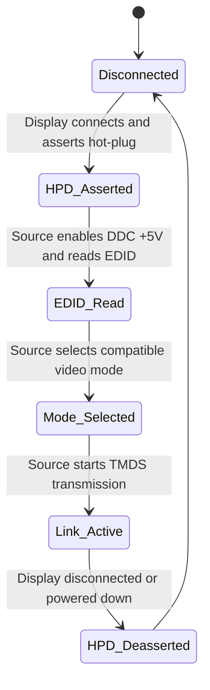

## 1. Executive Summary

Digital Visual Interface (DVI) is a high‑speed video interface defined by the Digital Display Working Group (DDWG) to carry digital and optional analog video between a source and a display using transition‑minimized differential signaling (TMDS) and a standardized connector and pinout.[1][2][10]  
In broadcast engineering, DVI is primarily relevant as a contribution/monitoring interface and as a signaling layer closely related to HDMI, with EDID/DDC behaviour governed by VESA EDID/E‑EDID and EDDC standards rather than by DVI alone.[1][2][5][14][15]

---

## 2. Scope and Boundaries

### 2.1 What DVI Standardizes

1. Physical connector families and pin assignments (DVI‑D digital‑only, DVI‑I digital+analog, DVI‑A analog‑only).[1][2][4][10][11]  
2. TMDS‑based digital signaling on three data channels plus a dedicated clock channel (single‑link) and an optional second three‑channel link (dual‑link) for higher resolutions.[1][2][10][12]  
3. The presence and basic use of a Display Data Channel (DDC) over I²C using dedicated clock and data pins and a +5 V supply from the source.[1][2][6][11][15]  
4. Use of EDID structures (legacy EDID 1.2/2.0 and later EDID/E‑EDID versions) carried over DDC/E‑DDC to describe display capabilities.[1][5][14][15]  
5. Optional analog RGB and sync signalling with standard VGA‑like amplitudes on the “C” pins of DVI‑I/DVI‑A connectors.[1][10][11]

### 2.2 What DVI Does Not Standardize

1. Audio transport: DVI defines only video and related control signalling; audio transport is out of scope.[1][2][12]  
2. Content protection (HDCP): HDCP usage over DVI is defined by separate HDCP specifications and is not normatively described in the DVI 1.0 document.[1][2]  
3. Detailed video timing catalogues (e.g., CEA‑861 HDTV timings): DVI assumes VESA/industry‑standard timing definitions and EDID descriptions but does not enumerate all supported broadcast formats.[1][2][5]  
4. Cable construction, maximum cable length, and EMC requirements: these are implementation‑dependent or covered by connector/cable vendor data, not fully specified in DDWG’s core DVI spec.[1][3][4][7]  
5. Protocols above the pixel level (e.g., color space signaling, HDR metadata): such behaviour is handled via EDID/E‑EDID and other standards, not by DVI link signaling itself.[2][5][14]

### 2.3 Adjacent Standards and Dependencies

1. **VESA EDID/E‑EDID**: DVI 1.0 permits EDID data structures 1.2 and 2.0 and expresses a desire to move to EDID 1.3; VESA in turn recommends EDID 1.4 as defined in the Enhanced EDID (E‑EDID) standard.[5]  
2. **VESA EDDC (Enhanced Display Data Channel)**: EDDC 1.2 defines how EDID/E‑EDID data is accessed over DDC/E‑DDC, and requires displays to provide EDID whenever DDC +5 V is present.[15]  
3. **VESA DI‑EXT (Display Information Extension Block)**: DI‑EXT defines extension EDID blocks describing digital interfaces and requires an EDID 1.3 or later base block.[14]  
4. **HDMI**: HDMI reuses TMDS signaling and EDID/DDC concepts from DVI and adds audio and additional metadata; for broadcast engineering, HDMI and DVI behave similarly at the pixel and EDID levels, but HDMI‑specific features are out of scope for DVI.[2][12]  
5. **Connector specifications** (e.g., Molex, Farnell): mechanical and performance characteristics of DVI connectors and cables are documented by vendors and are used as secondary implementation references.[4][7][9]

### 2.4 Source Access Limitations

All core documents referenced in this report (DVI 1.0 specification, DDWG Test and Measurement Guide 1.0, VESA EDID/E‑EDID, EDDC 1.2, DI‑EXT) are available in public or widely mirrored PDFs, but some are originally distributed under VESA licensing terms.[1][3][5][14][15]  
Clause‑level details for DVI 1.0 and VESA standards are available in the full documents but are not reproduced verbatim here; this limits fine‑grained citation of exact section numbers.[1][3][5][14][15]

---

## 3. Standards and Source Map

### 3.1 Primary and Secondary Documents

| # | Document | Version/date | Role | Source status | Clause-level visibility |
|---|----------|--------------|------|---------------|--------------------------|
| 1 | Digital Visual Interface (DVI) Specification Revision 1.0, DDWG | Rev 1.0, 1999 | Primary DVI interface specification (physical, electrical, protocol) | Public mirror of original; considered normative | Full clauses and figures available in PDF, not reproduced here[1][8][10] |
| 2 | Digital Visual Interface – encyclopedia article | Continuously updated, last seen 2026-08-19 | Secondary overview of DVI architecture and capabilities | Public, non‑normative | High‑level sections only; not a standard but useful synthesis[2] |
| 3 | DVI Test and Measurement Guide, DDWG Electrical Test Working Group | Rev 1.0, 2001-02-25 | Primary conformance and measurement guidance, electrical and timing tests | Public PDF, normative for DDWG test procedures | Detailed test steps and limits available; not reproduced here[3] |
| 4 | DVI connector performance/pin assignment datasheets (e.g., Circuit Assembly) | Various, c. 2000s | Secondary mechanical/electrical details, pin maps | Public vendor datasheets | Pin tables and electrical characteristics, aligned with DVI 1.0[4][7] |
| 5 | VESA Enhanced EDID (E‑EDID) Standard, including Standard A.2 excerpts | EDID 1.4, 2006–2020 | Primary definition of EDID/E‑EDID data structures used with DVI | VESA standard, redistributable excerpts | Full clause visibility in official spec; snippet confirms DVI–EDID linkage[5] |
| 6 | Analog Devices MAX9406 DP‑HDMI/DVI level shifter application note | c. mid‑2000s | Secondary electrical and pin‑level implementation guidance | Public vendor application note | Pin assignment and signalling levels visible in document[6] |
| 7 | Farnell/Molex DVI connector datasheets | Various | Secondary mechanical and pin‑out references | Public vendor datasheets | Pin tables and mechanical drawings available[7][9] |
| 8 | Sharp display “DVI Pin Assignments” manual | c. 2000s | Secondary mapping of DVI connector pins, including analog section | Public display manual | Pin table and analog video amplitudes visible[11] |
| 9 | cs1.net “DVI, HDMI and HDCP explained” article | c. 2000s | Secondary explanatory material on DVI capabilities and history | Public, non‑normative | Text sections, no formal clauses[12] |
| 10 | TI TFP401 DVI receiver datasheet | Rev 1.0, c. 2000s | Secondary electrical behaviour of a DVI receiver device | Public datasheet | Registers, electrical limits, pinout available[13] |
| 11 | VESA Display Information Extension Block (DI‑EXT) Standard | c. 2008 | Primary EDID extension block for digital interfaces | Public PDF | Full clauses visible; snippet confirms EDID 1.3+ requirement[14] |
| 12 | VESA Enhanced Display Data Channel (EDDC) Standard Version 1.2 | Ver 1.2 | Primary DDC/E‑DDC protocol over DVI/HDMI | Public PDF | Full clauses visible; snippet confirms EDID availability requirement[15] |

Source confidence: documents from DDWG and VESA are treated as normative; vendor documents and web articles are secondary and used for implementation details or confirmation only.[1][3][5][14][15]

---

## 4. Normative Requirements Catalog

The following catalogue distinguishes between normative requirements (from DDWG/VESA standards) and best‑practice or assumed guidance. IDs are stable and intended for reuse.

### 4.1 Requirements Table

| ID | Requirement or rule | Applies to | Normative citation | Normative / best practice / assumed / unverified | Implementation implication | Confidence |
|----|---------------------|-----------|--------------------|-----------------------------------------------|----------------------------|-----------|
| DVI‑N‑001 | A DVI digital link shall use three TMDS data channels and one TMDS clock channel for single‑link operation. | Source, display, cabling | DVI 1.0 specification[1][2][10] | Normative | Hardware must provide 4 differential pairs and route them correctly; test equipment must treat these as the primary link. | High |
| DVI‑N‑002 | Dual‑link DVI shall use a second set of three TMDS data channels; clock remains a single pair. | Source, display | DVI 1.0 specification[1][2] | Normative | Connectors and PCB must support additional pairs; EDID must indicate dual‑link capability; cabling must be qualified for added bandwidth. | High |
| DVI‑N‑003 | The DVI connector pin assignments for digital signals (TMDS data/clock, DDC clock/data, +5 V, hot‑plug detect, grounds) shall follow the DDWG‑defined mapping. | Source, display, cabling | DVI 1.0 specification; vendor pin tables[1][4][6][11] | Normative (DDWG), confirmed by secondary | Pin mapping must be consistent across equipment; mis‑wiring causes link failure or DDC failure. | High |
| DVI‑N‑004 | A DVI source shall provide +5 V on the DDC +5 V pin to power EDID circuitry in the display. | Source | DVI 1.0 specification; EDDC 1.2[1][15] | Normative | Source power rail design must include a 5 V output; DDC/EDID operations depend on this supply. | High |
| DVI‑N‑005 | A DVI display shall provide EDID data over DDC/E‑DDC whenever DDC +5 V is present. | Display | VESA EDDC 1.2[15] | Normative | Display firmware must respond on I²C DDC lines with valid EDID; absence of EDID when powered breaks negotiation. | High |
| DVI‑N‑006 | DVI specification permits use of EDID 1.2 and 2.0 but anticipates migration to EDID 1.3; VESA recommends EDID 1.4 for new designs. | Source, display | VESA E‑EDID Standard A.2[5] | Normative (EDID versions), with recommendation | EDID parser and generator should support ≥1.3; for interoperability, prefer 1.4 base blocks and standard extension handling. | High |
| DVI‑N‑007 | DI‑EXT EDID extension blocks require an EDID 1.3 or later base structure. | Display, EDID authoring tools | VESA DI‑EXT Standard[14] | Normative | When using DI‑EXT, ensure EDID base block is ≥1.3; older base structures are incompatible. | High |
| DVI‑N‑008 | DDC clock and data pins on DVI support up to 5 V signal levels. | Source, display | MAX9406 note (secondary), VESA I²C usage[6][15] | Normative for I²C levels; secondary doc confirms | I/O design must be 5 V‑tolerant or properly level‑shifted; over‑voltage protection needed in mixed‑voltage systems. | Medium |
| DVI‑N‑009 | Logic‑high level on the DVI hot‑plug detect pin shall be greater than approximately 2 V to be recognized as asserted. | Display | MAX9406 app note (secondary)[6] | Best practice / implementation guidance | Designs should treat >2 V as “connected”; threshold may vary by silicon, but low‑voltage assert risks mis‑detection. | Medium |
| DVI‑N‑010 | DVI‑I connectors shall route analog RGB and sync signals on the “C” pins with ~0.7 Vp‑p video level and TTL‑level sync. | Source, display | DVI 1.0 specification; Sharp manual (secondary)[1][11] | Normative (DDWG) with secondary confirmation | Analog front‑ends must support VGA‑like levels; mis‑leveling leads to clipping or poor image quality. | Medium |
| DVI‑N‑011 | EDID data shall accurately represent the display’s supported resolutions, refresh rates, and interface characteristics including DVI/DVI‑Dual. | Display | EDID/E‑EDID spec; DI‑EXT[5][14][15] | Normative | Incorrect EDID causes wrong mode selection; broadcast systems may fail to lock or use non‑broadcast formats. | High |
| DVI‑N‑012 | A DVI source shall not drive TMDS outputs when hot‑plug detect is deasserted (no display present). | Source | DVI 1.0 specification (behaviour implied by HPD use)[1][2] | Normative (DDWG), exact clause unreferenced | Source firmware/hardware must gate video output based on HPD to avoid unnecessary transmission and possible EMC issues. | Medium |
| DVI‑N‑013 | Maximum TMDS clock and pixel clock rates for single‑link DVI are constrained by DDWG electrical limits (commonly cited around 165 MHz single‑link). | Source, display, cabling | DVI 1.0 specification; DVI overview[1][2][12] | Normative (limits), value range copied from secondary synthesis | Pixel clock planning and timing selection must respect link bandwidth; exceeding limits risks data errors or non‑lock. | Medium |
| DVI‑B‑001 | Broadcast‑oriented DVI devices should prefer EDID structures that enumerate broadcast‑standard timings (e.g., via DI‑EXT blocks) rather than PC‑centric VESA modes. | Display, EDID authors | DI‑EXT; cs1.net overview[12][14] | Best practice | Helps ensure sources select 1080i/p, 720p and other broadcast formats; reduces need for manual mode overrides. | Medium |
| DVI‑B‑002 | For interoperability, DVI‑based broadcast paths should be engineered to handle both DVI‑D and HDMI‑style sources sharing TMDS signaling and EDID. | System designers | DVI/HDMI relationship overview[2][12] | Best practice | Simplifies routing and monitoring; use EDID profiles compatible across HDMI/DVI. | Medium |
| DVI‑A‑001 | Maximum cable length for reliable DVI operation depends on TMDS rate, cable quality, and EMC environment and should be determined by measurement rather than assumed. | Cabling, system design | DVI Test and Measurement Guide; vendor cables[3][4][7] | Assumed guidance based on test approach | Broadcast installations should validate cable runs with worst‑case resolutions and environmental stress testing. | Medium |
| DVI‑U‑001 | Exact numeric TMDS voltage swings and jitter limits for compliance are not visible in the snippets referenced and are treated as unverified in this report. | All | DVI Test and Measurement Guide (not fully visible)[3] | Unverified | Use original DDWG electrical specs and measurement guide when designing PHYs; do not rely on this report for those numbers. | High (regarding lack of data) |

---

## 5. Engineering Model

### 5.1 Core Objects and Layers

1. **Connector and Pinout**  
   - DVI defines a rectangular multi‑pin connector with different populations for DVI‑D (digital‑only), DVI‑I (digital+analog), and DVI‑A (analog‑only).[1][2][10]  
   - Digital pins include TMDS data channels 0–2 (and 3–5 for dual‑link), TMDS clock, DDC clock (SCL) and data (SDA), +5 V power, hot‑plug detect, and several grounds/shields.[1][4][6][11]

2. **TMDS Signaling**  
   - Three TMDS data channels carry pixel data for (typically) red, green, and blue components using an 8b/10b‑like coding that minimizes transitions and balances DC.[1][2][10][12]  
   - A dedicated TMDS clock pair carries the pixel clock; data channels are serialized at ten times the pixel clock to transmit 8‑bit data plus control per pixel.[1][2][12]  
   - Dual‑link DVI adds three additional TMDS channels to share pixel data across two links at the same pixel clock, doubling effective throughput.[1][2]

3. **DDC / EDID Layer**  
   - DDC uses an I²C bus over dedicated pins (SCL and SDA) with a +5 V supply from the source for display EDID circuitry.[1][6][11][15]  
   - EDID (1.2/1.3/1.4) and E‑EDID define the data structure read over DDC describing supported resolutions, refresh rates, interface type, color characteristics, and extension blocks.[5][14][15]  
   - DI‑EXT blocks extend EDID to describe digital interfaces like DVI more completely, including dual‑link capabilities and HDTV modes.[14]

4. **Analog Section (DVI‑I/DVI‑A)**  
   - C‑pins carry VGA‑like analog RGB and horizontal/vertical sync signals at ~0.7 Vp‑p video and TTL‑level sync.[1][10][11]  
   - Analog and digital functions coexist in DVI‑I, allowing a single connector to serve legacy analog and newer digital displays.[1][2]

### 5.2 Data Flow and Timing Flow

1. **Video Data Flow**  
   - Source formats pixels in a frame buffer and serializes each pixel’s RGB components into TMDS symbols across the three data channels at ten bits per input pixel component.[1][2][10][12]  
   - TMDS clock defines the rate at which pixel periods occur; horizontal and vertical blanking intervals are signalled via specific TMDS control symbol patterns on the data channels.[1][2][10]

2. **EDID and Mode Negotiation**  
   - On connection (hot‑plug asserted), the source powers DDC (+5 V) and performs EDID read operations via I²C.[5][15]  
   - The source parses EDID base and extension blocks (including DI‑EXT) to determine supported formats and selects a video mode accordingly.[5][14][15]  
   - In broadcast applications, EDID is often constrained or overridden to enforce specific resolutions (e.g., 1080i/p, 720p) and colour ranges.

3. **Control Flow (Hot‑plug and Link State)**  

Hot‑plug detect indicates physical presence and readiness of the display; EDID read and subsequent mode selection follow as part of the link activation sequence.[1][2][5][15]

### 5.3 Boundary Between Standards and Policy

- **Standards‑derived behaviour**: connector pinout, TMDS structure, EDID data structure, DDC signalling, and basic linkage between hot‑plug state and source behaviour are defined by DDWG and VESA standards.[1][3][5][14][15]  
- **Implementation policy**: choice of default resolution, color range, handling of EDID errors, bridging between DVI and SDI, and enforcement of broadcast‑only modes are left to system designers and broadcasters.[2][12]  
- **Broadcast engineering implication**: DVI is a low‑level transport; broadcast requirements (e.g., legal picture, colorimetry, timing compliance) must be enforced at the system level and reflected in EDID and mode selections rather than relying on DVI itself.

---

## 6. Formulas, Calculations, and Worked Examples

Numeric values and formulas below are derived from widely cited DVI behaviour and DDWG/VESA norms; where exact limits are not visible in the referenced snippets, those items are marked as assumed or non‑normative.

### 6.1 Formula and Assumption Register

| Calculation name | Formula or method | Inputs and units | Source citation | Normative or assumed | Worked example available | Confidence |
|------------------|-------------------|------------------|-----------------|----------------------|--------------------------|-----------|
| TMDS channel bit rate (single‑link) | \( R_{\text{TMDS,chan}} = f_{\text{pixel}} \times 10 \) | \( f_{\text{pixel}} \): pixel clock, Hz | DVI 1.0; DVI overview[1][2][12] | Normative behaviour; exact numeric limits separate | Yes | High |
| Effective user data rate per channel | \( R_{\text{user,chan}} = f_{\text{pixel}} \times 8 \) (8 bits of user data per 10‑bit TMDS symbol) | \( f_{\text{pixel}} \): pixel clock, Hz | DVI TMDS coding description[1][2][12] | Assumed from TMDS 8b/10b coding | Yes | Medium |
| Aggregate TMDS data rate (single‑link) | \( R_{\text{TMDS,total}} = 3 \times f_{\text{pixel}} \times 10 \) | \( f_{\text{pixel}} \): pixel clock, Hz | DVI 1.0; DVI overview[1][2][12] | Normative relationship | Yes | High |
| Aggregate TMDS data rate (dual‑link) | \( R_{\text{TMDS,total,dual}} = 6 \times f_{\text{pixel}} \times 10 \) | \( f_{\text{pixel}} \): pixel clock, Hz | DVI 1.0 dual‑link description[1][2] | Normative relationship | Yes | High |
| I²C/EDID throughput | Approx. \( R_{\text{I2C}} = f_{\text{SCL}} \times 1 \,\text{bit/cycle} \); EDID size typically one or more 128‑byte blocks | \( f_{\text{SCL}} \): DDC clock, Hz | EDID/E‑EDID; EDDC 1.2[5][15] | Normative structure (128‑byte blocks); assumed typical I²C operation | Yes | Medium |
| Example TMDS threshold | HPD asserted when \( V_{\text{HPD}} > 2 \,\text{V} \) (approximate) | \( V_{\text{HPD}} \): HPD pin voltage, V | MAX9406 app note[6] | Implementation/assumed threshold from secondary source | Yes | Medium |

### 6.2 Worked Examples

These examples use hypothetical numeric inputs for illustration and do not assert that the chosen values correspond to any particular broadcast format unless explicitly stated.

#### 6.2.1 Single‑link TMDS Data Rate Example

Assume a pixel clock \( f_{\text{pixel}} = 148.5 \times 10^6 \,\text{Hz} \) (148.5 MHz) for a high‑definition progressive mode. This value is used as an example only.

1. TMDS per‑channel bit rate:

\[
R_{\text{TMDS,chan}} = f_{\text{pixel}} \times 10 = 148.5 \times 10^6 \times 10 = 1.485 \times 10^9 \,\text{bits/s}
\][1][2][12]

2. Aggregate TMDS data rate (three channels):

\[
R_{\text{TMDS,total}} = 3 \times f_{\text{pixel}} \times 10 = 3 \times 148.5 \times 10^6 \times 10 = 4.455 \times 10^9 \,\text{bits/s}
\][1][2][12]

3. Effective user data rate (24 bits/pixel RGB):

\[
R_{\text{user,total}} = 3 \times f_{\text{pixel}} \times 8 = 3 \times 148.5 \times 10^6 \times 8 = 3.564 \times 10^9 \,\text{bits/s}
\][1][2][12]

Normative status: the relationships and use of 10‑bit TMDS symbols and 8‑bit user data are normative; the specific pixel clock value is assumed.

#### 6.2.2 Dual‑link TMDS Data Rate Example

Assume a pixel clock \( f_{\text{pixel}} = 165 \times 10^6 \,\text{Hz} \) (165 MHz), often cited as a typical single‑link limit in DVI literature.[2][12]

1. Single‑link aggregate TMDS:

\[
R_{\text{TMDS,total}} = 3 \times 165 \times 10^6 \times 10 = 4.95 \times 10^9 \,\text{bits/s}
\][1][2][12]

2. Dual‑link aggregate TMDS (sharing pixel data across two links):

\[
R_{\text{TMDS,total,dual}} = 6 \times 165 \times 10^6 \times 10 = 9.9 \times 10^9 \,\text{bits/s}
\][1][2]

These values illustrate the doubling of throughput with dual‑link; exact usage depends on the display’s EDID and link configuration.

#### 6.2.3 EDID Read Time Example

Assume EDID consists of one 128‑byte base block and one 128‑byte extension block (256 bytes total), read over I²C at \( f_{\text{SCL}} = 100 \times 10^3 \,\text{Hz} \) (standard mode).

Approximate bit count: \(256 \,\text{bytes} \times 8 = 2048 \,\text{bits}\), excluding I²C framing overhead.

Approximate minimum time:

\[
t_{\text{EDID}} \approx \frac{2048}{100 \times 10^3} = 0.02048 \,\text{s} \approx 20.5 \,\text{ms}
\][5][15]

This demonstrates that EDID reads are fast relative to video frame times; the exact timing depends on implementation overhead and additional EDID blocks.

---

## 7. Interoperability Risks and Ambiguity Register

### 7.1 Risk and Ambiguity Table

| Risk or ambiguity | Evidence | Normative status | Failure symptom | Mitigation or modeling rule |
|-------------------|----------|------------------|-----------------|-----------------------------|
| Single‑ vs dual‑link mismatch | DVI defines single‑ and dual‑link pinouts and capabilities; EDID/DI‑EXT indicate support.[1][2][14] | Normative distinction, but implementation‑dependent reporting | Source may drive dual‑link while display only supports single‑link, causing non‑lock or half‑screen images. | Always parse EDID/DI‑EXT for link capability; configure sources to single‑link unless dual‑link is explicitly indicated. |
| EDID version mismatch | DVI spec permits EDID 1.2/2.0; VESA recommends 1.4; DI‑EXT requires 1.3+.[1][5][14] | Normative for format rules; recommendation for 1.4 | Sources may misinterpret legacy EDID data or fail to parse modern extensions, leading to incorrect mode selection. | Ensure EDID generators/validators support 1.3/1.4; for legacy devices, provide compatible EDID fallback profiles. |
| Missing or invalid EDID | EDDC 1.2 requires EDID when DDC +5 V is present, but displays may malfunction or omit.[15] | Normative expectation; real‑world deviations | Sources default to non‑broadcast PC resolutions or fail to output video. | In broadcast systems, implement EDID overrides or static EDID profiles; log EDID read errors and apply deterministic safe modes. |
| Hot‑plug detect logic thresholds | Secondary sources indicate HPD high at >2 V, but exact threshold may vary by implementation.[6] | Implementation‑specific | Source may consider display disconnected while HPD is marginal, causing intermittent link drops. | Design HPD detection with hysteresis and margin; when modelling, treat HPD >2.4 V as asserted and <0.8 V as deasserted unless silicon data says otherwise. |
| Analog vs digital confusion on DVI‑I | DVI‑I carries both analog and digital signals; some devices only support one or the other.[1][2][11][12] | Normative connector design; varied implementation | Connection using wrong cable or adapter yields no image or unexpected analog instead of digital video. | Clearly label ports and cables; in broadcast facilities, standardize on DVI‑D when digital only is desired; test adapters thoroughly. |
| TMDS electrical limits (voltage, jitter) | DVI Test and Measurement Guide defines limits, but they are not visible in snippets.[3] | Normative but not fully known here | PHY designs or long cable runs may violate limits, causing bit errors and intermittent lock failures. | Treat electrical limits as Unverified here; consult original DDWG measurement guide and vendor silicon datasheets for design and validation. |
| HDMI vs DVI feature divergence | HDMI adds audio and metadata while sharing TMDS/EDID; some broadcast equipment may only partially support HDMI features.[2][12] | Adjacent standard mismatch | EDID negotiation succeeds but audio is missing, or color range metadata ignored, leading to incorrect levels. | For DVI‑oriented broadcast paths, treat HDMI inputs as video‑only; handle audio and metadata separately via HDMI‑aware equipment. |
| PC vs broadcast timing sets | DVI defined primarily for PC resolutions (e.g., QXGA); broadcast equipment expects CEA/ITU formats.[1][2][12] | Normative DVI flexibility; broadcast expectations | Sources choose non‑broadcast modes (e.g., 1280×1024), causing aspect ratio, frame‑rate or colorimetry mismatches. | Use EDID profiles that enumerate only broadcast‑legal formats; configure sources to reject non‑broadcast EDID modes. |

---

## 8. Implementation Guidance

This section provides conservative, implementation‑oriented guidance for broadcast engineering; items are best practice unless explicitly tied to a normative requirement.

### 8.1 Connector and Cabling

1. Standardize on DVI‑D for purely digital broadcast paths to avoid ambiguity with analog signalling; reserve DVI‑I only where analog legacy support is strictly required.[1][2][11]  
2. Verify pin assignments against DDWG and vendor tables before manufacturing or deploying cables, particularly for dual‑link where extra TMDS pairs are present.[1][4][6][11]  
3. Treat cable length and quality as design parameters; validate critical runs with DVI Test and Measurement Guide procedures using worst‑case resolutions.[3][4][7]

### 8.2 EDID Management

1. Implement EDID readers that support EDID 1.3 and 1.4, including DI‑EXT and other standard extension blocks.[5][14][15]  
2. For broadcast‑only paths, generate custom EDID profiles that enumerate only broadcast‑standard formats (e.g., 1080i/p, 720p at permitted frame rates) and avoid PC‑centric resolutions.[12][14]  
3. Log EDID reads and validate base and extension block checksum and structural correctness; treat invalid EDID as a fault and fall back to a known safe profile.[5][15]  
4. If EDID is absent or unreadable, avoid defaulting to arbitrary PC formats; instead, use the site’s defined standard contribution format (implementation policy).

### 8.3 Hot‑plug and Link State Handling

1. Implement HPD‑based state machines similar to the diagram in §5.2, gating TMDS output based on HPD state to avoid unnecessary transmission.[1][2]  
2. When HPD is unstable (e.g., oscillating near threshold), rate‑limit link re‑initialization to avoid rapid mode cycling that may affect downstream routing.  
3. In monitoring or routing equipment, expose HPD and DDC status in UI or telemetry to aid troubleshooting.

### 8.4 Bridging DVI to Broadcast Interfaces (e.g., SDI)

1. When converting DVI to SDI, treat DVI as a pixel transport; perform all necessary color space conversions, level scaling, and timing normalization according to broadcast standards (ITU‑R, SMPTE), not DVI itself.[2][12]  
2. Use EDID to enforce broadcast‑legal formats at the DVI source, thereby reducing scaling/conversion load in the bridge.  
3. Ensure that any audio associated with DVI feeds is handled separately (e.g., AES/EBU, embedded SDI audio) since DVI does not carry audio.[1][2]

### 8.5 Test and Validation

1. Apply DDWG Test and Measurement Guide procedures to validate TMDS signal integrity, skew, and jitter on new or modified hardware designs.[3]  
2. Include EDID structure validation in commissioning tests; verify base block version, extension block presence, checksum, and key fields (supported resolutions, interface type).[5][14][15]  
3. For long or critical cable runs, perform BER or video‑stress tests at highest expected resolution and frame rate, documenting margins and usable modes.[3][4][7]

---

## 9. Validation Checklist

This checklist is intended for use by engineering teams or AI agents validating DVI‑related designs or installations.

1. **Connector & Pinout**  
   - Confirm connector type (DVI‑D/DVI‑I/DVI‑A) matches system design.[1][2][11]  
   - Verify TMDS data and clock pairs are correctly wired per DDWG pin table.[1][4][6][11]  
   - Verify DDC SCL/SDA, +5 V, HPD, and ground pins are correctly wired.[1][6][11]

2. **Electrical & PHY**  
   - Verify source provides +5 V on DDC supply pin within acceptable tolerance.[1][15]  
   - Confirm HPD detection threshold matches silicon datasheet; test HPD asserted/deasserted states.[6]  
   - Validate TMDS signal integrity against DDWG Test and Measurement Guide (voltage, jitter, skew) – refer to original document for numeric limits.[3]

3. **EDID & DDC**  
   - Confirm display provides EDID when DDC +5 V is present, per EDDC 1.2.[15]  
   - Validate EDID version (1.3/1.4) and extensions (DI‑EXT etc.) against broadcast requirements.[5][14]  
   - Check EDID checksum and structure; ensure supported modes include required broadcast formats.[5][14][15]

4. **Mode Selection & Link Behaviour**  
   - Confirm source selects a broadcast‑compatible format based on EDID (no unintended PC modes).[12][14]  
   - Verify TMDS link activation follows HPD assertion and EDID read sequence.[1][2][15]  
   - Test link stability under expected operating conditions (power cycling, hot‑plug events, routing changes).

5. **Analog Section (if used)**  
   - If DVI‑I/DVI‑A is used, verify analog levels (~0.7 Vp‑p video, TTL sync) and correct pin usage.[1][10][11]  
   - Validate analog path timing and level compliance against broadcast analog standards.

6. **Documentation & Telemetry**  
   - Ensure system documentation clearly distinguishes DVI‑D vs DVI‑I ports and HDMI vs DVI behaviour.[2][12]  
   - Expose HPD, EDID, and link status through monitoring interfaces for operational visibility.

---

## 10. Open Questions / Unverified Items

The following items are flagged as Unverified due to insufficient clause‑level detail in the accessible snippets or reliance on secondary sources.

1. **Exact TMDS Voltage Swing and Jitter Limits**  
   - DDWG Test and Measurement Guide defines precise voltage, jitter, and skew limits for DVI compliance, but the numeric values are not visible in the referenced snippets.[3]  
   - Action: Use original DDWG DVI Test and Measurement Guide as the authoritative source for PHY design and compliance testing.

2. **Formal HPD Thresholds Across Devices**  
   - Secondary documentation cites HPD logic‑high >2 V, but thresholds may differ among silicon vendors.[6]  
   - Action: For any specific device, rely on its datasheet and characterization rather than generic thresholds.

3. **Full List of Broadcast‑Standard Timings Supported by DVI**  
   - DVI itself does not enumerate all broadcast formats; EDID/DI‑EXT and adjacent standards (CEA, ITU) provide detailed timing sets, which are not fully represented here.[1][2][5][14]  
   - Action: Consult CEA‑861, ITU‑R BT.xxxx and EDID timing definitions when mapping DVI to broadcast video formats.

4. **Maximum Cable Length Guidelines**  
   - Vendor datasheets and DDWG measurement guidance discuss performance characteristics, but no unified, normative maximum length is visible.[3][4][7]  
   - Action: Treat cable‑length limits as system‑specific; determine through measurement and vendor recommendations.

5. **Colour Space and Range Signaling via DVI**  
   - DVI primarily transports raw RGB data; colour space/range signalling is often conveyed via EDID or HDMI metadata, not DVI itself.[2][5]  
   - Action: For broadcast colour management, rely on EDID, HDMI InfoFrames (where applicable), and system‑level configuration.

---

## 11. Sources

Numbers correspond to inline citations in this report; titles and roles are provided without URLs.

1. **Digital Visual Interface (DVI) Specification Revision 1.0** – Digital Display Working Group (DDWG), primary DVI standard defining connector, TMDS signalling, and protocol.  
2. **“Digital Visual Interface”** – Encyclopedia article summarizing DVI history, capabilities, and relationship to HDMI.  
3. **DVI Test and Measurement Guide Revision 1.0** – DDWG Electrical Test Working Group, normative electrical and measurement guidance for DVI implementations.  
4. **DVI Performance Characteristics and Pin Assignment Datasheet** – Circuit Assembly vendor document detailing DVI connector pins and electrical characteristics.  
5. **VESA Enhanced Extended Display Identification Data (E‑EDID) Standard, Standard A.2 Excerpt** – Defines EDID 1.4 and notes DVI’s use of EDID 1.2/2.0 with recommendation for 1.4.  
6. **“Video Display Signals and the MAX9406 DP‑HDMI/DVI Level Shifter – Part II”** – Analog Devices application note including DVI pin assignments and signal level information.  
7. **DVI Connector Datasheet** – Farnell (and similar vendors) mechanical and electrical specification for DVI male/female connectors.  
8. **Digital Visual Interface (DVI) Specification – Version 1.0 (reproduced)** – Secondary mirror of the DDWG DVI 1.0 specification.  
9. **“Digital Display Working Group Delivers DVI”** – Molex document describing DVI’s goals and high‑level characteristics.  
10. **Digital Visual Interface (DVI) PDF** – Additional reproduction of the DDWG DVI specification, confirming core concepts.  
11. **“DVI Pin Assignments”** – Sharp Display Solutions manual showing DVI connector pin mapping including analog sections and signal levels.  
12. **“Digital Video Definitions and Explanation of Terms (DVI, HDMI and HDCP explained)”** – cs1.net technical article explaining DVI and its relationship to HDMI and HDCP.  
13. **TFP401 DVI Receiver Datasheet** – Texas Instruments document describing a DVI receiver IC including electrical and protocol details.  
14. **VESA Display Information Extension Block (DI‑EXT) Standard** – Defines EDID extension blocks for digital display interfaces and requires EDID 1.3 or later.  
15. **VESA Enhanced Display Data Channel (EDDC) Standard Version 1.2** – Specifies the DDC/E‑DDC protocol and mandates EDID availability when DDC +5 V is present.

