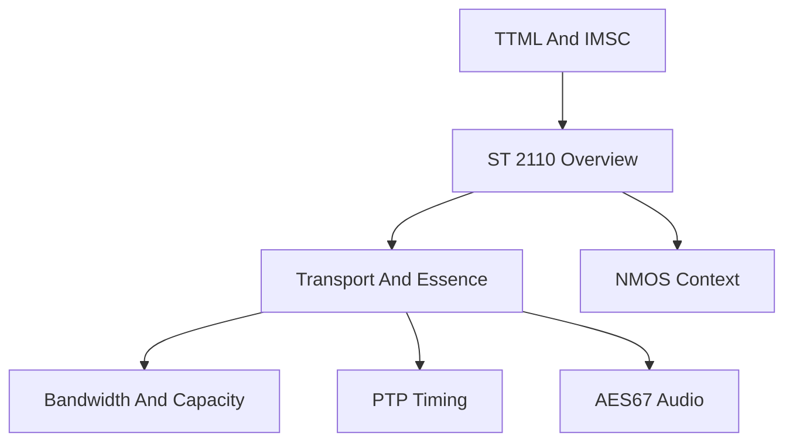

# ST 2110 Overview and Cross-Domain Context

## 1. Executive Summary

SMPTE ST 2110 systems should be modeled as related but separable domains: essence transport, timing, capacity, audio interoperability, control-plane state, and monitoring/security context. The ST 2110 suite identifies separate parts for system timing, uncompressed video, video traffic shaping, compressed video, PCM audio, AES3 transparent transport, ANC data, and fast metadata, but the public SMPTE DOI pages used by this report generally expose title/status metadata rather than full clause-level requirements ([SMPTE Standards Index](https://www.smpte.org/standards/document-index/st), [SMPTE ST 2110-10 DOI](https://doi.org/10.5594/SMPTE.ST2110-10.2022), [SMPTE ST 2110-20 DOI](https://doi.org/10.5594/SMPTE.ST2110-20.2022), [SMPTE ST 2110-21 DOI](https://doi.org/10.5594/SMPTE.ST2110-21.2022), [SMPTE ST 2110-30 DOI](https://doi.org/10.5594/SMPTE.ST2110-30.2025)).

The conservative rule for this report set is to use openly verifiable primary or standards-track text where available and mark hidden SMPTE/AES clause requirements as `Unverified` unless licensed text is attached. Public RFCs provide strong RTP, SDP, and clock-signaling anchors, especially RFC 3550 for RTP behavior, RFC 4175 for uncompressed video payload behavior, RFC 7273 for RTP clock-source signaling, and RFC 8866/RFC 4566 for SDP context ([RFC 3550](https://datatracker.ietf.org/doc/html/rfc3550), [RFC 4175](https://datatracker.ietf.org/doc/html/rfc4175), [RFC 7273](https://www.rfc-editor.org/rfc/rfc7273.html), [RFC 8866](https://datatracker.ietf.org/doc/html/rfc8866)).

## 2. Scope and Boundaries

This overview is a navigation and synthesis report. It is not the primary source for detailed packetization rules, bandwidth formulas, timing architecture, AES67 profile behavior, or timed-text validation. Those details live in the owning reports listed below.

| Owning report | Scope |
| --- | --- |
| [`transport-and-essence.md`](transport-and-essence.md) | ST 2110 essence, RTP flow/session separation, uncompressed video, PCM audio context, ANC, and conformance boundaries. |
| [`bandwidth-and-capacity.md`](bandwidth-and-capacity.md) | ST 2110 bandwidth formulas, packet overhead, capacity assumptions, and worked examples. |
| [`../timing/ptp.md`](../timing/ptp.md) | IEEE 1588/PTP, ST 2059 boundaries, RTP clock-source signaling, and timing validation. |
| [`../audio/aes67.md`](../audio/aes67.md) | AES67 audio interoperability, RTP audio payloads, SDP, packet time, discovery/connection context, and ST 2110-30 overlap. |
| [`../timed-text/ttml-imsc.md`](../timed-text/ttml-imsc.md) | TTML/IMSC timed-text validation and profile behavior. |

NMOS appears in this overview only as control-plane context. A dedicated NMOS report remains a known gap until created.

## 3. Standards and Source Map

| Source | Role in overview | Evidence status |
| --- | --- | --- |
| SMPTE ST 2110-10, -20, -21, -22, -30, -31, -40, -41 | ST 2110 suite map and part boundaries | Primary metadata only for most parts; clause-level text generally not public in fetched sources ([SMPTE Standards Index](https://www.smpte.org/standards/document-index/st)). |
| SMPTE ST 2059-1 / ST 2059-2 | Broadcast timing profile and SMPTE epoch context | Primary metadata plus secondary guidance; exact profile clauses `Unverified` ([SMPTE ST 2059-2 DOI](https://doi.org/10.5594/SMPTE.ST2059-2.2015)). |
| IEEE 1588-2019 | PTP base protocol context | Primary metadata/scope; full clause text not public in fetched source ([IEEE 1588-2019](https://standards.ieee.org/standard/1588-2019.html)). |
| RFC 3550 | RTP sessions, timestamps, sequence numbers, RTCP, and transport limits | Public standards-track text ([RFC 3550](https://datatracker.ietf.org/doc/html/rfc3550)). |
| RFC 4175 | RTP payload format for uncompressed video | Public standards-track text ([RFC 4175](https://datatracker.ietf.org/doc/html/rfc4175)). |
| RFC 7273 | RTP clock-source signaling in SDP | Public standards-track text ([RFC 7273](https://www.rfc-editor.org/rfc/rfc7273.html)). |
| AMWA IS-04 / IS-05 | NMOS discovery, registration, and connection management context | Public AMWA specifications ([AMWA IS-04](https://specs.amwa.tv/is-04/), [AMWA IS-05](https://specs.amwa.tv/is-05/)). |
| AMWA BCP-003-01 | Secure NMOS API context | Public BCP; media stream security is outside its scope ([AMWA BCP-003-01](https://specs.amwa.tv/bcp-003-01/releases/v1.0.0/docs/1.0._Secure_Communication.html)). |

## 4. Normative Requirements Catalog

| ID | Requirement or rule | Applies to | Normative citation | Evidence label | Implementation implication | Confidence |
| --- | --- | --- | --- | --- | --- | --- |
| ST2110-OV-1 | Separate essence media should be modeled as separate RTP sessions unless a payload or system standard explicitly defines another structure. | Transport model | RFC 3550 Section 5.2 ([RFC 3550](https://datatracker.ietf.org/doc/html/rfc3550)) | Normative dependency | Do not silently combine audio, video, and ANC into one RTP session. | High |
| ST2110-OV-2 | RTP does not guarantee delivery, packet order, timely delivery, or QoS. | Transport and capacity reports | RFC 3550 ([RFC 3550](https://datatracker.ietf.org/doc/html/rfc3550)) | Normative dependency | Keep capacity, QoS, reservation, and loss assumptions outside the RTP validity flag. | High |
| ST2110-OV-3 | RFC 4175 uncompressed video modeling uses active samples and pgroup-constrained packetization. | Uncompressed video and bandwidth reports | RFC 4175 ([RFC 4175](https://datatracker.ietf.org/doc/html/rfc4175)) | Normative dependency | Treat RFC 4175 payload validity separately from full ST 2110-20 conformance. | High |
| ST2110-OV-4 | RTP clock equivalence and cross-flow synchronization need reference-clock context; raw RTP timestamps across flows are not sufficient. | Timing and transport reports | RFC 3550 and RFC 7273 ([RFC 3550](https://datatracker.ietf.org/doc/html/rfc3550), [RFC 7273](https://www.rfc-editor.org/rfc/rfc7273.html)) | Normative dependency | Store PTP/reference-clock metadata separately from RTP timestamp values. | High |
| ST2110-OV-5 | ST 2110 part-specific clause claims remain `Unverified` unless backed by licensed SMPTE text or visible primary clauses. | All ST 2110 reports | Public DOI metadata visibility limits | Unverified boundary | Separate public RFC validation from formal SMPTE conformance claims. | High |

## 5. Engineering Model

The report set should use a layered model:

The core object boundaries are:

- Essence transport: RTP sessions, payload formats, SDP attributes, source/destination transport addresses, SSRC, payload type, and per-essence conformance status.
- Timing: PTP profile, domain, grandmaster identity, traceability, media clock, timestamp reference clock, RTCP evidence, and timing confidence.
- Capacity: payload rate, packetization strategy, packet rate, RTP/UDP/IP/link overhead, redundancy multiplier, headroom policy, and link utilization.
- Control plane: NMOS Node, Device, Source, Flow, Sender, Receiver, staged state, active state, and transport parameters.
- Monitoring/security: RTCP, PTP monitoring evidence, NMOS API security, and operational risk signals.

## 6. Formulas, Calculations, and Worked Examples

This overview does not own formulas. Formula ownership is delegated to [`bandwidth-and-capacity.md`](bandwidth-and-capacity.md), with timing checks delegated to [`../timing/ptp.md`](../timing/ptp.md). Cross-report consumers should keep formula provenance attached to the owning report rather than copying unlabelled constants into this overview.

## 7. Interoperability Risks and Ambiguity Register

| Risk or ambiguity | Evidence | Normative status | Failure symptom | Mitigation or modeling rule |
| --- | --- | --- | --- | --- |
| Payload-RFC validity mistaken for ST 2110 conformance | RFC 4175 is public, but ST 2110-20 clauses are not visible in fetched DOI pages ([RFC 4175](https://datatracker.ietf.org/doc/html/rfc4175), [SMPTE ST 2110-20 DOI](https://doi.org/10.5594/SMPTE.ST2110-20.2022)). | Unverified ST 2110 clause boundary | A tool reports formal ST 2110 conformance from only RFC payload checks. | Keep `rfc_payload_valid` and `st2110_conformance_valid` separate. |
| Timing assumptions hidden inside transport objects | RFC 3550 and RFC 7273 require explicit clock context for synchronization reasoning ([RFC 3550](https://datatracker.ietf.org/doc/html/rfc3550), [RFC 7273](https://www.rfc-editor.org/rfc/rfc7273.html)). | Normative dependency | Audio/video/ANC sync appears valid when streams use different clocks. | Store timing evidence in the timing model and reference it from flows. |
| NMOS Flow equated with network stream | AMWA IS-04 states Flows are internal content representations, not simply network streams ([AMWA IS-04 Data Model](https://specs.amwa.tv/is-04/releases/v1.3.3/docs/Data_Model.html)). | Normative dependency | Discovery/control state is misread as actual packet presence. | Model Flow, Sender, RTP session, and active connection state separately. |
| ST 2110-21 traffic-shaping constants hard-coded from secondary material | Public DOI metadata confirms the topic but not normative tables ([SMPTE ST 2110-21 DOI](https://doi.org/10.5594/SMPTE.ST2110-21.2022)). | Unverified until licensed review | False pass/fail traffic-shaping results. | Keep exact ST 2110-21 limits source-backed and downgrade unsourced constants. |
| Control-plane security mistaken for media-plane security | BCP-003-01 covers secure NMOS APIs and excludes securing ST 2110 streams ([AMWA BCP-003-01](https://specs.amwa.tv/bcp-003-01/releases/v1.0.0/docs/1.0._Secure_Communication.html)). | Best practice / BCP scope | A secure API is presented as secured media transport. | Report control-plane and media-plane security separately. |

## 8. Implementation Guidance

Use this overview as the entry point for agents and downstream repositories. For detailed work, load the owning domain report and keep this file as the scope map.

Recommended cross-report metadata:

| Field | Purpose |
| --- | --- |
| `report_id` | Stable identifier for the report artifact. |
| `topic` | Human-readable domain boundary. |
| `source_access` | Public, licensed, mixed, or unknown source visibility. |
| `related_reports` | Optional list of related report IDs for overlap navigation. |
| `evidence_label` | Normative, Best practice, Assumed, Derived, Secondary, or Unverified. |
| `conformance_boundary` | Explicit distinction between payload validity, profile validity, and formal standards conformance. |

## 9. Validation Checklist

- Confirm each report can be understood without reading another report first.
- Confirm overlaps are brief and scoped, with detailed ownership clear from the overview.
- Confirm SMPTE/AES clause claims are not promoted beyond available source visibility.
- Confirm formula constants and worked examples live in the bandwidth report unless another report owns the formula.
- Confirm timing claims that depend on PTP/ST 2059 point to the timing report or include local citation context.
- Confirm NMOS claims remain control-plane claims and do not redefine media transport.

## 10. Open Questions / Unverified Items

- A dedicated NMOS report is not yet present; NMOS is currently overview/control-plane context only.
- Exact ST 2110-10, -20, -21, -22, -31, -40, -41, ST 2059-1, ST 2059-2, and ST 2022-7 clause-level requirements remain `Unverified` without licensed standards text.
- Exact AES67-2023 clauses beyond the public preview remain owned by the AES67 report and are `Unverified` without licensed AES text.
- Whether `related_reports` should become a front matter extension is an open repository-contract decision.

## 11. Sources

| Source | Version/date captured | Role |
| --- | --- | --- |
| [SMPTE Standards Index](https://www.smpte.org/standards/document-index/st) | Fetched index with no dates for requested entries | ST 2110 and ST 2059 title map. |
| [SMPTE ST 2110-10 DOI](https://doi.org/10.5594/SMPTE.ST2110-10.2022) | 2022 in DOI; active/latest visible | ST 2110 system timing metadata. |
| [SMPTE ST 2110-20 DOI](https://doi.org/10.5594/SMPTE.ST2110-20.2022) | 2022 in DOI; active/latest visible | Uncompressed active video metadata. |
| [SMPTE ST 2110-21 DOI](https://doi.org/10.5594/SMPTE.ST2110-21.2022) | 2022 in DOI; active/latest visible | Traffic shaping and delivery timing metadata. |
| [SMPTE ST 2110-30 DOI](https://doi.org/10.5594/SMPTE.ST2110-30.2025) | 2025 in DOI; active/latest visible | PCM digital audio metadata. |
| [SMPTE ST 2059-2 DOI](https://doi.org/10.5594/SMPTE.ST2059-2.2015) | URL uses 2015; active/latest page | SMPTE PTP broadcast profile metadata. |
| [IEEE 1588-2019](https://standards.ieee.org/standard/1588-2019.html) | Published 2020-06-16; active standard | PTP base protocol metadata and scope. |
| [RFC 3550](https://datatracker.ietf.org/doc/html/rfc3550) | July 2003 | RTP/RTCP behavior. |
| [RFC 4175](https://datatracker.ietf.org/doc/html/rfc4175) | September 2005 | Uncompressed video RTP payload. |
| [RFC 7273](https://www.rfc-editor.org/rfc/rfc7273.html) | June 2014 | RTP clock-source signaling. |
| [RFC 8866](https://datatracker.ietf.org/doc/html/rfc8866) | January 2021 | Current SDP reference. |
| [AMWA IS-04](https://specs.amwa.tv/is-04/) | v1.3.3 | NMOS discovery and registration. |
| [AMWA IS-05](https://specs.amwa.tv/is-05/) | v1.1.2 | NMOS connection management. |
| [AMWA BCP-003-01](https://specs.amwa.tv/bcp-003-01/releases/v1.0.0/docs/1.0._Secure_Communication.html) | v1.0.0 | Secure NMOS API context. |
