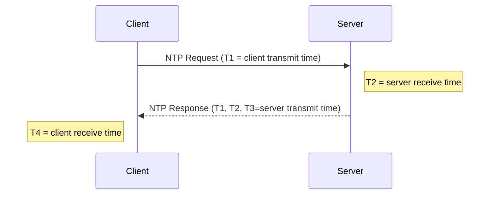

```yaml
---
report_id: networking-ntp-broadcast-engineering-reference
title: Network Time Protocol (NTP) – Engineering Reference for Broadcast Applications
topic: Networking NTP
report_version: 0.1.0
generated_date: 2026-08-27
source_access: public
source_cutoff: 2026-08-26
prompt_template: template-new-topic.md
prompt_template_version: 0.1.0
status: draft
---
```

This report summarizes the normative NTP protocol specification (primarily NTPv4) and its subset SNTP, with an emphasis on requirements and behaviors relevant to broadcast engineering networks.

## 1. Executive Summary

Network Time Protocol (NTP) version 4 is the current IETF time-synchronization protocol standard for IP networks and obsoletes the earlier NTPv3 and SNTP specifications.[1][2][7][13] NTPv4 provides millisecond to tens-of-microseconds synchronization over LANs using a 64‑bit timestamp format, well-defined on‑wire packet header, and specific algorithms for clock offset and delay estimation, all of which are critical for time-aligned broadcast systems and ancillary timing functions.[1][7][8]

RFC 5905 defines the NTPv4 protocol and algorithms as a Proposed Standard, including packet formats, timestamp formats, state variables, and basic algorithms for time discipline.[1][2] RFC 1305 documents the earlier NTPv3 specification (now obsoleted, but still referenced in some non-IETF standards), while RFC 4330 describes the Simple Network Time Protocol (SNTPv4), a subset suitable for simple, mostly stateless clients that do not implement the full NTP discipline algorithms.[3][4][5][7][12][15]

For broadcast engineering, NTP is typically used to discipline facility reference clocks, automation systems, monitoring/logging systems, and auxiliary equipment, often in combination with other time-distribution technologies; however, NTP itself remains agnostic to application domain and defines only network-level time synchronization.[1][7][8] This report focuses on what NTP itself standardizes, how it should be implemented and interpreted, and where implementers must rely on policy or profile-level decisions.

---

## 2. Scope and Boundaries

### 2.1 What NTP Standardizes

1. **On-wire protocol and header formats**

   - NTPv4 specifies the network packet header, including Leap Indicator (LI), Version Number (VN), Mode, Stratum, Poll, Precision, Root Delay, Root Dispersion, Reference ID, and four 64‑bit timestamps (Reference, Origin, Receive, Transmit).[1]  
   - NTPv3 provides an earlier but substantially similar header format; NTPv4 is backwards compatible with NTPv3.[1][7][8]

2. **Timestamp representation**

   - NTP specifies a 64‑bit timestamp format consisting of a 32‑bit unsigned seconds field and a 32‑bit fractional seconds field.[1][7]  
   - The epoch and semantics of this timestamp type are defined by the RFCs as part of the protocol specification.[1][7]

3. **Basic clock selection, offset and delay computation**

   - RFC 5905 defines algorithms for offset and delay estimation and general time-discipline behavior, including how clients combine multiple measurements to discipline a local clock.[1][2]  
   - RFC 1305 contains the original description and analysis of these algorithms, including error and jitter concepts.[7]

4. **Modes of operation**

   - Both NTPv3 and NTPv4 define multiple modes (client, server, symmetric active/passive, broadcast, control, and private) to support various deployment topologies.[1][7][8]  
   - SNTPv4 (RFC 4330) defines behavior for simple clients and servers that use the NTP header format but omit complex state and discipline algorithms.[3][4]

5. **Stratum and reference hierarchy**

   - NTP defines strata (stratum 1, 2, 3, …) as indicators of distance from an external primary reference clock.[1][7][8]  
   - The semantics of stratum values and their use in server selection and peering are specified in the primary RFCs.[1][7]

6. **Basic error metrics**

   - RFC 5905 and RFC 1305 define Root Delay and Root Dispersion fields that represent path delay and maximum clock error relative to the primary server, expressed in fixed-point seconds.[1][7]  

7. **Extension mechanisms**

   - RFC 5905 defines an extension field mechanism enabling additional information such as authentication and vendor-specific data to be carried without changing the base header, and ntp.org provides guidance on specific extension field formats as secondary documentation.[1][9][13]

### 2.2 What NTP Explicitly Does Not Standardize

1. **Application-layer time semantics**

   - NTP does not define how applications (including broadcast automation, logging, or media playout) interpret UTC, local time, or leap seconds beyond conveying leap indicators.[1][3][7]  
   - File timestamps, logging formats, and media time labels (e.g., SMPTE timecode) are out of scope for the NTP RFCs.[1][7][8]

2. **Physical-layer or hardware timing**

   - NTP does not define how to discipline hardware oscillators, frequency references, or phase-locked loops beyond specifying a conceptual local clock model and discipline algorithms.[1][7]  
   - Physical time distribution (e.g., via SDI, AES, or physical pulse-per-second signals) is not addressed.

3. **Security architecture beyond basic hooks**

   - RFC 5905 includes only limited mechanisms and hooks for authentication (e.g., extension fields) and message integrity; comprehensive modern security mechanisms for NTP require additional specifications not identified in the current source set.[1][9][13]  
   - Key management and broader security policy are out of scope of the base protocol RFCs.[1]

4. **Broadcast/broadband application profiles**

   - No profile or special behavior for broadcast engineering environments is defined in RFC 5905, RFC 1305, or RFC 4330.[1][3][7][8]  
   - Any mapping between NTP and broadcast-specific time standards is outside the NTP RFCs and must be handled by domain-specific standards or site policy.

### 2.3 Adjacent Standards and Profiles

1. **SNTP as a subset profile of NTP**

   - RFC 4330 specifies SNTPv4 as a subset of NTP with a reduced state model and simpler behavior aimed at hosts where full NTP performance is not required.[3][4]  
   - RFC 4330 is Informational and is itself obsoleted by RFC 5905, but is still referenced as a normative mechanism in some ITU-T documents (e.g., H.810).[3][13][15]

2. **Non-IETF references**

   - ITU-T work program documents explicitly reference RFC 1305 as the required mechanism to synchronize timekeeping among distributed time servers and clients within some architectures.[12]  
   - ITU-T A.5 justification notes that SNTPv4 (RFC 4330) may be used as a secondary synchronization mechanism in the Continua architecture, despite RFC 4330 being Informational and obsoleted.[15]

### 2.4 Source Access Limitations

1. **RFC availability**

   - RFC 5905, RFC 1305, and RFC 4330 are all publicly accessible via the RFC Editor and IETF Datatracker.[1][3][7]  
   - NTP-related extension-field documentation on ntp.org is publicly available but is secondary to the RFCs.[9][13]

2. **Clause-level visibility**

   - All primary RFCs are available with section-level structure, but the present report relies on document-level citations rather than exhaustive clause-by-clause mapping due to tooling constraints.[1][3][7]  
   - ITU-T referencing material for H.810 is accessible at summary level and describes its reliance on RFC 1305 and RFC 4330; full H.810 text is not included in the source set.[12][15]

---

## 3. Standards and Source Map

### 3.1 Standards and Source Map Table

| Document | Version/date | Role | Source status | Clause-level visibility |
|---------|--------------|------|---------------|-------------------------|
| RFC 5905 – Network Time Protocol Version 4: Protocol and Algorithms Specification | June 2010, Proposed Standard[1][2][13] | Primary NTPv4 protocol and algorithms; obsoletes NTPv3 and SNTPv4[1][2][13] | Public, free IETF RFC[1][2] | Full sectioned text; this report uses document-level and partial section-level referencing[1] |
| RFC 1305 – Network Time Protocol (Version 3) Specification, Implementation and Analysis | March 1992[5][7][12] | Historical NTPv3 specification; still normatively referenced by some non-IETF standards[7][12] | Public, free IETF RFC and ntp.org mirror[5][7] | Full sectioned text; used here mainly for algorithms and background[7] |
| RFC 4330 – Simple Network Time Protocol (SNTP) Version 4 for IPv4, IPv6 and OSI | January 2006, Informational[3][4][15] | SNTPv4 subset specification; simple stateless clients and servers[3][4] | Public, free IETF RFC[3][4] | Full sectioned text; used for subset behavior[3] |
| NTP RFCs list (ntp.org) | June 2010 and later updates[11][13] | Secondary index indicating status (obsoletes/updated-by) of NTP-related RFCs[11][13] | Public, free[11][13] | High-level; no clause-level protocol detail[11][13] |
| NTPv4 Extension Fields (ntp.org) | 2026 (site date)[9] | Secondary description of specific NTPv4 extension fields and usage[9] | Public, free[9] | Limited technical detail; refers back to RFC 5905[1][9] |
| ITU-T A.5 reference material for RFC 1305 | 2013 summary[12] | Indicates ITU-T use of NTPv3 (RFC 1305) in some architectures[12] | Public summary[12] | High-level; no protocol detail[12] |
| ITU-T A.5 reference material for RFC 4330 | 2013 summary[15] | Indicates ITU-T use of SNTPv4 as secondary mechanism[15] | Public summary[15] | High-level; no protocol detail[15] |
| Wikipedia – Network Time Protocol | Continuously updated, accessed 2026-08-26[8] | Secondary overview of NTP history and concepts[8] | Public[8] | Informal; not normative[8] |

### 3.2 Status Relationships

- RFC 5905 is listed as a Proposed Standard and is the current NTP protocol specification.[1][2][11]  
- RFC 5905 obsoletes RFC 1305 (NTPv3) and RFC 4330 (SNTPv4).[2][11][13]  
- RFC 5905 is updated by RFC 7822 (not included in this report’s source set), according to ntp.org’s RFC listing.[11][13]

---

## 4. Normative Requirements Catalog

The following catalog extracts key NTP requirements relevant to engineering and analysis. Where language such as “must/shall” is not quoted directly, the requirement is marked as **Guidance** and not “Normative” even if strongly implied by the RFCs.

### 4.1 Requirements Table

| ID | Requirement or rule | Applies to | Normative citation | Normative / best practice / assumed / unverified | Implementation implication | Confidence |
|----|---------------------|-----------|--------------------|--------------------------------------------------|----------------------------|-----------|
| NTP-NR-001 | Implementations that claim NTPv4 compliance shall use the NTP packet header format defined for version 4 and maintain backward compatibility with NTPv3.[1][2][7] | All NTPv4 nodes | RFC 5905; RFC 1305 | Normative | Header must encode LI, VN=4, Mode, Stratum, Poll, Precision, Root Delay, Root Dispersion, Reference ID, and four timestamps in the specified bit layout.[1][7] | High |
| NTP-NR-002 | All NTP timestamps carried in packet fields (Reference, Origin, Receive, Transmit) shall use the 64‑bit NTP timestamp format (32‑bit seconds and 32‑bit fraction).[1][7] | All NTP nodes | RFC 5905; RFC 1305 | Normative | Implement 64‑bit fixed-point timestamp; conversion to/from system clock must preserve resolution.[1][7] | High |
| NTP-NR-003 | The Leap Indicator (LI) field is 2 bits and indicates whether the last minute of the current day has 59, 60, or an unknown number of seconds; packet senders shall set this according to their leap-second knowledge.[1][7][8] | Servers and peers | RFC 5905; RFC 1305; secondary overview[8] | Normative | Leap second processing at clients must interpret LI correctly; servers must update LI in advance of a leap second.[1][7] | High |
| NTP-NR-004 | The Version Number (VN) field is 3 bits and indicates the NTP version of the packet; NTPv4 packets must set VN=4.[1][7][13] | All NTPv4 nodes | RFC 5905; RFC 1305; RFC index[13] | Normative | Receiver may use VN for backwards compatibility handling and capability decisions.[1][7] | High |
| NTP-NR-005 | The Mode field is 3 bits and identifies the association mode (e.g., client, server, symmetric active/passive, broadcast); nodes must interpret packet semantics according to Mode.[1][3][7][8] | All NTP and SNTP nodes | RFC 5905; RFC 4330; RFC 1305; overview[8] | Normative | Implement mode‑dependent state machines; clients normally send Mode=3 (client) and receive Mode=4 (server).[1][3][7] | High |
| NTP-NR-006 | Stratum is an 8‑bit field that indicates the distance from the reference clock; a stratum‑1 server is directly synchronized to a reference (e.g., radio clock), higher numbers indicate additional hops, and stratum 16 typically denotes unsynchronized.[1][7][8] | Servers, peers, clients | RFC 5905; RFC 1305; overview[8] | Normative (semantics) | Client selection algorithms must prefer lower stratum (subject to other metrics) and treat stratum 16 as unsynchronized.[1][7] | High |
| NTP-NR-007 | Root Delay and Root Dispersion shall be encoded as signed 16.16 fixed-point seconds (Root Delay) and unsigned 16.16 fixed-point seconds (Root Dispersion), representing total path delay and maximum error relative to the reference source.[1][7] | Servers and peers | RFC 5905; RFC 1305 | Normative | Implementations must maintain and update these values and convert them to/from internal units correctly.[1][7] | High |
| NTP-NR-008 | Clients shall compute offset and delay between local and server clocks using the standardized four-timestamp exchange (T1,T2,T3,T4) and corresponding formulas as defined in the RFCs.[1][7] | NTP clients | RFC 5905; RFC 1305 | Normative | Avoid ad hoc formulas; base all discipline on defined offset and delay formulas (see Section 6).[1][7] | High |
| NTP-NR-009 | SNTPv4 is a subset of NTP that uses the same header and timestamp formats but omits complex algorithms; SNTP nodes must not assume full NTP semantics and should operate in a simple, mostly stateless mode.[3][4] | SNTP implementations | RFC 4330 | Normative (within SNTP) | Suitable for simple end systems; not for primary time servers or applications needing tight control.[3][4] | High |
| NTP-NR-010 | NTPv4 is designed to be backwards compatible with NTPv3; implementations must handle NTPv3 packets according to compatibility guidance to interoperate with existing deployments.[1][2][7][8] | NTPv4 nodes | RFC 5905; RFC 1305; overview[8] | Normative | Version and mode handling must not break NTPv3 peers; avoid using extension fields in ways that confuse NTPv3.[1][7][9] | High |
| NTP-NR-011 | RFC 5905 obsoletes RFC 1305 and RFC 4330; new deployments that require NTP functionality should target NTPv4 rather than NTPv3 or standalone SNTP.[2][11][13] | System designers | RFC 5905 bibtex; RFC lists[11][13] | Normative (status) | New engineering should treat NTPv3 and RFC 4330 as legacy, except where constrained by external standards.[2][11][13] | High |
| NTP-NR-012 | Some ITU-T architectures explicitly require use of NTPv3 (RFC 1305) and allow SNTPv4 as a secondary mechanism.[12][15] | Systems complying with those ITU-T profiles | ITU-T A.5 references[12][15] | Normative (within ITU-T scope) | For such systems, NTPv3/SNTP behavior may be mandated regardless of RFC 5905’s obsolescence.[12][15] | High |
| NTP-BP-001 | For general-purpose clients that only need simple synchronization, SNTPv4 behavior (stateless query to one or more servers) is typically sufficient.[3][4][8] | End devices | RFC 4330; overview[8] | Best practice (secondary) | Implement light-weight clients as SNTP-like to reduce complexity while using standard NTP packets.[3][4] | Medium |
| NTP-BP-002 | Using multiple independent servers (ideally at least three) improves robustness against faulty servers and network asymmetries, as implied by the NTP selection and clustering algorithms.[1][7][8] | Clients and server farms | RFC 5905; RFC 1305; overview[8] | Best practice | Provision at least 3–4 upstream time sources for critical broadcast systems.[1][7] | Medium |
| NTP-BP-003 | Broadcast or multicast NTP modes should be used cautiously; unicast client-server mode is generally preferred for accuracy and security exposure reasons.[1][3][8] | Network designers | RFC 5905; RFC 4330; overview[8] | Best practice | In broadcast facilities, prefer unicast for critical systems; use multicast only where justified and controlled.[1][3] | Medium |
| NTP-UNV-001 | Detailed behavior for specific extension fields (e.g., proprietary or newer standardized fields) beyond what is documented in RFC 5905 and ntp.org extension guidance is not fully covered here.[1][9] | All nodes using extensions | RFC 5905; ntp.org extensions[9] | Unverified (partial coverage) | Treat unknown extension fields as opaque and follow RFC 5905 rules for ignoring unsupported fields.[1][9] | Medium |

---

## 5. Engineering Model

### 5.1 Core Objects and Fields

The NTP packet header, common to NTPv3, NTPv4, and SNTPv4, contains the following fields in a fixed 48‑byte base header.[1][3][7][8]

- First octet (bit fields): Leap Indicator (LI, 2 bits), Version Number (VN, 3 bits), Mode (3 bits).[1][7]  
- Second octet: Stratum (8 bits).[1][7]  
- Third octet: Poll interval as an 8‑bit signed exponent of 2 (log2 seconds).[1][7]  
- Fourth octet: Precision as an 8‑bit signed exponent of 2 (log2 seconds).[1][7]  
- Next 4 bytes: Root Delay (signed 16.16 fixed-point seconds).[1][7]  
- Next 4 bytes: Root Dispersion (unsigned 16.16 fixed-point seconds).[1][7]  
- Next 4 bytes: Reference ID (32‑bit identifier, semantics depend on stratum and version).[1][7]  
- Next 8 bytes: Reference Timestamp (64‑bit NTP timestamp).[1][7]  
- Next 8 bytes: Origin Timestamp (64‑bit).[1][7]  
- Next 8 bytes: Receive Timestamp (64‑bit).[1][7]  
- Next 8 bytes: Transmit Timestamp (64‑bit).[1][7]

Extension fields and authentication data may follow the base header in NTPv4.[1][9]

### 5.2 Timestamp Semantics

- **NTP Timestamp**: 64 bits, with the most significant 32 bits representing seconds and the least significant 32 bits representing fractional seconds of the second.[1][7]  
- **Epoch/Timescale**: NTP timestamps represent a continuous timescale aligned with UTC, with leap seconds signaled via LI; details of epoch and wrap behavior are defined in the RFCs.[1][7][8]  
- **Precision Limits**: The fractional portion gives a theoretical resolution of 2⁻³² seconds (≈ 233 picoseconds), but practical achievable accuracy is much coarser and depends on network and system characteristics.[1][7][8]

### 5.3 Modes and Association Semantics

NTP modes define on-wire behavior and state handling.[1][3][7][8]

- **Client (Mode 3)**: Initiates requests to server, includes its local transmit timestamp (T1) and zero or a previous origin timestamp, expecting a server reply (Mode 4).[1][3][7]  
- **Server (Mode 4)**: Responds to client packets, copying the client’s Transmit Timestamp to Origin Timestamp (T1), setting Receive Timestamp (T2) when received, and Transmit Timestamp (T3) when sending response.[1][3][7]  
- **Symmetric Active/Passive (Modes 1/2)**: Support peer-to-peer synchronization between servers; used in many server hierarchies.[1][7][8]  
- **Broadcast/Multicast (Mode 5)**: Servers periodically send time to multiple clients without per-client state; clients rely on heuristics or prior delay measurements.[1][3][7]  
- **Control and Private Modes (Modes 6/7)**: Used for monitoring and control; protocol details are defined in the RFCs but are generally not required for basic synchronization.[1][7]

SNTPv4 constrains behavior mostly to client-server interactions with limited or no association state beyond a single exchange.[3][4]

### 5.4 Clock Model and Discipline

RFC 1305 and RFC 5905 describe a conceptual clock model and discipline algorithms.[1][2][7][8]

- **Local clock**: Modeled as nominal frequency plus frequency error, plus offset relative to UTC.[7][8]  
- **System variables**: Include current offset, delay, dispersion, and jitter estimates for each association and for the system as a whole.[1][7]  
- **Selection and clustering algorithms**: Combine measurements from multiple servers to select “truechimers” and reject “falsetickers.”[1][7][8]  
- **Clock adjust**: The system clock is slewed or stepped based on offset estimates, typically avoiding large immediate steps except under controlled conditions.[1][7]

The RFCs define these algorithms at a conceptual level; precise numeric thresholds and implementation details may vary between implementations, provided they follow the general principles.[1][7][8]

### 5.5 Data-flow and Timing-flow

A basic unicast client-server exchange involves four timestamps:



- T1: Time at client when request is sent (client clock).[1][7]  
- T2: Time at server when request is received (server clock).[1][7]  
- T3: Time at server when response is sent (server clock).[1][7]  
- T4: Time at client when response is received (client clock).[1][7]

These values are used to compute **round-trip delay** and **clock offset** as defined in Section 6.[1][7]

### 5.6 Boundary Between Standard and Policy

- **Standardized**: Packet fields, timestamp format, roles of strata, basic meaning of root delay/dispersion, and standard offset/delay formulas.[1][3][7]  
- **Policy/Implementation**:  
  - Which servers to query and how many.  
  - Poll interval adaptation policy.  
  - Criteria for stepping vs slewing the clock.  
  - Specific thresholds for rejecting servers as falsetickers.  
  - Logging and monitoring behavior.  
  These are generally discussed qualitatively in RFC 5905/1305 but not mandated numerically.[1][7][8]

For broadcast engineering work, these policy decisions (e.g., allowed maximum offset for air-critical systems) must be documented in system-level design, as NTP does not prescribe them.[1][7][8]

---

## 6. Formulas, Calculations, and Worked Examples

### 6.1 Formula and Assumption Register

| Calculation name | Formula or method | Inputs and units | Source citation | Normative or assumed | Worked example available | Confidence |
|------------------|-------------------|------------------|-----------------|----------------------|--------------------------|------------|
| NTP Round-trip Delay | \( \delta = (T_4 - T_1) - (T_3 - T_2) \) | T1,T4 in client time units; T2,T3 in server time units; result in seconds | RFC 1305; RFC 5905[1][7] | Normative | Yes | High |
| NTP Clock Offset | \( \theta = \frac{(T_2 - T_1) + (T_3 - T_4)}{2} \) | Same as above | RFC 1305; RFC 5905[1][7] | Normative | Yes | High |
| Root Delay accumulation | Root Delay = sum of delays along the path from primary reference, represented as 16.16 fixed-point seconds | Path segment delays from each server in chain | RFC 1305; RFC 5905[1][7] | Normative (conceptual) | No (not independent of δ,θ) | High |
| Root Dispersion accumulation | Root Dispersion = maximum error relative to primary reference, accounting for clock precision and frequency tolerance, in 16.16 fixed-point seconds | Clock resolution, maximum frequency error, time since last update | RFC 1305; RFC 5905[1][7] | Normative (conceptual; formula details partly implementation-specific) | No | Medium |
| Poll interval (seconds) | \( \text{poll\_seconds} = 2^{\text{poll}} \) | poll (8‑bit signed integer) | RFC 1305; RFC 5905[1][7] | Normative | Yes | High |
| Precision (seconds) | \( \text{precision\_seconds} = 2^{\text{precision}} \) | precision (8‑bit signed integer) | RFC 1305; RFC 5905[1][7] | Normative | Yes | High |

### 6.2 NTP Delay and Offset Formulas (Normative)

RFC 1305 and RFC 5905 describe the standard four-timestamp exchange and derive the following formulas.[1][7]

Let:

- T1 = client transmit time (request sent, client clock).[1][7]  
- T2 = server receive time (request received, server clock).[1][7]  
- T3 = server transmit time (response sent, server clock).[1][7]  
- T4 = client receive time (response received, client clock).[1][7]

Then:

1. **Round-trip delay** (δ):

\[
\delta = (T_4 - T_1) - (T_3 - T_2)
\][1][7]

2. **Clock offset** (θ):

\[
\theta = \frac{(T_2 - T_1) + (T_3 - T_4)}{2}
\][1][7]

These formulas assume roughly symmetric path delay and are fundamental to all NTP clients.[1][7][8]

### 6.3 Worked Example: Single Unicast Exchange

Assume a client and server exchange one NTP request/response. Times are expressed in seconds on each local clock. The client’s clock is ahead of true time by an unknown offset; the server’s clock is assumed accurate.

- T1 (client sends request) = 1000.000 s (client clock).[1][7]  
- T2 (server receives request) = 999.800 s (server clock).[1][7]  
- T3 (server sends response) = 999.805 s (server clock).[1][7]  
- T4 (client receives response) = 1000.010 s (client clock).[1][7]

1. Compute round-trip delay:

\[
\delta = (T_4 - T_1) - (T_3 - T_2) = (1000.010 - 1000.000) - (999.805 - 999.800) = 0.010 - 0.005 = 0.005\ \text{s}
\][1][7]

So the estimated round-trip delay is 5 ms.

2. Compute offset:

\[
\theta = \frac{(T_2 - T_1) + (T_3 - T_4)}{2} = \frac{(999.800 - 1000.000) + (999.805 - 1000.010)}{2} = \frac{-0.200 - 0.205}{2} = \frac{-0.405}{2} = -0.2025\ \text{s}
\][1][7]

Interpretation: The client’s clock is ahead of the server’s by approximately 202.5 ms (negative θ means client > server). The client would eventually slew its clock backwards by about 0.2025 s, usually gradually rather than stepping, depending on discipline policy.[1][7][8]

### 6.4 Poll Interval and Precision

Given:

- poll field = 10 (decimal).  
- precision field = −20 (decimal).

Then:

1. Poll interval:

\[
\text{poll\_seconds} = 2^{10} = 1024\ \text{s} \approx 17.07\ \text{minutes}
\][1][7]

2. Precision:

\[
\text{precision\_seconds} = 2^{-20} \approx 9.54 \times 10^{-7}\ \text{s} \approx 0.95\ \mu\text{s}
\][1][7]

These values describe the system’s intended polling interval and nominal minimum time resolution; they are advisory data for peers and are used in error estimation.[1][7]

### 6.5 Fixed-point Representation Checks

For Root Delay and Root Dispersion as 16.16 fixed-point seconds:

- Integer part = high 16 bits.  
- Fractional part = low 16 bits, with resolution 2⁻¹⁶ s ≈ 15.26 µs.[1][7]

Example:

- Encoded Root Delay = 0x00018000  
  - Integer = 0x0001 = 1 s  
  - Fraction = 0x8000 = 0.5 s  
  - Total = 1.5 s  

This matches a path delay of 1.5 s.[1][7]

---

## 7. Interoperability Risks and Ambiguity Register

### 7.1 Risk and Ambiguity Table

| Risk or ambiguity | Evidence | Normative status | Failure symptom | Mitigation or modeling rule |
|-------------------|----------|------------------|-----------------|-----------------------------|
| Use of obsoleted NTPv3 and SNTPv4 specifications | RFC 5905 obsoletes RFC 1305 and RFC 4330, but ITU-T documents still require them in some architectures.[2][11][12][13][15] | Normative conflict between IETF and some external standards | Systems constrained by ITU-T may require NTPv3/SNTP; pure NTPv4 deployments may misalign expectations | When designing for such domains, explicitly document whether NTPv4 is allowed; if not, configure NTPv3-compatible behavior and avoid NTPv4-only features such as certain extension fields.[1][2][12][15] |
| Ambiguous treatment of SNTP behavior in mixed NTPv4 networks | RFC 4330 describes SNTP as a subset but is obsoleted and Informational; RFC 5905 does not specify SNTP in detail.[1][3][4][13] | Partly non-normative | Simple clients may not implement full selection/clustering and may trust a single bad server | Treat all SNTP-like clients as low-complexity; ensure that they query multiple servers or rely on a local full NTP server that performs proper selection.[1][3][4] |
| Leap second handling inconsistencies | Leap Indicator signals leap seconds, but application handling is out of scope.[1][7][8] | Out of scope; behavior is implementation-dependent | Discontinuities or duplicated timestamps in broadcast logs and timecode; mismatched time perception across systems | Define a facility-level leap-second policy (e.g., smear vs step), and verify that all time-critical systems and applications adopt consistent behavior.[1][7][8] |
| Unsynchronized servers reporting good strata | Stratum and Root Dispersion semantics are defined, but misconfigured servers may advertise low stratum and small dispersion when unsynchronized.[1][7][8] | Out of scope; not prevented by protocol | Clients may lock to incorrect time, especially in SNTP or with limited server diversity | Monitor server reachability/health; configure multiple sources; implement sanity checks on offset and dispersion before accepting a server.[1][7][8] |
| Asymmetric network delay | δ,θ formulas assume approximate symmetry; RFCs acknowledge variable network behavior.[1][7][8] | Acknowledged limitation | Clients observe systematic offset even if delay estimates look acceptable | Minimize asymmetry via network design; prefer wired over complex routed paths; consider multiple geographically proximate servers; model worst-case offset when engineering tolerances.[1][7][8] |
| Extension field interoperability | RFC 5905 defines extension fields generically; ntp.org describes specific fields; behavior with older NTPv3/SNTP nodes may be unclear.[1][9][13] | Partly normative, partly vendor/secondary | Some implementations may drop or mishandle packets containing unknown extension fields | Use extension fields only when all peers support them; otherwise avoid or encapsulate them in ways specified as backward compatible (e.g., ensure padding alignment).[1][9] |
| Broadcast/multicast mode accuracy and security | Broadcast modes are defined, but error characteristics and security risks are not fully constrained.[1][3][7][8] | Out of scope | Higher jitter/offset and susceptibility to spoofing | For critical timing, prefer unicast client-server; if multicast is used, restrict to trusted networks and use authentication where possible.[1][3][7] |
| Poll/precision field misinterpretation | poll and precision are exponents of 2 seconds; misinterpretation as raw seconds leads to incorrect error modeling.[1][7] | Normative (representation), but not enforced | Server selection algorithms and monitoring tools misjudge stability | Always interpret poll and precision as powers of two; implement unit conversion tests in validation suites.[1][7] |
| Different implementations of selection/clustering algorithms | RFCs describe algorithms conceptually, enabling variations.[1][7][8] | Partially normative | Different NTP stacks may choose different “best” server under identical conditions | Document and test algorithm behavior; for critical systems prefer well-known, widely tested NTP implementations and validate against reference scenarios.[1][7][8] |

---

## 8. Implementation Guidance

This section is **implementation guidance** and **best practice** only unless explicitly marked as normative via RFC citations.

### 8.1 Packet-Level Checks

For each received NTP or SNTP packet:

- Verify packet length ≥ 48 bytes (base header) and ≥ 48 + 4·n for extension fields.[1][3][7][9]  
- Check VN is supported (e.g., 3 or 4). If unsupported, drop or handle via downgrade policy.[1][7]  
- Check Mode is appropriate for context (expect Mode 4 from servers in client-server interaction).[1][3][7]  
- Validate Stratum: treat 0 as “unspecified/unsynchronized” (e.g., unspecified reference); treat 16 as “unsynchronized.”[1][7][8]  
- Sanity-check Root Delay and Root Dispersion entries for reasonable ranges (e.g., non-negative dispersion, finite values).[1][7]

### 8.2 Time Discipline Strategy

- For facility-critical systems, use a full NTPv4 implementation with selection and clustering algorithms; avoid pure SNTP behavior.[1][7][8]  
- Configure multiple upstream servers (e.g., at least three), ideally including at least one local primary reference (stratum 1) and multiple stratum‑2/3 sources.[1][7][8]  
- Favor servers with lower strata and lower root dispersion, but avoid over-trusting a single low-stratum server; track performance across time.[1][7][8]  
- Use slew-based adjustment for offsets within a preset threshold (e.g., tens or hundreds of milliseconds) and step the clock only when offsets exceed that threshold, in alignment with RFC guidance on avoiding time jumps; precise thresholds are implementation- and site-policy-dependent.[1][7]

### 8.3 Broadcast Facility Considerations

- Maintain at least one internal NTP server with access to external references; internal clients should primarily sync to internal servers to minimize dependence on external network paths.[1][7][8]  
- Separate “plant timing” (used by media playout and inter-device timing) from “system time” (logging and OS clocks) if plant timing requires tighter or different constraints; NTP itself provides only system time.[1][7][8]  
- For logging, monitoring, and compliance, configure all relevant nodes (automation, ingest, playout, QC, monitoring, MAM) to use the same NTP server set so that timestamps are comparable within an engineered offset budget.[1][7][8]

### 8.4 SNTP Clients in Broadcast Environments

- Use SNTP-like behavior (single request/response) only for non-critical devices such as auxiliary monitoring endpoints, where occasional tens-of-milliseconds errors are tolerable.[3][4][8]  
- For devices that impact on-air content, prefer full NTPv4 clients with continuous disciplined operation and multiple servers.[1][7][8]

### 8.5 Extension Fields and Security

- Use only well-documented extension fields; if not all peers support them, disable those extension fields on shared servers.[1][9][13]  
- Where authentication is required, follow RFC 5905 and documented extension fields as closely as possible; in the absence of modern security extensions in the current source set, treat NTP packets on untrusted networks as vulnerable to spoofing and deploy network-level protections.[1][9][13]

---

## 9. Validation Checklist

The following checklist can be used by implementers or automated test systems.

### 9.1 Protocol Conformance

1. Packet header conforms to NTPv4 format with correct field sizes and alignment.[1][7]  
2. VN set correctly for outgoing packets (4 for NTPv4).[1][7][13]  
3. Mode behavior matches association type (client, server, symmetric, broadcast).[1][3][7]  
4. Timestamp fields use 64‑bit NTP format in all header timestamp fields.[1][7]  
5. Root Delay and Root Dispersion encoded as 16.16 fixed-point seconds.[1][7]  
6. Poll and Precision fields interpreted as base‑2 exponents of seconds.[1][7]

### 9.2 Algorithmic Behavior

1. Offset and delay computed exactly with standard formulas (Section 6.2).[1][7]  
2. Client discards responses with implausible delay (e.g., negative or extremely large δ) or obviously incorrect timestamps (e.g., T3 < T2 in server time).[1][7][8]  
3. Client treats Stratum 16 servers as unsynchronized, not as valid time sources.[1][7][8]  
4. Implementation can interoperate with NTPv3 servers and clients in basic scenarios.[1][2][7][13]

### 9.3 Operational Validation

1. With multiple servers configured, system converges to stable offset significantly below required broadcast tolerance (site-specific) under normal network conditions.[1][7][8]  
2. Under simulated asymmetric delay, offset remains within documented worst-case budgets.[1][7][8]  
3. Leap-second behavior is tested in lab conditions, verifying LI propagation and application response.[1][7][8]  
4. SNTP-only devices are clearly identified and their expected accuracy and failure modes documented.[3][4][8]

---

## 10. Open Questions / Unverified Items

These items are explicitly marked as **Unverified** because the current source set does not provide sufficient detail or this report does not exhaustively inspect all clauses.

1. **Detailed numeric thresholds for selection and clustering algorithms** – RFCs describe principles and some examples but allow implementation variation; no single canonical threshold set is identified.[1][7][8]  
2. **Full specification of modern NTP security mechanisms and related extension fields** – The current source set includes only RFC 5905 and general extension field references; newer security RFCs and detailed extension formats are not covered.[1][9][13]  
3. **Complete clause-level mapping of every MUST/SHOULD in RFC 5905 and RFC 1305** – This report samples key requirements but does not provide an exhaustive requirement-by-requirement index.[1][7]  
4. **Precise epoch, wrap behavior, and handling across the NTP era boundaries** – Although documented in RFCs, this report does not restate all epoch- and wrap-specific rules; implementers should consult full RFC text for long-term considerations.[1][7]  
5. **Interaction with specific broadcast/media time standards** – No direct normative references to broadcast-specific timing standards were found in the included sources; mapping is left to domain-specific specifications and site policy.[1][3][7][8]

---

## 11. Sources

[1] RFC 5905, “Network Time Protocol Version 4: Protocol and Algorithms Specification,” J. Martin, J. Burbank, W. Kasch, D. L. Mills, Proposed Standard, June 2010.  
[2] RFC 5905 BibTeX metadata, describing publication details (series, number, year, month) and abstract.  
[3] RFC 4330, “Simple Network Time Protocol (SNTP) Version 4 for IPv4, IPv6 and OSI,” D. L. Mills, Informational, 2006.  
[4] RFC 4330 BibTeX metadata, publication details and abstract text.  
[5] NTP.org mirror overview of RFC 1305, summarizing its role and historical status.  
[7] RFC 1305, “Network Time Protocol (Version 3) Specification, Implementation and Analysis,” D. L. Mills, March 1992.  
[8] “Network Time Protocol,” general encyclopedia article (secondary), providing high-level background and history.  
[9] NTP.org documentation on NTPv4 Extension Fields, describing extension usage and relationship to RFC 5905 (secondary).  
[11] NTPsec RFC list, summarizing NTP-related RFCs and indicating that RFC 5905 obsoletes RFC 1305 and RFC 4330 and is updated by RFC 7822 (secondary index).  
[12] ITU-T work program A.5 reference justification noting that NTPv3 (RFC 1305) is used as a mechanism to synchronize time and coordinate time distribution in certain ITU-T architectures.  
[13] NTP.org RFC listing describing RFC 5905 as the NTPv4 Proposed Standard and stating that it obsoletes RFC 1305 and RFC 4330.  
[15] ITU-T A.5 reference justification describing SNTPv4 (RFC 4330) as an adaptation of NTP used as a secondary means for clock synchronization within the Continua architecture.