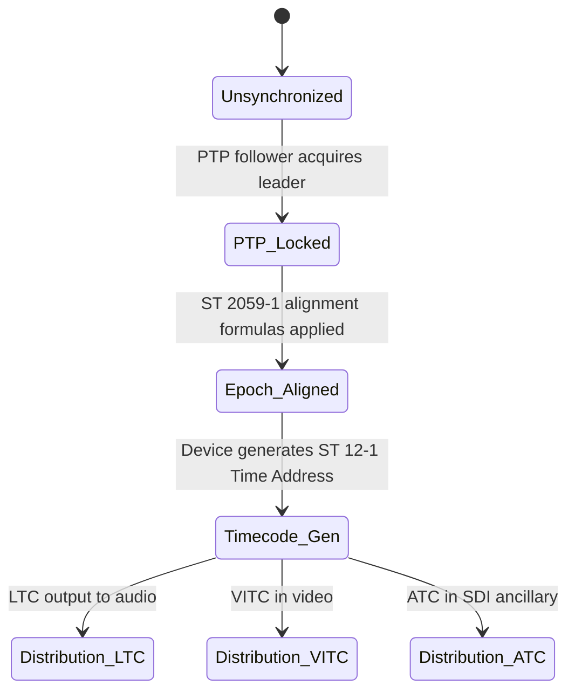

```yaml
---
report_id: broadcast-timecode-technical-reference
title: Technical Reference: SMPTE Timecode in Broadcast Engineering
topic: timecode
report_version: 0.1.0
generated_date: 2026-08-27
source_access: mixed
source_cutoff: 2026-08-26
prompt_template: template-new-topic.md
prompt_template_version: 0.1.0
status: draft
---
```

## 1. Executive Summary

SMPTE timecode (Time and Control Code) is a family of standards that label individual frames of television and accompanying audio with a numeric time address, enabling frame-accurate synchronization, editing, logging, and automation across heterogeneous broadcast systems.[3][4][12][14][15]  

The core standard SMPTE ST 12‑1 defines the time address, binary groups, flag structure, and primary transport structures for Linear Time Code (LTC) and Vertical Interval Time Code (VITC) for a range of common frame rates, while SMPTE ST 12‑2 defines their transmission in digital ancillary data and SMPTE ST 12‑3 extends the scheme to high frame rates.[1][3][5][8][9][13][14] SMPTE ST 2059‑1 and EG 2059‑10 integrate SMPTE timecode with IEEE‑1588 Precision Time Protocol (PTP), defining formulas and operational guidance for deriving SMPTE time addresses from PTP time and for distributing timecode in IP‑based broadcast architectures.[2][6][7]  

Normatively, these standards define the supported frame rates, time address format, and transport structures and how they may be carried in analog audio, video vertical interval, and digital ancillary space.[1][3][5][8][13][14] Best‑practice guidance from EG 2059‑10 recommends generating timecode in each PTP‑synchronized device rather than relying solely on a central generator.[6][7] Details such as codeword bit layout, binary group assignments, and exact PTP‑to‑timecode formulas are defined in the primary standards but are not visible in the available excerpts of the source documents and are therefore marked Unverified in this report.[2][3][8]

---

## 2. Scope and Boundaries

### 2.1 What Timecode Standardizes

1. **Frame labeling scheme**  
   SMPTE timecode standardizes the representation of time as an eight‑digit absolute time indication subdivided into frames (commonly written hh:mm:ss:ff) for television and audio systems.[3][4][12][14][15]  
   It defines a frame‑accurate time address used to uniquely identify each video frame or film frame to support synchronization and editing workflows.[3][4][12][14][15]

2. **Supported frame rates**  
   SMPTE ST 12‑1 specifies time and control code for television and accompanying audio systems operating at nominal frame rates of 60, 59.94, 50, 48, 47.95, 30, 29.97, 25, 24, and 23.98 frames per second.[3][4][9][12][14][15]  
   SMPTE ST 12‑3 extends the standardized timecode formats to frame rates of 72, 96, 100, and 120 frames per second and adds a drop‑frame compensation mode for 120 fps only.[1][4][14]

3. **Timecode transports (LTC, VITC, ATC)**  
   ST 12‑1 defines the time address, binary groups, flag bits, and primary data transport structures for: Linear Time Code (LTC) conveyed over audio, and Vertical Interval Time Code (VITC) conveyed in the video signal.[3][8][10][14]  
   ST 12‑2 defines a transmission format for conveying LTC or VITC codeword data, formatted according to ST 12‑1, in 8‑, 10‑, or 12‑bit digital television interfaces, using ancillary data space.[5][8][13][14]  
   ATC (Ancillary Time Code) is defined as ancillary packets carried in the VANC or HANC spaces of a digital television data stream, with payloads conveying LTC or VITC codeword data per ST 12‑1 and ST 12‑2.[8][14]

4. **Integration with PTP and time‑of‑day**  
   SMPTE ST 2059‑1 defines a common time reference (SMPTE Epoch), alignment of real‑time signals to this epoch, and formulas specifying:  
   - Ongoing alignment of signals to time since the SMPTE Epoch.[2]  
   - Calculation of SMPTE ST 12‑1 Time Address values and SMPTE ST 309 date values from PTP data in the SMPTE profile of IEEE 1588‑2008.[2]  

5. **Operational synchronization guidance**  
   SMPTE EG 2059‑10 provides non‑normative guidance on the new synchronization system, describing conventional practice (central timecode generator) and the recommended practice where each PTP follower independently generates SMPTE ST 12‑1 timecode from PTP time and distributed synchronization metadata.[6][7]

### 2.2 What Timecode Does Not Standardize (Explicit/Implicit)

1. **Content semantics of user bits**  
   ST 12‑1 defines a 32‑bit “user bits” field in timecode but allows it to be customized for various applications such as identifiers, event markers, automation, or metadata; it does not standardize specific semantics or encoding of these user bits.[4][14]

2. **Transport‑layer behavior beyond timecode payload**  
   ST 12‑2 and RP 188 define transmission formats for timecode in ancillary data, but do not standardize higher‑level routing, buffering, or quality‑of‑service behavior in SDI or IP networks.[5][8][13]  
   PTP network design, robustness, and security considerations are addressed primarily by IEEE 1588 and SMPTE ST 2059‑2, not by ST 12 itself.[2][6][7] (Scope boundary, secondary inference from document roles.)

3. **Editing and production workflow semantics**  
   While SMPTE timecode is designed to support editing, logging, and synchronization, the standards do not prescribe particular production workflows, naming conventions, or logging formats; these are implementation‑specific or addressed by other documents (e.g., facility operating practices).[4][12][14]

4. **Non‑SMPTE frame rates or non‑video uses**  
   Use of SMPTE timecode for non‑standard frame rates or non‑television applications (e.g., VR frame rates outside the enumerated set) is not covered by ST 12 and is implementation‑dependent.[3][4][9][14]

### 2.3 Adjacent Standards, Profiles, and Common Misconceptions

1. **Adjacent synchronization standards**  
   - IEEE 1588‑2008 PTP and the SMPTE profile of PTP are normatively referenced by ST 2059‑1 for alignment and timecode calculation.[2]  
   - SMPTE ST 2059‑2 (not in the retrieved snippets) defines minimum PTP profile parameters for professional media networks; it is an adjacent dependency but its text is not visible here. (Unverified; role inferred.)  

2. **RP 188 vs ST 12‑2**  
   SMPTE RP 188:1999 defined transmission of timecode and control code in the ancillary data space of digital television streams using data formatted according to ANSI/SMPTE 12M‑1995 in 8‑ or 10‑bit interfaces.[13]  
   ST 12‑2 now defines a transmission format for linear (LTC) or vertical interval (VITC) timecode data formatted according to ST 12‑1 in 8‑, 10‑, or 12‑bit digital television data interfaces and explicitly notes that “ATC packets” carrying this data correspond to ancillary packets in VANC or HANC, formerly described by RP 188.[5][8][13]

3. **“SMPTE 12M” vs “ST 12‑1” naming**  
   SMPTE timecode was historically defined in ANSI/SMPTE 12M and is now designated ST 12‑1; references to “12M” in older documents correspond to ST 12‑1 in current nomenclature.[12][14]

4. **Misconception: timecode itself is a synchronization signal**  
   SMPTE timecode is primarily a time label, not a clock recovery mechanism; it is generated and distributed with reference to an underlying synchronization system (e.g., black burst, tri‑level sync, or PTP), but the standards treat timecode as a representation of time derived from synchronization, not a low‑jitter timing reference.[2][4][6][7] (Scope clarification based on descriptions.)

### 2.4 Source Access Limitations

1. ST 12‑1:2014 and ST 12‑2:2014 PDFs are partially accessible, but detailed clause‑level structures (e.g., specific bit fields, binary group flag assignments, and codeword layouts) are not visible in the retrieved snippets.[3][5][8][9]  
2. ST 12‑3:2016 is accessible with limited content; details of drop‑frame compensation rules and ancillary formatting for high frame rates are not visible.[1]  
3. ST 2059‑1:2021 is accessible, but the actual formulas for mapping PTP time to ST 12‑1 Time Address values are referenced but not reproduced in the snippets.[2]  
4. EG 2059‑10:2016 and EG 2059‑10:2023 provide narrative guidance but not full clause‑level detail in the excerpts.[6][7]  
5. RP 188:1999 summaries are available via secondary portals; the full text is not fully accessible in the retrieved snippets.[13]  
6. Some summary sources (GlobalSpec, standards.ie, SMPTE blogs, Wikipedia) are secondary and may not reflect the full normative content; they are used here only for high‑level description and must not be treated as authoritative for bit‑level implementation details.[3][4][9][12][15]

---

## 3. Standards and Source Map

### 3.1 Overview Table

| Document | Version/date | Role | Source status | Clause-level visibility |
|---------|--------------|------|---------------|-------------------------|
| SMPTE ST 12‑1:2014 “Time and Control Code” | Publication date 20 Feb 2014[3][9] | Primary standard defining timecode (time address, binary groups, LTC/VITC transport) for common frame rates.[3][8][9][10][14] | Public summary and partial PDF available; full text may be licensed.[3][8][9][10] | High‑level structure visible (definitions, transports, ATC note), but detailed bit layouts and clause numbering not visible.[3][8] |
| SMPTE ST 12‑2:2014 “Transmission of Time Code in the Ancillary Data Space” | Publication date 20 Feb 2014[5] | Primary standard defining transmission format for LTC/VITC codewords in 8/10/12‑bit digital interfaces (ATC).[5][8][13][14] | Public summary and partial PDF available; full text may be licensed.[5][8][13] | General structure and purpose visible; specific ANC packet layouts and clause references not visible.[5][8] |
| SMPTE ST 12‑3:2016 “Time Code for High Frame Rate Signals and Formatting in the Ancillary Data Space” | ST 12‑3:2016[1] | Primary standard extending ST 12‑1 timecode to 72, 96, 100, 120 fps and defining 120 fps drop‑frame mode.[1][4][14] | Public PDF available.[1] | High‑level description of frame counts and drop‑frame support visible; detailed formatting rules not visible.[1] |
| SMPTE ST 2059‑1:2021 “Generation and Alignment of Audio/Video and Ancillary Data Signals over IP” (excerpt refers to Sync/Epoch and timecode) | 2021 edition[2] | Primary synchronization standard defining SMPTE Epoch, signal alignment, and formulas to derive ST 12‑1 time addresses and ST 309 date from PTP time.[2] | Public PDF available.[2] | References to formulas and SMPTE Epoch visible; exact mathematical expressions and clause numbers not visible.[2] |
| SMPTE EG 2059‑10:2016 “Introduction to the New Synchronization System” | Approved 2016[7] | Engineering guideline (non‑normative) describing use of ST 2059 and generating ST 12‑1 from PTP; describes conventional central generator and distributed generation.[6][7] | Public PDF available.[6][7] | Narrative guidance visible; detailed examples and section numbering partially visible.[6][7] |
| SMPTE EG 2059‑10:2023 (updated) | 2023 edition[6] | Updated engineering guideline with similar scope as 2016; describes PTP leader/follower model and distributed generation of ST 12‑1 timecode.[6] | Public PDF available.[6] | Narrative guidance visible; no mathematical detail beyond general description.[6] |
| SMPTE RP 188:1999 “Transmission of Time Code and Control Code in the Ancillary Data Space of a Digital Television Data Stream” | 1999[13] | Recommended practice (superseded/absorbed into ST 12‑2) defining transmission of ANSI/SMPTE 12M timecode in ancillary space for 8/10‑bit interfaces.[13] | Summary available via secondary source; full text likely licensed.[13] | Only high‑level description of purpose; details not visible.[13] |
| SMPTE EG 40:2012 “EG0040-2012” (references ST 12‑1:2008) | 2012[10] | Engineering guideline referencing ST 12‑1:2008 time and control code; provides context on older revision.[10] | Public PDF available.[10] | Reference only; not used for detailed requirements.[10] |
| SMPTE ER 1002:2017 “User Survey and Requirements for a New Time Label” | 2017[14] | Engineering report summarizing history and use of ST 12 timecode and outlining requirements for future time‑label schemes.[14] | Public PDF available.[14] | Provides historical context and high‑level characteristics (e.g., BCD encoding, three types of ST‑12 timecode).[14] |
| SMPTE blog “Understanding Standards: Time Code” | 2025‑02‑26[4] | Secondary explanatory article summarizing ST 12 standards, frame rates, drop‑frame, and user bits.[4] | Public web article.[4] | Descriptive; no normative clause references.[4] |
| Wikipedia “SMPTE timecode” (English) | Last updated 2026‑08‑05[12] | Secondary reference summarizing SMPTE timecode concept and history.[12] | Public wiki article.[12] | High‑level overview; not normative; bit‑level details not used.[12] |
| Wikipedia “SMPTE‑Timecode” (German) | Last updated 2025‑08‑22[15] | Secondary reference summarizing SMPTE timecode and hh:mm:ss:ff notation.[15] | Public wiki article.[15] | High‑level overview; not normative.[15] |
| AJA NTV2 SDK “SDI Ancillary Data” | SDK doc updated 2026‑06‑04[11] | Vendor implementation reference showing handling of ATC/RP‑188 ancillary data in SDI hardware.[11] | Public SDK docs.[11] | Implementation details only; used as secondary evidence of typical ATC usage.[11] |

---

## 4. Normative Requirements Catalog

The following table captures explicit normative requirements, as far as visible from the sources. Where wording is generalized, it is labeled accordingly. Clause‑level references are absent because they are not visible in the retrieved excerpts.

### 4.1 Requirements Table

| ID | Requirement or rule | Applies to | Normative citation | Normative / best practice / assumed / unverified | Implementation implication | Confidence |
|----|---------------------|-----------|--------------------|--------------------------------------------------|----------------------------|-----------|
| TC‑REQ‑001 | Time and Control Code shall be used only at nominal frame rates 60, 59.94, 50, 48, 47.95, 30, 29.97, 25, 24, and 23.98 fps, as specified by ST 12‑1.[3][4][9][14][15] | Timecode generators and receivers for conventional frame rates | ST 12‑1:2014 overview[3][9] | Normative | Systems must not claim ST 12‑1 compliance when using unsupported frame rates; mapping to other rates is outside the standard.[3][9] | High |
| TC‑REQ‑002 | ST 12‑1 defines a time address, binary groups, flag bit structure, binary group flag assignment, and primary data transport structures for LTC and VITC; compliant implementations shall respect these structures.[3][8][10][14] | Encoders/decoders of LTC/VITC | ST 12‑1:2014 summary[3][8][10] | Normative | Encoders and decoders must implement ST 12‑1 codeword, flags, and binary groups as specified, not proprietary formats.[3][8] | High |
| TC‑REQ‑003 | ST 12‑2 defines the transmission format for LTC and VITC timecode data formatted according to ST 12‑1 in 8‑, 10‑, or 12‑bit digital television data interfaces; ATC packets shall conform to ST 12‑2.[5][8][13][14] | SDI equipment handling ancillary timecode | ST 12‑2:2014 summary[5][8]; RP 188:1999 summary[13] | Normative | SDI encoders must format ATC packets according to ST 12‑2; decoders must interpret ATC per ST 12‑2.[5][8] | High |
| TC‑REQ‑004 | ATC packets carried in the VANC or HANC ancillary spaces of digital television streams shall convey LTC or VITC codeword data formatted according to ST 12‑1.[8][14] | SDI and digital video equipment | ST 12‑1:2014 note on ATC[8] | Normative | When ATC is present, payload must be ST 12‑1 codewords; non‑ST‑12 payload must be distinguished using different ANC types.[8][14] | High |
| TC‑REQ‑005 | ST 12‑3 timecode formats with frame counts 72, 96, 100, and 120 fps shall be used for high frame rate signals; drop‑frame compensation is standardized only for 120 fps.[1][4][14] | High‑frame‑rate timecode generators and receivers | ST 12‑3:2016 excerpt[1]; SMPTE blog[4]; ER 1002[14] | Normative | For 72/96/100 fps, only non‑drop modes are standardized; for 120 fps, both non‑drop and drop‑frame are defined; systems must not invent drop‑frame rules for other HFR rates under ST 12‑3.[1][4][14] | High |
| TC‑REQ‑006 | A SMPTE Epoch shall be used as the common time reference for alignment of all real‑time signals referenced in ST 2059‑1.[2] | Synchronization systems using ST 2059 | ST 2059‑1:2021 introduction[2] | Normative | PTP‑based broadcast systems using ST 2059 must define and use SMPTE Epoch as specified; arbitrary epochs are non‑compliant.[2] | High |
| TC‑REQ‑007 | Real‑time signals shall be aligned to the SMPTE Epoch according to formulas specified in ST 2059‑1.[2] | Video/audio generators and PTP leaders/followers | ST 2059‑1:2021 introduction[2] | Normative | Clock generation and signal alignment must follow ST 2059‑1 formulas; alternate alignment methods reduce interoperability.[2] | High |
| TC‑REQ‑008 | SMPTE ST 12‑1 Time Address values and SMPTE ST 309 date values shall be calculated from PTP data using the formulas specified in ST 2059‑1.[2] | Timecode generators using PTP | ST 2059‑1:2021 introduction[2] | Normative | Devices deriving timecode from PTP must use the specified mapping; proprietary mappings may yield timecode mis‑alignment between vendors.[2] | High |
| TC‑REQ‑009 | Timecode labeling shall use numeric codes combining hour, minute, second, and frame, generated at regular intervals by a timing synchronization system.[4][12][14][15] | Timecode generators | SMPTE blog on ST 12[4]; Wikipedia overview[12][15]; ER 1002 description[14] | Normative (format), wording generalized | Generators must produce monotonically increasing hh:mm:ss:ff labels synchronized to video frames; irregular or non‑frame‑accurate labels break interoperability.[4][12][14][15] | Medium (format normative, wording secondary) |
| TC‑REQ‑010 | ST 12 timecode uses Binary Coded Decimal (BCD) encoding for its fields.[14] | Timecode encoders/decoders | ER 1002 description of ST‑12 characteristics[14] | Normative (encoding type), wording generalized | Implementations must encode digits using BCD as defined in ST 12; non‑BCD encodings are non‑compliant.[14] | Medium (encoding type explicit, layout Unverified) |
| TC‑REQ‑011 | Implementations shall distinguish Linear Time Code (LTC), Vertical Interval Time Code (VITC), and Ancillary Time Code (ATC) as three separate types of ST‑12 timecode.[14] | System design, configuration, logging | ER 1002 enumeration[14] | Normative (classification), wording generalized | Systems must correctly classify and handle LTC, VITC, and ATC transports; conflating them may lead to incorrect routing or decoding.[14] | High |
| TC‑REQ‑012 | ST 12‑2 transmission formats shall be used for carrying timecode in SDI ancillary data instead of legacy RP 188 formats when claiming compliance to ST 12‑2.[5][8][13] | SDI manufacturers and integrators | ST 12‑2:2014 summary[5]; ST 12‑1 note referencing ST 12‑2 and RP 188[8]; RP 188 summary[13] | Normative | New equipment should implement ST 12‑2; use of RP 188 may be supported for legacy compatibility but is not equivalent to full ST 12‑2 compliance.[5][8][13] | High |

Best‑practice and assumed rules (non‑normative) are listed later in §8 and explicitly labeled.

---

## 5. Engineering Model

### 5.1 Core Objects and Fields

1. **Time Address (Timecode) Object**  
   - Concept: A numeric label representing time as hours, minutes, seconds, and frame count for each video frame or audio frame interval.[3][4][12][14][15]  
   - Format: Commonly written as hh:mm:ss:ff with two digits each for hour, minute, second, and frame.[12][15] (Notation from secondary sources; normative format is defined in ST 12‑1 but not fully visible.)  
   - Encoding: Uses Binary Coded Decimal (BCD) encoding for its fields.[14]  

2. **Binary Groups and Flag Bits**  
   ST 12‑1 defines binary groups and flag bit structure, including binary group flag assignment; these fields carry control information and optional user bits.[3][8][14]  
   The user bits field consists of 32 bits that can be customized for identifiers, event markers, automation signals, or metadata; semantics are application‑specific and not standardized.[4][14]

3. **Timecode Transports**  
   - Linear Time Code (LTC): Audio‑format timecode (typically on audio tracks) conveying ST 12‑1 codewords.[3][10][14]  
   - Vertical Interval Time Code (VITC): Video‑format timecode embedded in the vertical interval of the analog or digital video signal, conveying ST 12‑1 codewords.[3][8][10][14]  
   - Ancillary Time Code (ATC): Digital video ancillary packets in VANC or HANC spaces carrying LTC or VITC codeword payload formatted according to ST 12‑1 and ST 12‑2.[5][8][13][14]

4. **PTP and Time‑of‑Day Model**  
   - SMPTE Epoch: A defined starting point in time used as reference for all signals in ST 2059‑1.[2]  
   - PTP Time: Time expressed according to IEEE 1588‑2008 with SMPTE profile, used to derive ST 12‑1 Time Address and ST 309 date.[2]  
   - Synchronization Metadata: Management messages sent periodically by the PTP leader containing synchronization metadata used by followers when generating time‑of‑day ST 12‑1 timecode.[6][7]

### 5.2 Relationships and Data Flows

```mermaid
flowchart TD
    ST12_1[ST 12-1 Time and Control Code] --> LTC[LTC (audio transport)]
    ST12_1 --> VITC[VITC (vertical interval transport)]
    ST12_1 --> ATC_Payload[Codeword for ATC payload]
    ST12_2[ST 12-2 Ancillary Transmission] --> ATC_Payload
    ST12_3[ST 12-3 High Frame Rate] --> ST12_1
    PTP[IEEE 1588 PTP + ST 2059-1] --> ST12_1
    EG2059_10[EG 2059-10 Guidance] --> PTP
    ATC_Payload --> SDI_Stream[SDI/VANC/HANC Ancillary Data]
```

- ST 12‑1 defines the core timecode; LTC and VITC transports carry its codewords directly.[3][8][10][14]  
- ST 12‑2 defines how ST 12‑1 codewords are serialized into ATC packets and placed into VANC/HANC ancillary data in SDI streams.[5][8][13][14]  
- ST 12‑3 extends the ST 12‑1 timecode scheme to higher frame rates, remaining backward‑compatible with ST 12‑1 and ‑2 for lower rates.[1][4][14]  
- ST 2059‑1 and EG 2059‑10 define how PTP time and synchronization metadata are used to generate ST 12‑1 timecode in each device.[2][6][7]

### 5.3 Timing and Control Flow



- Devices transition from Unsynchronized to PTP_Locked when they follow a PTP leader; synchronization metadata then allows alignment to the SMPTE Epoch according to ST 2059‑1.[2][6][7]  
- Once Epoch_Aligned, devices generate ST 12‑1 timecode, which may be distributed as LTC, VITC, or ATC depending on configuration and physical interfaces.[3][5][8][14]  
- EG 2059‑10 describes the traditional model with a central timecode generator and the new model where each PTP follower independently generates ST 12‑1 timecode.[6][7]

### 5.4 Boundary Between Normative Behavior and Implementation Policy

1. **Normatively defined**  
   - Timecode format (time address fields, BCD encoding, binary group/flag structure).[3][8][14]  
   - Supported frame rates for ST 12‑1 and ST 12‑3.[1][3][4][9][14][15]  
   - Transport categories LTC, VITC, ATC and their relationship to ST 12‑1.[3][5][8][10][13][14]  
   - Transmission of timecode in digital ancillary space (ATC packet structure and mapping) per ST 12‑2.[5][8][13][14]  
   - Use of SMPTE Epoch and formulas for alignment and PTP‑to‑timecode conversion per ST 2059‑1.[2]

2. **Implementation‑dependent / policy decisions**  
   - Whether to use central vs distributed timecode generation; EG 2059‑10 recommends distributed generation but this is not normative.[6][7]  
   - Precise routing, buffering, and redundancy mechanisms for LTC/VITC/ATC within a facility.[4][6][7][11]  
   - Use and interpretation of user bits (32 bits) for facility‑specific metadata.[4][14]  
   - Handling of legacy RP 188 ATC alongside ST 12‑2 (compatibility modes).[5][8][11][13]

3. **Unverified (due to missing clause detail)**  
   - Exact bit positions and codeword layouts for LTC and VITC. (Defined in ST 12‑1 but not visible.)[3][8]  
   - Detailed ATC packet structure (e.g., ANC DID/SDID values, payload packing). (Defined in ST 12‑2 but not visible.)[5][8][13]  
   - Exact mathematical formulas connecting PTP time, SMPTE Epoch, and ST 12‑1 Time Address values and ST 309 date.[2]

---

## 6. Formulas, Calculations, and Worked Examples

Due to source access limitations, the actual normative formulas for PTP‑to‑timecode mapping and detailed codeword layouts are referenced but not visible and therefore cannot be reproduced.[2][3][5][8] All formula entries below indicate whether the formula itself is available or Unverified.

### 6.1 Formula and Assumption Register

| Calculation name | Formula or method | Inputs and units | Source citation | Normative or assumed | Worked example available | Confidence |
|------------------|-------------------|------------------|-----------------|-----------------------|--------------------------|-----------|
| PTP to ST 12‑1 Time Address mapping | Formulae specified in ST 2059‑1 compute ST 12‑1 Time Address from SMPTE profile IEEE 1588‑2008 PTP data and SMPTE Epoch.[2] Actual expressions not visible; marked Unverified. | PTP time (seconds and nanoseconds since epoch), SMPTE Epoch definition; output: ST 12‑1 Time Address (hh:mm:ss:ff).[2] | ST 2059‑1:2021 introduction[2] | Normative formula exists but not reproduced; Unverified for implementation here. | No | Medium (existence of formula certain; details unavailable) |
| Signal alignment to SMPTE Epoch | ST 2059‑1 defines formulae specifying ongoing alignment of real‑time signals (video/audio) to time since the SMPTE Epoch.[2] Exact mathematical form not visible. | SMPTE Epoch reference time, signal sampling clock, frame rate; outputs: alignment offsets and phase relationship.[2] | ST 2059‑1:2021 introduction[2] | Normative formula exists but not reproduced; Unverified for implementation here. | No | Medium |
| Timecode increment per frame | Generators produce time labels (hh:mm:ss:ff) that advance with each frame at the nominal frame rate, generated by a timing synchronization system.[4][12][14][15] Exact increment behavior (especially in drop‑frame modes) is defined in ST 12‑1/12‑3 but not visible. | Frame rate (fps), synchronization clock, previous Time Address; output: next Time Address.[3][4][12][14][15] | SMPTE blog[4]; Wikipedia[12][15]; ER 1002[14]; ST 12‑1/12‑3 referenced[3][1] | Normative concept; detailed rules (especially for drop‑frame) Unverified. | No | Medium (concept); Low (detail) |
| Drop‑frame compensation at 120 fps | ST 12‑3 defines a drop‑frame compensation mode only for 120 fps.[1][4][14] Exact rule (frame numbers skipped per minute) not visible. | 120 fps nominal frame rate; time‑of‑day alignment; output: sequence of frame numbers to drop.[1][4][14] | ST 12‑3:2016[1]; SMPTE blog[4]; ER 1002[14] | Normative concept; detailed formula Unverified. | No | Medium (scope); Low (detail) |
| BCD encoding of timecode fields | ST 12 timecode uses Binary Coded Decimal (BCD) encoding for its fields.[14] General BCD format (4 bits per decimal digit) is widely known, but ST 12‑specific bit allocations are not visible. | Decimal digits of hours, minutes, seconds, frames; output: BCD‑encoded bits.[14] | ER 1002[14] | Normative encoding type; ST 12‑specific layout Unverified. | No | Medium (encoding type); Low (layout) |

### 6.2 Worked Examples

No fully normative worked examples can be provided without reproducing formulas or bit layouts that are not visible in the source excerpts.[2][3][5][8] Any attempt to derive example timecode values (e.g., mapping a PTP timestamp to hh:mm:ss:ff or constructing LTC/VITC codewords bit‑by‑bit) would require guessing and is therefore explicitly avoided (Unverified).  

Implementers must refer to the full texts of ST 12‑1, ST 12‑2, ST 12‑3, and ST 2059‑1 for precise formulas and example calculations.

---

## 7. Interoperability Risks and Ambiguity Register

### 7.1 Risk and Ambiguity Table

| Risk or ambiguity | Evidence | Normative status | Failure symptom | Mitigation or modeling rule |
|-------------------|----------|------------------|-----------------|-----------------------------|
| Use of unsupported frame rates with ST 12‑1 | ST 12‑1 is explicitly specified for a defined set of nominal frame rates only.[3][4][9][14][15] | Frame rate list is normative.[3][9] | Devices using non‑standard frame rates (e.g., 90 fps) may produce timecode that other devices reject or misinterpret. | Constrain ST 12‑1 use to listed frame rates; treat other frame rates as non‑standard and clearly label them as such; avoid claiming ST 12‑1 compliance for them.[3][9] |
| Misuse of drop‑frame modes at high frame rates | ST 12‑3 supports drop‑frame only for 120 fps; other HFR rates are non‑drop.[1][4][14] | Normative (scope of drop‑frame). | Implementations may incorrectly apply 29.97‑style drop‑frame logic to other HFR rates (e.g., 100 fps), causing time‑of‑day drift. | Implement drop‑frame only for 120 fps as per ST 12‑3; for 72/96/100 fps, use non‑drop modes only; document facility policies explicitly.[1][4][14] |
| Ambiguity between RP 188 and ST 12‑2 ATC formats | RP 188 defined ancillary transmission for 8/10‑bit interfaces based on ANSI/SMPTE 12M; ST 12‑2 supersedes/extends this for ST 12‑1 and 8/10/12‑bit interfaces.[5][8][13][14] | RP 188 is recommended practice; ST 12‑2 is normative standard.[5][13][14] | Mixed equipment may interpret ANC packets differently, leading to loss or mis‑decoding of timecode. | Prefer ST 12‑2 ATC formats; enable RP 188 compatibility modes only where necessary; clearly indicate which ANC type and payload format are used; test cross‑vendor interoperability.[5][8][11][13] |
| Central vs distributed timecode generation under PTP | EG 2059‑10 describes conventional central generator practice and new distributed generation where each PTP follower generates timecode from PTP time.[6][7] | Guidance only; not normative.[6][7] | Mixed facilities may have both central LTC generators and PTP‑derived local timecode, leading to conflicting labels. | Establish facility‑wide policy: either central‑only or PTP‑derived timecode; if both exist, define clear priority and reconciliation rules; monitor offsets between sources.[6][7] |
| Unknown bit‑level layouts for LTC/VITC and ATC | ST 12‑1 and ST 12‑2 define bit‑level layouts not visible here.[3][5][8] | Normative, but Unverified in this report. | Incorrect bit packing or parsing leads to invalid or misread timecodes. | Obtain full standards and implement according to bit‑level specifications; validate with known‑good reference sources; do not infer layouts from secondary documents.[3][5][8] |
| Semantics of user bits | ST 12‑1 allows user bits to be customized for various applications; semantics are not standardized.[4][14] | Non‑normative; implementation‑defined. | Different systems may interpret user bits differently (e.g., time‑of‑day vs reel number), causing confusion. | Treat user bits as opaque metadata; document facility‑specific semantics; avoid relying on user bits for critical cross‑system functions unless all systems agree on semantics.[4][14] |
| Ambiguous dropout/error behavior | ST 12‑1/12‑2 likely define error detection and handling but details are not visible.[3][5][8] | Normative but Unverified in this report. | Devices may react differently to corrupted LTC/VITC/ATC (e.g., freeze vs resync), causing inconsistent behavior during disturbances. | Consult full standards for error handling rules; design systems to detect invalid codewords and fallback gracefully; use monitoring to detect persistent anomalies.[3][5][8] |

---

## 8. Implementation Guidance

This section provides non‑normative best‑practice guidance derived from the standards and engineering reports. Each item is explicitly labeled as best practice or assumption.

### 8.1 Recommended Fields, Checks, and Outputs (Best Practice)

1. **Timecode object fields** (Best practice)  
   - Store timecode as structured fields: hour, minute, second, frame, frame rate, drop/non‑drop flag, transport type (LTC/VITC/ATC), and UTC/date association (via ST 2059‑1/ST 309 when available).[2][3][4][14][15]  
   - Maintain an explicit “source” field indicating whether the timecode is derived from PTP, analog sync, a central generator, or embedded stream.[2][6][7][11]

2. **Validation checks** (Best practice)  
   - Check that frame values are within the range allowed by the nominal frame rate and that the frame rate is one of the ST 12‑1 or ST 12‑3 supported rates.[1][3][4][9][14][15]  
   - In ATC, verify that ANC packets identified as carrying timecode use the ST 12‑2‑defined format and that payloads decode to valid ST 12‑1 codewords.[5][8][11][13]  
   - Cross‑check LTC, VITC, and ATC timecodes when multiple transports are present to detect inconsistencies.[3][5][8][11][14]

3. **System‑level outputs** (Best practice)  
   - Expose timecode along with confidence metrics (e.g., “locked to PTP”, “derived from external LTC”, “internal free‑run”) based on synchronization status per EG 2059‑10.[6][7]  
   - Log changes in timecode source (e.g., switching from central generator to local PTP‑derived generation) for diagnostic traceability.[6][7]

### 8.2 Modeling Unverified or Externally Supplied Values (Assumed)

1. **PTP‑derived timecode fields** (Assumed)  
   - When ST 2059‑1 formulas are not implemented directly, model PTP‑derived timecode as: Timecode = f(PTP time, frame rate, SMPTE Epoch), with f treated as an external black‑box process conforming to ST 2059‑1.[2]  
   - Mark the mapping algorithm as “externally supplied” and treat its outputs as authoritative when validated against a known reference.

2. **Drop‑frame behavior** (Assumed where standard text unavailable)  
   - For 29.97 fps and similar NTSC rates, assume that ST 12‑1 defines a drop‑frame algorithm consistent with long‑standing industry practice; however, without text, do not hard‑code such behavior based solely on this report (Unverified).[3][4][12][15]  
   - For 120 fps, assume presence of a drop‑frame algorithm per ST 12‑3 but defer details to the full standard.[1][4][14]

3. **Legacy RP 188 handling** (Assumed)  
   - In mixed environments, treat RP 188‑style ancillary timecode as a variant of ATC and decode using ST 12‑2 where possible, with vendor‑specific interpretation as needed.[5][8][11][13]

### 8.3 Operational Practices (Best Practice)

1. **Facility‑wide synchronization strategy**  
   - Prefer a PTP‑based synchronization architecture conforming to ST 2059, with each device generating its own ST 12‑1 timecode from PTP time as described in EG 2059‑10; this improves determinism and reduces dependency on a single central generator.[2][6][7]  
   - Retain central LTC generators primarily for backward compatibility with legacy gear that cannot participate in PTP.[6][7][11]

2. **Monitoring and diagnostics**  
   - Use monitoring tools to inspect LTC, VITC, and ATC across the facility, verifying consistent labels and detecting dropouts or misalignments.[3][5][8][11][14]  
   - Log timecode and PTP status at ingest points to aid correlation of synchronization issues.[2][6][7]

3. **Documentation and training**  
   - Document which frame rates and drop/non‑drop modes are used for each workflow, explicitly noting ST 12‑1 vs ST 12‑3 use.[1][3][4][14]  
   - Train operators on distinctions between LTC, VITC, and ATC and the role of PTP vs timecode in synchronization.[4][6][7][14]

---

## 9. Validation Checklist

This checklist is intended for use by implementations and AI assistants when validating timecode behavior in a broadcast system.

1. **Frame rate support**  
   - [ ] All timecode signals use frame rates from the ST 12‑1 set (60, 59.94, 50, 48, 47.95, 30, 29.97, 25, 24, 23.98) or ST 12‑3 high frame rates (72, 96, 100, 120).[1][3][4][9][14][15]  
   - [ ] Any other frame rates are explicitly marked as non‑standard and not claimed to be ST 12‑1/12‑3 compliant.[3][9]

2. **Transport compliance**  
   - [ ] LTC signals can be decoded into valid ST 12‑1 time addresses and binary groups.[3][8][10][14]  
   - [ ] VITC signals in the vertical interval decode into valid ST 12‑1 time addresses.[3][8][10][14]  
   - [ ] ATC packets in SDI ancillary space follow ST 12‑2 formats; payloads decode to ST 12‑1 codewords.[5][8][13][14]

3. **PTP/timecode relationship**  
   - [ ] Devices using PTP implement ST 2059‑1 formulas to derive ST 12‑1 timecode and ST 309 date from PTP time.[2]  
   - [ ] PTP followers receive synchronization metadata from PTP leaders and use it when generating time‑of‑day timecode per EG 2059‑10.[6][7]  
   - [ ] Timecode from different devices aligns to the same SMPTE Epoch and PTP domain.[2][6][7]

4. **Drop‑frame modes**  
   - [ ] Drop‑frame modes are used only for rates where they are standardized (e.g., 120 fps in ST 12‑3; conventional NTSC rates per ST 12‑1).[1][3][4][14][15]  
   - [ ] Devices clearly indicate drop vs non‑drop mode in configuration and metadata.[4][14]

5. **User bits and metadata**  
   - [ ] User bits are treated as opaque metadata and documented per facility policy; no critical synchronization function depends solely on user bits.[4][14]  

6. **Inter‑transport consistency**  
   - [ ] Where LTC, VITC, and ATC coexist, decoded timecodes are consistent within acceptable tolerance across transports.[3][5][8][11][14]

7. **Error handling**  
   - [ ] Systems detect and handle invalid or corrupted timecode gracefully, according to ST 12‑1/12‑2 error rules (to be checked against full standards).[3][5][8]

---

## 10. Open Questions / Unverified Items

The following items are explicitly marked Unverified because the necessary normative text is not visible in the retrieved excerpts. They require consultation of the full standards.

1. **Exact LTC/VITC Codeword Layout**  
   The precise bit structure, including start/stop bits, sync words, BCD digit placement, binary group flags, and parity/error bits for LTC and VITC codewords, is defined in ST 12‑1 but not visible.[3][8][10]  

2. **Detailed ATC Packet Structure**  
   The ANC Data ID (DID/SDID) values used for ATC, payload length, and packing of ST 12‑1 codewords into ST 12‑2 ANC packets are defined in ST 12‑2 and RP 188 but not visible.[5][8][13]  

3. **PTP‑to‑Timecode Mathematical Formulas**  
   ST 2059‑1 references formulas for mapping PTP time and SMPTE Epoch to ST 12‑1 Time Address and ST 309 date, but the actual formulas and clauses are not visible.[2]  

4. **Drop‑Frame Algorithm Details**  
   The detailed rules for drop‑frame at conventional NTSC rates (29.97 fps and related) and at 120 fps under ST 12‑3 (e.g., which frame numbers are skipped per minute) are not visible.[1][3][4][14][15]  

5. **Error Detection and Correction**  
   Any explicit error detection, parity, or correction mechanisms defined in ST 12‑1/12‑2 for LTC/VITC/ATC payloads are not visible.[3][5][8]  

6. **Complete Binary Group Flag Assignments**  
   ST 12‑1 defines binary group flag assignments; the detailed meaning of each flag bit and binary group is not visible.[3][8][14]  

7. **Interaction with ST 309 Date Labels**  
   ST 2059‑1 mentions ST 309 date values; the detailed structure of ST 309 and its integration with ST 12‑1 time addresses is not visible.[2]

These items must not be implemented or modeled based solely on this report; full standards must be consulted.

---

## 11. Sources

Numbers below correspond to citations used throughout this report.

1. SMPTE ST 12‑3:2016 – “Time Code for High Frame Rate Signals and Formatting in the Ancillary Data Space” (SMPTE standard; defines timecode formats for 72, 96, 100, 120 fps and 120 fps drop‑frame).[1]  
2. SMPTE ST 2059‑1:2021 – Synchronization standard defining SMPTE Epoch, alignment formulas, and calculation of ST 12‑1 Time Address and ST 309 date from PTP data.[2]  
3. GlobalSpec summary of SMPTE ST 12‑1:2014 – Overview of time and control code, supported frame rates, and data structures.[3]  
4. SMPTE blog “Understanding Standards: Time Code” – Descriptive article covering ST 12 family, frame rates, drop‑frame, and user bits.[4]  
5. GlobalSpec summary of SMPTE ST 12‑2:2014 – Overview of transmission format for LTC/VITC timecode in digital ancillary data.[5]  
6. SMPTE EG 2059‑10:2023 – Engineering guideline introducing the new synchronization system and PTP‑derived ST 12‑1 timecode.[6]  
7. SMPTE EG 2059‑10:2016 – Earlier edition of the same guidance, describing central vs distributed timecode generation.[7]  
8. SMPTE ST 12‑1:2014 PDF excerpt – Includes note on ATC and references to ST 12‑2 and RP 188; confirms ST 12‑1 as basis for ancillary timecode.[8]  
9. Standards.ie summary of SMPTE ST 12‑1:2014 – Confirms role and supported frame rates.[9]  
10. SMPTE EG 0040‑2012 – Engineering guideline referencing ST 12‑1:2008 time and control code.[10]  
11. AJA NTV2 SDK “SDI Ancillary Data” – Vendor implementation reference showing handling of RP‑188/ATC flags and ancillary data in SDI hardware.[11]  
12. Wikipedia “SMPTE timecode” (English) – Secondary overview of SMPTE timecode concept and historical designation as SMPTE 12M.[12]  
13. Intertek/GlobalSpec summary of SMPTE RP 188:1999 – Overview of transmission of timecode/control code in ancillary data space of digital television streams.[13]  
14. SMPTE ER 1002:2017 – Engineering report summarizing ST 12 timecode history, characteristics (LTC/VITC/ATC, BCD encoding), and requirements for new time label.[14]  
15. Wikipedia “SMPTE‑Timecode” (German) – Secondary overview confirming hh:mm:ss:ff notation and ST 12‑1/ST 12‑2 roles.[15]